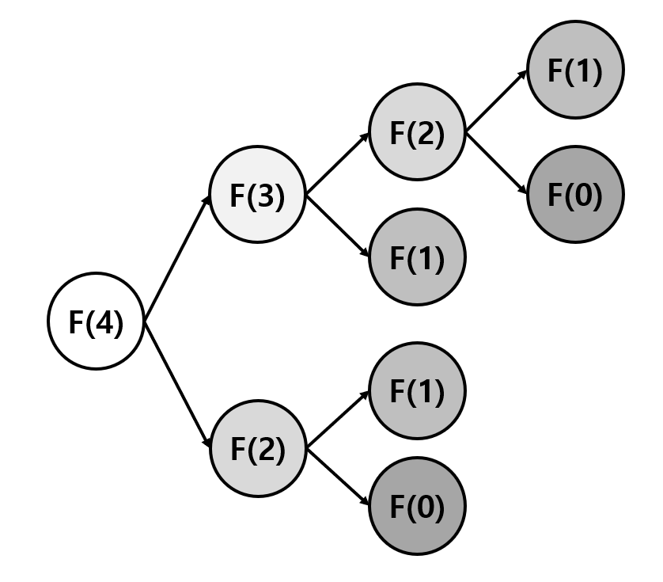
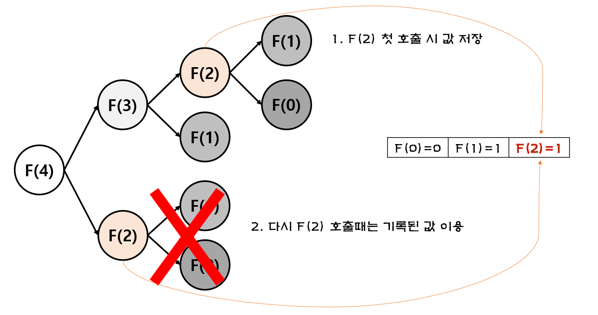

# BOJ 2749

## 문제 설명

- 문제: [백준 2749](https://www.acmicpc.net/problem/2749)

이 문제는 아주 큰 피보나치 수를 구하는 문제입니다. 주어진 수 N에 대해 N번째 피보나치 수를 어떤 수로 나눈 나머지를 구하면 되는 문제입니다. 이 문제는 피보나치 수를 구하기만 하면 되기 때문에 굉장히 쉬워 보이지만 N이 $10^{18}$이하의 자연수라는 점이 문제가 됩니다. $O(N)$ 시간 복잡도로는 절대 풀 수 없는 문제입니다.

## 사전 지식

이 포스트에서는 N번째 피보나치 수를 구하는 방법에 대해 말해보고자 합니다! 그전에 피보나치 수열에 대해 간단히 살펴보죠. 피보나치 수열은 다음 조건을 만족하는 수열입니다.

$F_{n} = F_{n-1} + F_{n-2} \quad (n \geq 2)$
$F_0 = 0, \; F_1 = 1$
이 피보나치 수열의 N번째 항을 구하는 데는 여러 가지 방법이 있겠지만 가장 대중적으로 알려진 방법 두 개를 소개해 드리겠습니다. 잘못된 방법과 다이나믹 프로그래밍을 이용한 일반적인 방법 두 개로요.

### 잘못된 피보나치 수열 구하기

가장 쉽게 접근할 수 있는 방식은, 재귀 함수를 이용한 방법입니다. 이 방식은 n번째 항을 알기 위해서 n-1, n-2번째 항을 알면 된다는 사실에 기인합니다. 따라서 다음과 같은 재귀를 통해 n번째 항을 구할 수 있을 것입니다.

```python
def fibonacci(n):
	if n == 0:
		return 0

	elif n == 1:
		return 1

	else:
		return fibonacci(n - 1) + fibonacci(n - 2)
```

하지만 이 방법을 실제로 사용한다면, n이 100 정도만 되어도 계산이 되지 않는 치명적인 문제가 있습니다. 그 이유는 같은 값을 너무 많이 호출한다는 것입니다. 다음 사진은 n == 4일 때 재귀 함수가 어떻게 호출되는 지를 나타낸 도식화 한 것입니다.



위 그림에서 볼 수 있듯이 F(2), F(1), F(0)등이 여러 번 호출됨을 알 수 있습니다. 특히 F(2)는 한번 더 호출되는 경우 재귀적으로 F(1), F(0)을 추가로 호출합니다. 이렇게 재귀적으로 계속 아랫 차수의 함수를 호출하기 때문에, n이 조금만 커져도 함수 호출 횟수가 지수급으로 증가하게 됩니다.

(총 함수 호출 횟수가 피보나치 수열의 일반항과 같은 $O({(\frac{1 + \sqrt5}{2})}^n)$이 됩니다. 자세한 내용은 [2] 문서를 참고)

2.2 Memoization을 이용한 O(N) 피보나치 수열 구하기
위에서 언급한 한번 구한 값을 다시 활용할 수 있는 방법은 없을까요? 당연히 가능합니다. n번째 값을 구했는데 그 값이 다시 활용이 된다면, 리스트에 기록해 두고 사용하면 되겠죠. 이런 방법을 memoization이라고 합니다. 동적 계획법에서 많이 사용되는 방법 중 하나입니다. 그림으로 먼저 살펴보시죠.



F(2)가 호출되는 경우, 그 값을 리스트에 저장해 두고 다음번에 호출할 때는 아래 차수의 함수를 호출하지 않고 바로 리스트에 있는 값을 사용하면 됩니다. 이런 식으로 F(3), F(4) 등등도 값을 저장해둔다면 한번 구한 값은 별도의 함수 호출 없이 빠르게 구할 수 있습니다. 코드는 다음과 같습니다.

```python
memoization = [0, 1]

def fibonacci(n):
	if n < len(memoization):
		return memoization[n]

	else:
		res = fibonacci(n - 1) + fibonacci(n - 2)
		memoization.append(res)
		return res
```

크게 달라진 점은 없습니다. 다만, memoization이라는 리스트를 만들어 두고, n번째 피보나치 수를 활용해야 할 때가 있을때, 그 값이 이미 구한 적이 있다면 값이 저장되어 있는 리스트에서 가져와서 사용하면 됩니다. 당연히 리스트의 접근에 소요되는 시간은 $O(1)$이구요. 반면 값을 구한 적이 없다면 이전 값들을 이용해 계산을 해야겠죠. 계산이 끝나면, 그 값을 리스트에 저장한 후 반환하면 됩니다.

여기서 시간 복잡도에 대한 의문이 들 수 있는데, n-1번째 값을 구했다면, 그 이전 n-1 이하 차수의 피보나치 수는 다 기록되어 있는 것이고, n-2번째 값은 $O(1)$만에 구할 수 있습니다. 즉, n번째 피보나치 수를 구하는 시간을 T(n)이라고 한다면, 다음과 같이 표현할 수 있습니다.

$$
T(n) = T(n-1) + O(1)
$$

즉, n번째 피보나치 수를 구하는 시간 복잡도는 $O(n)$이 됩니다.

여기에선 memoization을 설명하기 위해 재귀 함수를 이용했지만 사실 bottom-up 방식으로 반복문을 통해 작은 값부터 채워 나가는 것이 함수 호출이 없기에 조금 더 빠릅니다. 물론 시간 복잡도 자체는 역시 $O(n)$입니다.

```python
memos = [0, 1]

def fibonacci(n):
	if n < len(memos):
		return memos[n]

	else:
		for i in range(len(memos), n + 1):
			memos.append(memos[i - 1] + memos[i - 2])
		return memos[-1]
```

---

## 접근 방법

하지만 위에서 설명한 $O(n)$방식으로는 n이 $10^{18}$정도 되는 경우 구하기 굉장히 힘듭니다. 따라서 더욱 빠른 방법을 찾아보던 와중, 재밌는 점화식을 발견했고, 이를 응용해 문제를 푸는 법을 고안해 봤습니다.

### 피보나치 수열의 점화식

피보나치 수열에 대해, 다음과 같은 식들이 성립합니다.

> $F_{2n} = {(F_{n})}^2 + 2(F_{n}F_{n-1})$ > $F_{2n-1} = {(F_{n})}^2 + {(F_{n-1})}^2$

다소 놀라우면서도 비 직관적인 식들이네요. 바로 증명해 봅시다.

$$
\begin{aligned} F_{2n} &= 1 * F_{2n-1} + 1 * F_{2n-2} \\ &= 2 * F_{2n-2} + 1 * F_{2n-3} \\ &= 3 * F_{2n-3} + 2 * F_{2n-4} \\ &= \cdots \\ &= A_i * F_{2n-i} + B_i * F_{2n-i - 1} \end{aligned}
$$

여기서 마지막 줄을 다음과 같이 풀어서 적을 수 있습니다.

$$
\begin{aligned} F_{2n} &= A_i * F_{2n-i} + B_i * F_{2n-i - 1} \\ &= (A_i + B_i) * F_{2n-i-1} + A_i * F_{2n-i - 2} \\ &= A_{i+1} * F_{2n-i-1} + B_{i+1} * F_{2n-i - 2} \end{aligned}
$$

즉, $A_{i+1} = A_{i} + B_{i}, B_{i+1} = A_{i}$ 이므로, $B_{i}$에 대한 식은 다음과 같이 쓸 수 있습니다.

$$
\begin{aligned} B_{i+1} &= A_{i}\\ &= A_{i-1} + B_{i-1} \\ &= B_{i} + B_{i-1} \quad(i \geq 2, \; B_1 = 1, \; B_2 = 1) \\ \end{aligned}
$$

여기서 $B_{i}$에 대한 점화식은 및 초항이 피보나치 수열과 같기 때문에, $B_{i} = F_{i},\; A_{i} = F_{i+1}$로 쓸 수 있습니다. 이 값을 위의 식에 다시 대입하면, 다음 결과를 얻습니다.

$$
\begin{aligned} F_{2n} &= A_i * F_{2n-i} + B_i * F_{2n-i-1} \\ &= F_{i+1} * F_{2n-i} + F_i * F_{2n-i-1} \\ &= F_{n} * F_{n+1} + F_{n-1} * F_{n} \quad (i \leftarrow n-1)\\ &= F_{n} * (F_{n} + F_{n-1}) + F_{n-1} * F_{n} \\ &= {(F_{n})}^2 + 2(F_{n-1}F_{n}) \\ \end{aligned}
$$

마찬가지로 홀수 항에 대해서도 일반항을 얻을 수 있습니다.

$$
\begin{aligned} F_{2n-1} &= F_{2n} - F_{2n-2} \\ &= {(F_{n})}^2 + 2(F_{n-1}F_{n}) - {(F_{n-1})}^2 - 2(F_{n-2}F_{n-1}) \\ &= {(F_{n})}^2 + F_{n-1}(2F_{n} - F_{n-1} - 2F_{n-2}) \\ &= {(F_{n})}^2 + F_{n-1}(F_{n} - F_{n-2}) \\ &= {(F_{n})}^2 + {(F_{n-1})}^2 \\ \end{aligned}
$$

(직관적인 풀이를 위해 순차적으로 진행해봤지만 수학적 귀납법을 이용하면 더 쉽게 증명 가능합니다!)

### 높은 차수를 낮은 차수로부터 구하기

위 장에서 본 것과 같이 $F_{2n}$, $F_{2n-1}$은 $F_{n}$, $F_{n-1}$을 통해 구할 수 있습니다. 이 식을 이용해 이 장에서는 높은 차수의 피보나치 수를 낮은 차수의 피보나치 수로부터 구하는 과정을 살펴봅시다.

$F_{2n}$, $F_{2n-1}$은 $F_{n}$, $F_{n-1}$을 통해 구할 수 있는데, 그렇다면 $F_{n}$, $F_{n-1}$은 어떻게 구하면 될까요?

$n = 2k$인 경우와 $n = 2k + 1$인 경우로 나누어 봅시다.

$n = 2k$인 경우
이 경우에는 문제가 없겠죠. 역시 재귀적으로 $F_{2k}$, $F_{2k-1}$은 $F_{k}$, $F_{k-1}$를 통해 구하면 됩니다.

$n = 2k + 1$인 경우
이 경우는 조금 생각을 해 봐야 합니다. $n = 2(k+1) - 1$이고, $n-1 = 2k$니까 $F_{n}$, $F_{n-1}$의 값을 구하기 위해서는 각각 $F_{k+1}$, $F_{k}$ 와 $F_{k}$, $F_{k-1}$, 즉 세 개의 값이 필요하게 되는 것이죠.

여기서 약간의 아이디어를 이용해 봅시다. $F_{n-1}$, $F_{n}$ 대신 $F_{n}$, $F_{n+1}$을 구해보는 거죠. 이 값은 $F_{k+1}$, $F_{k}$ 두 개의 값만을 이용해 구할 수 있습니다.

그럼 $F_{n-1}$은? 피보나치 수열의 점화식을 이용하면 됩니다. $F_{n-1} = F_{n+1} - F_{n}$이니까요.

이 과정을 통해서 큰 차수의 피보나치 수열을 작은 차수의 피보나치 수열로 쪼개서 계산할 수 있는 기틀을 모두 만들었습니다. Top-down 방식의 재귀를 이용해서 구현할 수 있겠네요.

반면 시간 복잡도 역시 고려해 봅시다. 2로 나누는 과정을 k번 반복해서 1이 된다고 하면, 대략적으로 $2^k = n$이라고 볼 수 있습니다. 따라서 k, 즉 함수의 호출 횟수가 $O(lgn)$이라는 뜻입니다. $O(n)$이 걸리던 기존 방식에 비해 훨씬 빠르고 볼 수 있겠네요.

($lg(n)$은 $log_2(n)$을 의미합니다.)

$n = 10^{18}$일 때 $lg(n) \approx 59.79$ 정도 되니 약 60번 정도의 함수 호출 내에 답을 구할 수 있게 됩니다.

## 코드 설명

### base case

fibonacci*pair 함수는 입력이 ($2k-1, 2k$)라면 출력으로 ($F*{2k-1}, F\_{2k}$)를 반환하는 함수입니다. 수월한 계산을 위해 무조건 입력으로 홀수 값과 짝수 값을 받습니다.

`base case`로 입력이 (1, 2) 일 때 ($F_1, F_2$) 값인 (1, 1)을 반환합니다.

```python
# Input: 2k-1, 2k -> Output : F_2k-1, F_2k
def fibonacci_pair(odd_N, even_N):
	# F_1, F_2 == 1, 1
	if odd_N == 1:
		return 1, 1

```

### recursive case

recursive case를 살펴봅시다. 입력으로 2k-1, 2k를 받았으니 k가 짝수와 홀수인 경우로 나누어 생각해 봅시다. 3.2장에서 설명한 바와 같이 짝수인 경우는 별도의 작업을 거칠 필요 없이 k-1, k번째 피보나치 수를 재귀적으로 구하면 됩니다.

반면 홀수인 경우에는 설명한 것처럼 k-1, k 번째 피보나치 수 대신 k, k+1번째 피보나치 수를 구하면 됩니다.

```python
else:
	half_N = even_N // 2
	is_half_odd = False

	# If k is odd, we calculate (F_k+1, F_k) rather than (F_k, F_k-1)
	if half_N % 2 == 1:
		half_N += 1
		is_half_odd = True

	# F_k, F_k+1 or F_k-1, F_k
	res_pre_half, res_half = fibonacci_pair(half_N - 1, half_N)
```

이후 k-1번째 피보나치 수는 k+1번째 피보나치 수에서 k번째 피보나치 수를 빼면 됩니다. 참고로 res_half는 k번째 피보나치 수, res_pre_half는 k-1번째 피보나치 수를 의미합니다.

```python
# if F_k, F_k+1 case, get F_k-1 by using F_k, F_k+1
if is_half_odd:
	temp = res_half - res_pre_half
	res_half = res_pre_half
	res_pre_half = temp
```

마지막으로 피보나치 수열의 점화식을 이용해 2k-1, 2k 번째 피보나치 수를 구하면 됩니다.

문제에서 요구한 것이 피보나치 수를 어떤 수로 나눈 나머지인데, 피보나치 수를 다 구한 다음에 나누면 숫자가 너무 커지므로 매번 함수를 반환하기 전에 미리 나눈 후 나머지를 반환해 줍니다.

```python
# F_2k-1 = (F_k)^2 + (F_k-1)^2
res_odd = res_half * res_half + res_pre_half * res_pre_half
res_odd %= divider

# F_2k = (F_k)^2 + 2*(F_k)*(F_k-1)
res_even = res_half * res_half + 2 * res_half * res_pre_half
res_even %= divider

return res_odd, res_even
```

## 결론

수학적 지식을 이용해 아주 큰 피보나치 수를 구하는 방법을 사용했습니다. [다른 방법들에 대한 글](https://www.acmicpc.net/blog/view/28)도 읽어보시길 바랍니다.

코드 원본은 [여기](./codes/2020-11-09.cpp)를 참고해 주시면 됩니다.

## References

1. [피보나치 수를 구하는 여러가지 방법](https://www.acmicpc.net/blog/view/28)
2. [피보나치 수 (위키)](https://en.wikipedia.org/wiki/Fibonacci_number)
3. [백준 2749](https://www.acmicpc.net/problem/2749)
4. [백준 11444 (동일 문제)](https://www.acmicpc.net/problem/11444)
