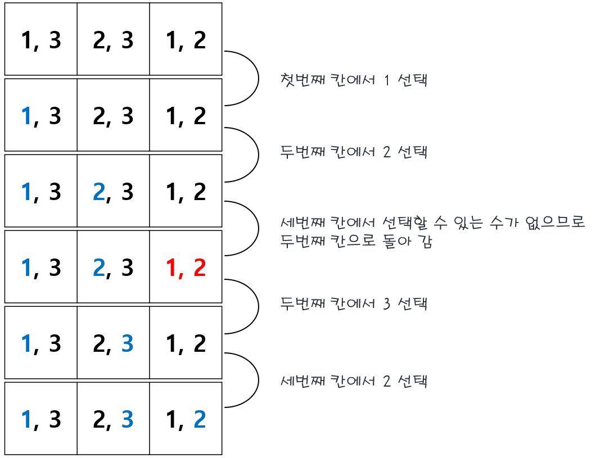
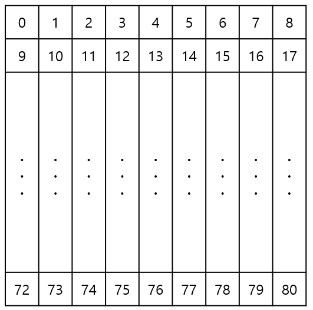

# BOJ 2239

## 문제 설명

- 문제: [백준 2239](https://www.acmicpc.net/problem/2239)

매우 간단한 문제입니다. 각 칸이 한 자리 정수로 이루어진 `9*9` 격자 칸이 입력이 주어집니다. 0은 빈칸을, 0이 아닌 수는 스도쿠에 미리 들어가 있는 수를 의미합니다. 스도쿠 규칙에 따라 빈칸을 채워서 그대로 출력하면 됩니다.

## 사전 지식

문제를 푸는데 가장 중요한 점은 백트래킹이라는 기법입니다. `N-Queen` 문제의 해법으로 널리 알려져 있는 풀이법이고, 여기서는 간단하게만 설명할 예정입니다. 자세한 설명은 참고 자료를 확인하시기 바랍니다.

백트래킹을 쉽게 설명하자면 일종의 미로 찾기라고 생각하시면 됩니다. 미로를 헤쳐 나가는데 두 갈래의 갈림길이 나왔다고 생각해 봅시다. 첫 번째 길로 들어서서 가다가 막힌 길이 나오면, 다시 갈림길로 돌아가 두 번째 길로 들어서면 됩니다.

직관적인 내용이지만, 이를 잘 응용하면 가능한 모든 경우의 수를 `brute force`보다 훨씬 효과적으로 탐색할 수 있습니다. 간단한 예시를 봅시다.

세 개의 칸이 있고, 각 칸에 1, 2, 3을 하나씩 넣을 수 있다고 해 봅시다. 첫 번째 칸에는 1과 3, 두 번째 칸에는 2와 3, 세 번째 칸에는 1과 2를 넣을 수 있다고 생각해 봅시다. 이를 백트래킹을 이용해 풀어봅시다.



첫 번째, 두 번째에서 각각 1, 2를 선택한 경우에는 세 번째 칸의 값을 선택할 수 없으므로 두 번째 칸으로 다시 돌아가 다른 값을 선택하면 됩니다. 이렇게 유효하지 않은 길은 제거하고, 유효한 모든 길을 찾는 것을 백트래킹이라고 합니다.

## 접근 방법

위에서 설명한 백트래킹을 이용해 빈 값을 채워 스도쿠를 완성시킬 수 있습니다. 왼쪽 위에서 부터 오른쪽 아래까지 순차적으로 가능한 값을 넣되, 어떤 칸에서 가능한 값이 하나도 없을 경우 다시 이전 칸으로 돌아가서 다른 값을 넣어보는 식으로 문제를 풀어보기로 했습니다. 이를 순차적으로 정리해보면 다음과 같습니다.

```
1. 왼쪽 위에서부터 오른쪽 아래까지 빈칸을 채워나간다.
2. 현재 칸의 행, 열, 박스 내의 숫자를 모두 비교해 칸에 들어갈 수 있는 값들을 구한다.
3. 현재 칸에 들어갈 값이 있는지 확인한다.
 1) 현재 칸에 들어갈 값이 있는 경우 가장 작은 숫자를 넣고 넣은 값을 들어갈 수 있는 값에서 제외한다.
 2) 현재 칸에 들어갈 값이 없는 경우 이전 칸으로 이동해 3번 과정을 다시 수행한다.
4. 다음 칸으로 이동해서 2번 과정을 수행한다.
5. 모든 빈칸을 다 채우면 종료한다.
```

추가로 각 칸에 접근하기 쉽게 하기 위해 왼쪽 위에서부터 오른쪽 아래까지 다음과 같이 0부터 1씩 증가시키며 번호를 매겼습니다. 이 번호를 나타내는 `depth`라는 변수를 이용했습니다.



## 코드 설명

### 백트래킹

`backtrack`이라는 함수를 이용해 스도쿠를 채우려 했습니다. 이 함수는 정수 번호 `depth`를 입력으로 받아 `depth`번째 칸의 빈칸을 채우고, 칸이 채워지면 `depth + 1`번째 칸을 채우는 방식을 이용했습니다.

이 함수를 시작할 때 `depth`가 81인 경우, 즉 모든 칸을 다 채운 경우라면 `is_finished` 태그를 이용해 스택에 쌓여있는 모든 함수를 반환하고 종료합니다.

```cpp
if(depth == 81){
    is_finished = true;
    return;
}
```

반면 현재 칸의 값이 0이 아니라면, 이미 채워져 있는 칸이라는 의미이므로 다음 칸으로 넘어가면 됩니다.

```cpp
if(arr[row][col] != 0){
    backtrack(depth+1);
    return;
}
```

현재 칸이 빈칸이면, 4.2장에 후술 될 후보자 색출 함수(`get_candidates`)를 이용해 현재 칸에 들어갈 수 있는 값을 계산합니다. 그 값들 중 작은 값부터 현재 칸에 넣고, 다음 칸을 채우는 함수를 호출합니다. 만약 다음 칸을 호출한 함수가 끝났는데 스도쿠가 다 채워졌다는 신호를 받으면 함수를 그대로 반환합니다.

```cpp
std::vector<int> candidates = get_candidates(row, col);

// Repeat every possible values
for(auto i : candidates){
	arr[row][col] = i;

	backtrack(depth+1);

	if(is_finished)
		return;
}
arr[row][col] = 0;
```

모든 가능한 값이 유효하지 않은 경우 이전 칸으로 돌아가서 다시 시작해야 하기 때문에 현재 칸을 빈칸으로 돌려놓습니다.

### 후보자 색출 함수

현재 칸에 들어갈 수 있는 모든 값을 찾는 과정 역시 필요합니다. 이를 `get_candidates`함수로 구현했습니다. 이 함수는 현재 칸의 행과 열을 입력으로 받아 조건에 만족하는 가능한 값을 찾는 함수입니다.

우선 `not_visitable`이라는 `boolean` 배열을 선언합니다. 이 배열의 i번째 값은 i가 현재 칸에 들어갈 수 없으면 `true`, 있으면 `false`를 가집니다. 현재 칸과 같은 행, 열, 박스에 있는 값들을 모두 확인 해 `not_visitable[i]`를 `true`로 변경합니다. 여기서 `box_row, box_col`은 각각 현재 박스의 가장 위 행, 가장 위 열을 의미합니다.

```cpp
bool not_visitable[10] = {0};

int box_row = ((row / 3) * 3);
int box_col = ((col / 3) * 3);

// Remove invalid numbers
for(int i = 0; i < 9; i++){
    if(arr[row][i] != 0){
        not_visitable[arr[row][i]] = true;
    }
    if(arr[i][col] != 0){
        not_visitable[arr[i][col]] = true;
    }
    if(arr[box_row + (i / 3)][box_col + (i % 3)] != 0){
        not_visitable[arr[box_row + (i / 3)][box_col + (i % 3)]] = true;
    }
}
```

`not_visitable[i]`의 값을 이용해 현재 칸에 들어갈 수 있는 모든 값을 작은 순 대로 정수 벡터에 넣어줍니다.

```cpp
std::vector<int> candidates;
for(int i = 1; i <= 9; i++){
    if(!not_visitable[i])
        candidates.push_back(i);
}
```

## 결론

백트래킹 알고리즘 자체가 처음 배울 때는 어려워 보이지만, 한 번 익히면 응용하기 굉장히 쉽기 때문에 꼭 이 문제가 아니더라도 한 번쯤은 풀어볼 만합니다. 특히 `N-Queen` 문제는 시간제한 내에 풀려면 약간의 센스가 필요해서 푸는 재미가 있습니다!

코드 원본은 [여기](./codes/2021-04-11.cpp)를 참고해 주시면 됩니다.

## References

1. [백트래킹 (블로그)](https://idea-sketch.tistory.com/29)
2. [백트래킹 (위키)](https://en.wikipedia.org/wiki/Backtracking)
3. [백준 2239](https://www.acmicpc.net/problem/2239)
4. [백준 2580 (동일 문제)](https://www.acmicpc.net/problem/2580)
