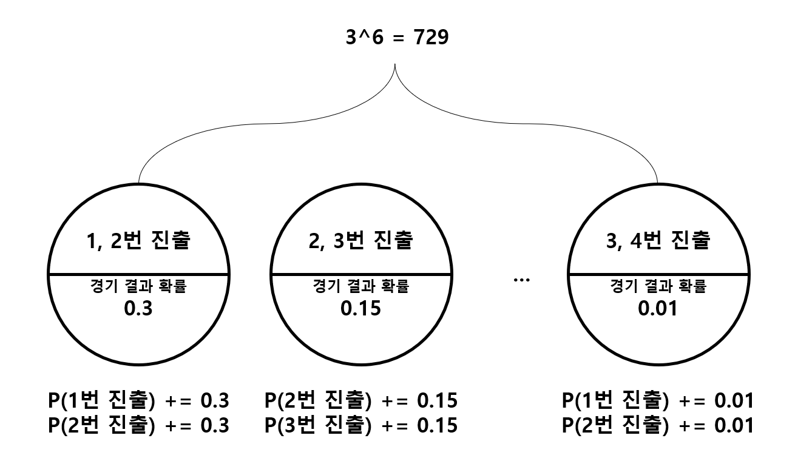
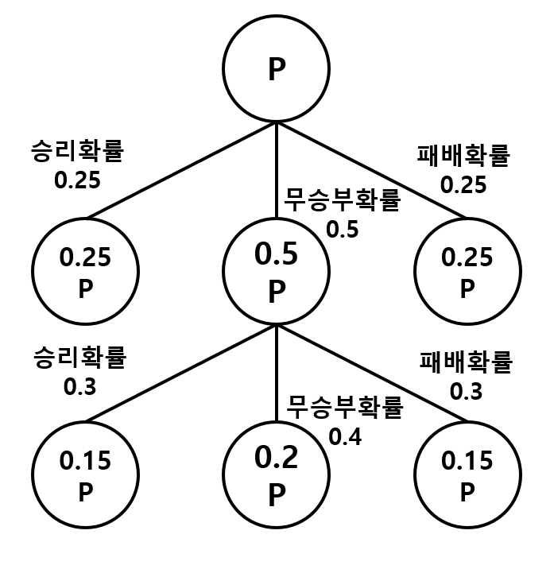

# BOJ 15997

## 문제 설명

- 문제 : [백준 15997](https://www.acmicpc.net/problem/15997)

이 문제는 네 개의 나라가 리그 식으로 경기를 진행하고, 각 경기마다 승패 할 확률이 주어집니다. 각 나라는 승리 시 3점, 무승부 시 각 1점을 얻고, 점수가 높은 두 나라가 진출할 경우 각 나라가 진출할 확률을 구하는 문제입니다.

`4C2 = 6`이므로, 총 6번의 경기에 대한 승패 확률이 주어집니다. 알고리즘을 세워 푸는 문제라기보다는 구현 능력을 요구하는 문제입니다.

## 사전 지식

이 문제는 알고리즘을 요구하는 문제는 아니기 때문에 사전 지식은 거의 필요 없습니다. 다만 문제에서 사용한 C++ stl의 `sort` 함수에 대해서만 간단히 설명하고자 합니다.

### C++ stl sort 함수

C++의 `<algorithm>` 헤더에서는 std::sort라는 함수를 제공합니다. 이 함수는 `first`, `last`라는 처음과 끝 주소(더 정확히는 `iterator`)를 받아서, 그 사이의 데이터를 오름차순으로 정렬합니다. 별도의 인자가 없다면 정렬에 `<` 연산을 사용하지만, `bool`형 값을 반환하는 `compare` 함수를 직접 인자로 줘서 정렬 방법을 결정할 수도 있습니다.

`std::sort` 함수는 저희가 직접 구현하는 것보다 효율적이며, `O(NlogN)`의 평균 시간 복잡도를 가집니다. 직접 정렬하는 함수를 만들어 사용할 수 있다면 당연히 좋지만, 잘 알려진 퀵, 합병, 힙 정렬 등은 제대로 된 성능을 내도록 구현하기 힘듭니다. ([참고 자료](https://www.acmicpc.net/board/view/31887))

## 접근 방법

### 모든 경우의 수

어떤 나라가 본선에 진출할 확률은 어떻게 구할 수 있을까요? 어떤 나라가 본선에 진출하는 모든 경기 결과의 집합을 A라고 합시다. 이때 첫 번째 나라가 본선에 진출할 확률은 A에 속하는 각 경기 결과 a에 대해, a가 일어날 확률을 모두 더한 값과 같습니다. 모든 경기가 다 치러졌을 때 해당 경기 결과 a가 나올 확률을 "경기 결과 확률", 어떤 나라가 본선에 진출할 확률, 즉 각 나라에 대해 경기 결과 확률을 다 더한 것을 "진출 확률"이라고 합시다.

즉, 어떤 팀이 본선에 진출할 확률을 구하는 법은, 모든 경기 결과를 살펴보면서 경기 결과 확률과 경기 결과에 따라 누가 진출하는지 두 가지만 보면 됩니다. 어떤 경기에 대해 나라 C1, C2가 진출한다면, 경기 결과 확률을 C1, C2 각각의 진출 확률에 더해주면서 값을 계산해주면 됩니다. 단, 진출 확률은 처음에는 모든 나라에 대해 0으로 초기화되어야겠죠.

가능한 경기 결과의 수는 $3^6 = 729$개 이므로, 다 살펴보는 데 시간적인 문제는 없을 것입니다. 다음 그림과 같습니다.



그렇다면 모든 경기 결과를 어떻게 다 체크할까요? 6중 for문을 통해 각 경기 결과를 다 바꿔가면서 계산하는 방법도 있지만, 여기서는 완전 탐색을 이용해 모든 경우를 체크해보는 방법을 사용하고자 합니다.

dfs를 수행하면서 각 함수가 한 번 호출될 때마다 한 경기 결과가 정해진다고 생각하면서, 한 함수 내에서 한 경기에 대해 3개의 결과를 나눠서, 다음 경기를 나타내는 함수를 호출합니다. 즉, `승리/무승부/패배` 에 대해 각각 다음 경기를 나타내는 함수를 호출하면 됩니다.

모든 경기(총 6개)를 다 진행할 때까지 반복하고, 경기가 다 끝나면 경기 결과 확률과 각 나라의 점수를 구합니다. 각 나라의 점수는 경기 결과가 정해지면 자동으로 정해지기 때문에 쉽게 구할 수 있습니다. 이를 이용해 상위 2개의 점수를 가지는 두 팀을 구하면 됩니다.

경기 결과 확률은 어떻게 구할 수 있을까요? 모든 사건이 독립이기 때문에 각 경기마다 일어날 확률을 모두 곱하면 됩니다. dfs를 수행할 때, 현재 경기 이전까지 일어날 확률에 현재 경기에서 일어날 확률을 곱해서 다음 함수를 호출할 때 전달해주면 됩니다. 다음 그림을 통해 직관적으로 이해하실 수 있을 겁니다.



### 동일 점수

경기 결과가 정해지면, 점수는 규칙에 따라 자동적으로 정해집니다. 점수에 따라 나라들을 정렬해서 점수가 가장 큰 나라 두 개를 구하고, 경기 결과 확률을 진출 확률에 더해주면 됩니다.

하지만 문제가 있습니다. 각 나라끼리 점수가 같을 때는 어떻게 해야 할까요? 점수가 같은 경우의 수는 다음과 같이 여러 가지 경우가 있습니다.

```
1. 4개의 나라의 점수가 모두 동일
2. 1,2,3등 나라의 점수가 모두 동일
3. 2,3,4등 나라의 점수가 모두 동일
4. 2,3등 나라의 점수가 동일 (나머지는 상이)
5. 1,2등 나라의 점수가 동일 (나머지는 상이)
6. 3,4등 나라의 점수가 동일 (나머지는 상이)
7. 1,2등 나라의 점수가 동일하고, 3,4등 나라의 점수가 별개로 동일
```

위와 같이 총 7개의 경우가 있는데, 5,6,7번은 고려할 필요가 없습니다. 점수가 동일한 것이 진출하는 것에 영향을 주지 못하기 때문입니다. 1,2등의 점수가 동일하든 안 하든 (3,4등 나라와 점수만 다르면) 1,2등이 진출하는 것은 확정입니다. 따라서 1,2,3,4번 총 네 개의 경우만 살펴보면 됩니다. 각 경기 결과 확률을 p라고 합시다.

1. 4개의 나라의 점수가 모두 동일한 경우

문제에서 주어진 대로, 4명의 나라가 추첨을 통해 등수를 정하게 됩니다. 4개 중 2개를 공정한 확률로 선정할 확률이므로, 각 나라가 선정되어 진출할 확률은 2/4 = 1/2입니다. 따라서 p \* 1/2을 모든 나라의 진출 확률에 더해주면 됩니다.

2. 1,2,3등 나라의 점수가 모두 동일

1번에서 수행한 것과 비슷하지만, 4등을 제외한 3개의 나라 중 2개의 나라를 선정하는 확률입니다. 각각 나라가 진출할 확률은 2/3이 되고, 역시 p \* 2/3을 1,2,3등 나라의 진출 확률에 더해주면 됩니다.

3. 2,3,4등 나라의 점수가 모두 동일

2번과 비슷하지만 조금 다릅니다. 이 경우는 1등이 정해져 있기 때문에, 2,3,4등 나라 중 2등 한 자리를 뽑아야 합니다. 따라서 진출할 확률은 1/3이 되고, 2,3,4등 나라의 진출 확률에 대해서는 p/3을 더하고, 1등 나라의 진출 확률에는 p를 더해주면 됩니다.

4. 2,3등 나라의 점수가 동일 (나머지는 상이)

이 경우는 1등, 4등이 정해져 있으므로 2,3등 중 한 팀이 1/2의 확률로 진출합니다. 1등의 진출 확률에 p를, 2,3등의 진출 확률에 p/2를 더하면 됩니다.

3.3 경기를 표시하는 방법
경기는 6번 치러집니다. 따라서 각 경기에 0번부터 5번까지 숫자를 매겨, 어떤 경기에 몇 번째 나라와 몇 번째 나라가 경기를 치르는지 고정시키려고 했습니다. 즉, 0번 경기는 0번째 나라와 1번째 나라의 경기, 1번 경기는 0번째 나라와 2번째 나라의 경기... 이런 식으로요. 그림으로 표현하면 다음과 같습니다.


이때 경기와 이를 나타내는 나라 사이에 이동하는 함수가 필요했습니다. 경기 번호로 나라들을 구하는 함수를 unpack, 나라 번호들로 경기 번호를 구하는 함수를 pack이라고 명명했습니다.

## 코드 설명

이 문제는 코드가 이전 포스트들에 비해 조금 길어서 더 자세히 나눠서 설명하고자 합니다.

### 전역 변수

```cpp
// 승, 무승부, 패를 나타내는 열거형 타입
enum match_result {win = 0, tie = 1, lose = 2, none};

// 나라 이름을 저장하는 문자열의 배열
char countries[4][11];

// 각 경기별로 경기 결과를 저장하는 match_result 타입의 배열
// result[i]가 win이면 i번째 경기의 앞에 오는 나라가 승리했다는 의미.
enum match_result results[6] = {none, };

// 각 경기별로 승, 무승부, 패를 예측한 확률, 문제에서 주어짐.
double predicts[6][3] = {.0};

// 각 나라별로 본선에 진출할 확률
double total_probs[4] = {.0};

// <i, i번째 나라 점수>값을 가지는 쌍, 4.5에서 점수를 정렬할 때 사용
std::pair<int, int> pts[4];
```

### 입출력 및 저장

우선 네 개의 나라를 입력으로 받고, 총 6번에 걸쳐 경기를 하는 나라 쌍과 경기의 승, 패, 무승부 확률을 입력으로 받습니다. 각 나라 이름을 index로 표현합니다. 여기서 3번 나라, 2번 나라 순으로 저희가 정한 순서에 역으로 입력이 주어지는 경우가 있습니다. 즉 두 번째 나라의 index가 첫 번째 나라의 index보다 작은 경우 나라의 순서를 바꾸고 승, 무승부, 패 확률을 반대로 입력합니다.

```cpp
for(int i = 0; i < 4; i++){
  scanf("%s", countries[i]);
}

for(int i = 0; i < 6; i++){
  scanf("%s", con_1);
  scanf("%s", con_2);
  scanf("%lf", &w_r);
  scanf("%lf", &t_r);
  scanf("%lf", &l_r);

  reversed = false;
  idx_1 = find_idx_countries_as_name(con_1);
  idx_2 = find_idx_countries_as_name(con_2);

  if(idx_2 < idx_1){
    int temp = idx_2;
    idx_2 = idx_1;
    idx_1 = temp;
    reversed = true;
  }

  temp_idx = pack(std::pair<int,int>(idx_1, idx_2));

  if(reversed){
    predicts[temp_idx][win] = l_r;
    predicts[temp_idx][tie] = t_r;
    predicts[temp_idx][lose] = w_r;
  }
  else{
    predicts[temp_idx][win] = w_r;
    predicts[temp_idx][tie] = t_r;
    predicts[temp_idx][lose] = l_r;
  }

}

dfs(1.0, 0);
```

나라 이름을 index로 표현하는 함수 find_idx_countries_as_name은 다음과 같습니다. 문자열로 주어지는 입력을 처리하기 위해 만든 함수입니다.

```cpp
int find_idx_countries_as_name(char* name){
    for(int i = 0; i < 4; i++){
        if(strcmp(name, countries[i]) == 0)
            return i;
    }

    exit(-1);
}
```

### DFS - Recursive case

입출력을 다 받고 값들을 저장하면 dfs를 수행하며 모든 경우를 다 살펴보면 됩니다. 이 함수는 총 몇 경기를 진행했는지를 나타내는 정수 depth와 현재 경기까지 일어날 확률을 계산한 실수 prob를 인자로 받습니다.

depth가 6보다 작은 경우는 아직 남은 경기가 있다는 의미입니다. 다음 경기가 승, 패, 무승부 세 가지 경우로 나뉠 수 있으므로 세 가지 경우로 나눕니다.

만약 다음 경기가 이기거나 지거나 비길 확률이 0이라면, 굳이 확률을 계산할 필요가 없습니다. (어차피 일어나지 않을 일이므로) 따라서 0이 아닌 경우에만 각 [승리/무승부/패배]하는 경우에 대해 depth를 1 증가시키고 prob에 현재 경기에서 [승리/무승부/패배]할 확률을 곱해서 dfs 함수를 호출하면 됩니다.

```cpp
// Use dfs for exhaustive search
void dfs(double prob, int depth){
    if(depth != 6){
        if(predicts[depth][win] != 0.0){
            results[depth] = win;
            dfs(prob * predicts[depth][win], depth + 1);
        }


        if(predicts[depth][tie] != 0.0){
            results[depth] = tie;
            dfs(prob * predicts[depth][tie], depth + 1);
        }

        if(prob != 0.0){
            results[depth] = lose;
            dfs(prob * predicts[depth][lose], depth + 1);
        }

        return;
    }
    // 뒤 내용으로 이어집니다.
```

### DFS - Base case

depth가 6인 경우는 모든 경기를 다 수행한 경우이고, 이 경우는 경기 결과 확률만큼 상위 두 나라의 진출 확률 값을 더해주면 됩니다. pts[i].second는 i번째 등수의 나라 번호를 나타냅니다.(4.5 참고) 하지만 만약 동점인 나라가 있다면 3.2에서 설명한 바와 같이 확률을 나눠서 각 나라들의 진출 확률에 더해주면 됩니다.

```cpp
// 앞 내용에서 이어짐
else{
        if(prob == 0.0)
            return;

        //4.5에서 설명
        clear_points();
        set_points();

        if(pts[0].second == pts[1].second && pts[1].second == pts[2].second && pts[2].second == pts[3].second){
            for(int i = 0; i < 4; i++){
                total_probs[i] += prob / 2;
            }
        }

        else if(pts[0].second == pts[1].second && pts[1].second == pts[2].second){
            total_probs[pts[0].first] += 2 * prob / 3;
            total_probs[pts[1].first] += 2 * prob / 3;
            total_probs[pts[2].first] += 2 * prob / 3;
        }

        else if(pts[1].second == pts[2].second && pts[2].second == pts[3].second){
            total_probs[pts[0].first] += prob;
            total_probs[pts[1].first] += prob / 3;
            total_probs[pts[2].first] += prob / 3;
            total_probs[pts[3].first] += prob / 3;
        }

        else if(pts[1].second == pts[2].second){
            total_probs[pts[0].first] += prob;
            total_probs[pts[1].first] += prob / 2;
            total_probs[pts[2].first] += prob / 2;
        }

        else{
            total_probs[pts[0].first] += prob;
            total_probs[pts[1].first] += prob;
        }

        return;

    }
}
```

### 점수 정렬

이전 장에서 상위 두 나라를 구하기 위해 clear_points라는 함수로 pts를 초기화하고 set_points라는 함수로 pts에 현재 results에 저장된 값을 활용해 pts에 점수를 넣습니다.

pts는 <i, i번째 나라 점수>로 구성돼 있으므로, clear_points에서는 (i,0) 형태로 초기화합니다.

```cpp
// Initialize the points
void clear_points(){
    for(int i = 0; i < 4; i++){
        pts[i].first = i;
        pts[i].second = 0;
    }
}
```

set_points에서는 result에 저장된 승패 결과를 확인합니다. 총 6개 경기에 대해 승리한 경우 앞에 있는 나라에 3점을, 비긴 경우 각 1점을, 패배한 경우 뒤의 나라에 1점을 줍니다. 이후 sort함수를 이용해 pts를 나라별 점수에 따라 정렬합니다. 이 과정을 치르고 나면 pts[i].second는 i번째 나라의 등수를 나타내게 됩니다.

```cpp
// Set the points for each country as the result of match
void set_points(){
    std::pair<int, int> cons;
    for(int i = 0; i < 6; i++){
        cons = unpack(i);

        if(results[i] == win){
            pts[cons.first].second += 3;
        }

        else if(results[i] == tie){
            pts[cons.first].second += 1;
            pts[cons.second].second += 1;
        }

        else{
            pts[cons.second].second += 3;
        }
    }

    std::sort(pts, pts+4, pair_comp);
}
```

여기서 pair_comp함수는 두 개의 pair를 비교하는 함수입니다. 여기서는 pts의 점수만 비교해야 하는데, 이는 pair에서 두 번째 값이므로, second 멤버 변수를 비교하는 함수를 구성하면 됩니다. 다음과 같습니다.

```cpp
// For sort function
bool pair_comp(std::pair<int, int> p1, std::pair<int, int> p2){
    return p1.second > p2.second;
}
```

## 결론

카카오 코드 페스티벌 문제였는데, 간단해 보이지만 생각보다 푸는데 시간이 좀 걸리는 흥미로운 문제입니다. 개인적으로는 이 시리즈의 문제들의 질이 정말 좋은 것 같고, 기회가 되신다면 풀어보기를 추천드립니다.

또한 [정렬에 대한 참고 자료](https://www.acmicpc.net/board/view/31887)를 추가적으로 읽어 보시길 권장드립니다. 코드 원본은 [여기](./codes/2021-05-12.cpp)를 참고해 주시면 됩니다.

## References

1. [카카오 코드 페스티벌](https://kakaocode.com/)
2. [백준 15997](https://www.acmicpc.net/problem/15997)
3. [C++ sort 함수](https://m.cplusplus.com/reference/algorithm/sort/)
4. [C++ pair 클래스](https://cplusplus.com/reference/utility/pair/)
5. [정렬에 대한 참고 자료](https://www.acmicpc.net/board/view/31887)
