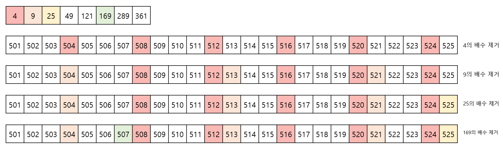

# BOJ 1016

## 문제 설명

- 문제: [백준 1016](https://www.acmicpc.net/problem/1016)

이 문제는 m 이상 M 이하의 모든 제곱 ㄴㄴ 수를 구하면 됩니다. 제곱 ㄴㄴ수란 어떠한 제곱수로도 나누어지지 않는 수를 의미합니다. m은 10^12 이하의 자연수이고, M은 m보다 최대 10^6 큰 수입니다. m과 M의 상한이 아주 크기때문에 $O(M)$의 시간으로는 풀기 힘든 문제입니다.

## 사전 지식

### 에라토스테네스의 체

이 문제를 보기 전에 에라토스테네스의 체를 다룬 이전 포스트를 보고 오시는 것을 추천드립니다. 이 문제와 긴밀히 연결되어 있고 중간중간 이전 문제에 대한 설명을 인용할 것입니다.

### 간단한 접근, 시간 복잡도

사전 지식 없이 이 문제를 푼다고 생각해 봅시다. m부터 M까지의 모든 수들에 대해, 그 수보다 작은 모든 제곱수를 구해서 나눠볼 수 있겠네요. 간단하게 코드를 짜 보자면 다음과 같습니다. 가독성을 위해 python 코드를 사용했습니다.

```python
for candidate in range(min, max + 1):
    divider = 2
    is_sqprime = True

    while candidate >= (divider * divider):
        if candidate % (divider * divider) == 0:
            is_sqprime = False
            break

        divider += 1

    if is_sqprime:
    	count += 1
```

이 방법을 사용하면, m부터 M사이의 모든 수들에 대해 최대 sqrt(M)번 만큼 제곱수를 찾는 연산이 필요하게 됩니다. 따라서 총 시간 복잡도는 O((M - m)\sqrt(M))이 되고, 주어진 문제에서 이 값은 최대 10^12 이기 때문에, 시간 내에 문제를 해결하기는 힘듭니다.

## 접근 방법

### 제곱 ㄴㄴ 수

제곱 ㄴㄴ수의 정의를 다시 살펴보죠. 어떠한 제곱수로도 나누어지지 않는 수인데, 이는 저번 주 포스트에서 살펴본 단어와 비슷합니다. 자신과 1을 제외한 어떤 수로도 나누어지지 않는 수, 즉 소수의 정의와 비슷하죠.

저번 포스트에서 소수를 구하기 위해 에라토스테네스의 체를 활용했습니다. 여기서도 비슷한 방법을 활용할 수 있겠죠. 다만 직접적인 에라토스테네스의 체를 활용하기는 쉽지 않습니다. 소수를 구하는 것이 아니기 때문이죠. 다만 M 이하의 모든 소수의 제곱수들을 안다면, 그 제곱수들의 배수를 지워 나가는 식으로 제곱 ㄴㄴ수를 구할 수 있습니다.



위 그림에서 알 수 있듯이, 525 이하의 모든 소수의 제곱수를 구합니다. 이후 에라토스테네스의 체와 같은 방법으로 해당 제곱수의 배수들을 제곱 ㄴㄴ수에서 제외합니다. 이 범위 안에 49, 121, 289, 361의 배수는 존재하지 않기 때문에 굳이 계산할 필요가 없습니다.

### 소수 제곱수 구하기

그렇다면 주어진 수 M 보다 작은 소수 제곱수들을 구하는 방법은 어떻게 될까요? 답은 간단합니다. \sqrt(M)이하의 모든 소수를 구한 뒤, 그 소수들을 제곱하면 M 이하의 모든 소수 제곱수들을 구할 수 있습니다.

### 에라토스테네스의 체 적용이 가능한 이유

다만 이 방법은 에라토스테네스의 체와 조금 다른점이 또 존재합니다. 바로 구간이 1부터 시작하지 않는다는 것입니다. 그렇다면 1부터 M까지 이 방법을 이용해 모든 제곱 ㄴㄴ수를 구한 다음에, N부터 M까지의 제곱 ㄴㄴ수만 구하면 될까요? 애석하게도, 그 방법을 사용한다면 시간복잡도가 O(M)초과가 될 텐데, M의 최댓값이 10^12이므로 시간 내에 해결하기 불가능합니다.

하지만 우리는 M - m의 값이 10^6이하라는것에 주목하면 됩니다. m부터 M까지의 수들에 대해서만 계산을 하면 되죠. 다만 이 경우에는 1부터 시작하지 않기 때문에, 범위 내의 수 중 가장 작은 특정 제곱수의 배수를 구해야 합니다. 그림 1에서 특정 수의 배수중 가장 앞에 오는 수를 구하는 과정이 필요합니다.

기존 에라토스테네스의 체와 같이 하나씩 더해가면서 구하기에는 m이 아주 커질때 계산 시간이 오래 걸립니다. 따라서 나눗셈을 활용해 봅시다. 어떤 소수 P에 대해, x = ceil(m / p^2) \* p^2이 범위 내의 가장 작은 특정 제곱수의 배수가 됩니다. x는 m보다 크고, x - p^2은 m보다 작기 때문입니다. (직접 증명해보세요!)

## 코드 설명

### 값 저장 벡터

N은 M - m의 길이, sqrt_max는 $\sqrt{M}$보다 크거나 같은 가장 작은 정수를 의미합니다.

sqrt_max 이하의 소수만 구하면 되기 때문에, 1부터 sqrt_max 이하의 수 중 소수 여부를 저장하는 벡터 is_prime를 정의합니다.

primes_sq 벡터에는 is_prime 벡터에서 구한 소수들을 이용해, 소수 제곱들을 저장하는 벡터입니다. M이하의 모든 소수의 제곱수들이 저장됩니다.

is_sqprime m과 M 사이의 수 중 제곱 ㄴㄴ수 여부를 저장하는 벡터입니다. i번째 값은 m + i가 제곱ㄴㄴ수인 경우 참입니다.

```cpp
int N = max - min + 1;
int sqrt_max = (int)(ceil(sqrt(max)));

/* If a[i] is true, then i is prime */
vector<bool> is_prime(sqrt_max + 1, true);

/* The vector that stores the squares of the primes under max */
vector<long long> primes_sq;

/* If a[i] is true, then "min + i" is not divided by any square number */
vector<bool> is_sqprime(N, true);
```

### 소수 & 소수 제곱 구하기

이전 포스트에서 에라토스테네스의 체를 활용해서 소수를 구한 것과 마찬가지로 $\sqrt{M}$ 이하의 소수들을 구합니다. 구한 소수들의 제곱을 계산해 소수 제곱수를 저장하는 배열에 저장합니다.

```cpp
for(int i = 2; i <= sqrt_max; i++){
    if(is_prime[i]){
        multiple = i + i;
        while(multiple <= sqrt_max){
            is_prime[multiple] = false;
            multiple += i;
        }
    }
}

for(int i = 2; i <= sqrt_max; i++){
    if(is_prime[i]){
        primes_sq.push_back((long long)i * (long long)i);
    }
}
```

### 에라토스테네스의 체 - 제곱수 제거

소수의 제곱수들을 이용해, m 이상 M 이하의 모든 수들 중 제곱수들의 배수를 제외합니다. 3.3에서 언급했던대로 ceil함수를 이용해 제곱수의 배수 중 첫 값을 구합니다. 제곱수의 배수에 해당하는 인덱스의 값을 제곱 ㄴㄴ수가 아니라고 표시해줍니다.

```cpp
for(auto& prime_sq :primes_sq){
    multiple_sq = (long long)(ceil(((double)min) / ((double)prime_sq))) * prime_sq;

    while(multiple_sq <= max){
        is_sqprime[multiple_sq - min] = false;
        multiple_sq += prime_sq;
    }
}
```

## 결론

이전 포스트인 에라토스테네스의 체와 연결된 문제를 다뤄 봤습니다. 수 자체는 크지만 두 수의 간격은 작기 때문에 시간 내에 푸는 것이 가능한 문제입니다.

코드 원본은 [여기](./codes/2021-07-26.cpp)를 참고해 주시면 됩니다.

## References

1. [백준 1016](https://www.acmicpc.net/problem/1016)
