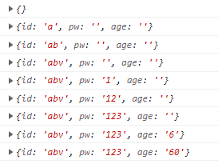

# Next.js React Hook Form

## 그냥 React로 Form 만들기

만약 여러분들이 `react`에서 아무 라이브러리 없이 `form`을 만든다면, 다음과 같은 방식을 사용하게 될 겁니다.

```ts
import React, { useState } from "react";

const Form = () => {
  const [name, setName] = useState("");
  const onNameChange = (event: React.SyntheticEvent<HTMLInputElement>) => {
    const {
      currentTarget: { value },
    } = event;
    setName(value);
  };

  const onSubmit = (event: React.SyntheticEvent<HTMLFormElement>) => {
    event.preventDefault();
    console.log(name);
  };
  return (
    <form onSubmit={onSubmit}>
      <input
        type="text"
        onChange={onNameChange}
        value={name}
        placeholder="name"
      />
      <input type="submit" />
    </form>
  );
};
```

딱 봐도 답답해 보이는 위 코드는 굳이 이해 하실 필요는 없습니다. 다만 다음과 같은 문제점이 있다는 것을 아시면 됩니다.

>

1. Form을 제출할 때 `preventDefault()`를 직접 해 줘야 함.
   <br/>
2. Input의 갯수가 늘어나면 그 만큼 `onChange`함수와 `useState`의 갯수를 늘려야 함.
   <br/>
3. Typescript를 사용하고 있다면, event의 type을 명기해줘야 하는데, 그 이름이 너무 어려움.
   (`React.SyntheticEvent<HTMLFormElement>`)

즉, 코드를 작성하는 사람이 굉장히 많은 노력을 기울여야 합니다. 이런 문제를 해결하기 위해, vercel에서는 [react-hook-form](https://react-hook-form.com/) 이라는 라이브러리를 제공합니다.

## React hook form 사용법

### 설치

`npm install react-hook-form`혹은 `yarn add react-hook-form`을 이용해 설치합니다.

### UseForm

간단한 코드의 기본 틀을 이용해 설명드리겠습니다. 다음 코드는 `ID`와 `password`, `age` 를 입력으로 받는 `form`을 구현한 코드입니다.

```ts
import { useForm } from "react-hook-form";

const HookForm = () => {
  const {} = useForm();
  return (
    <form>
      <input type="text" placeholder="ID" />
      <input type="password" placeholder="PW" />
      <input type="number" placeholder="AGE" />
      <input type="submit" />
    </form>
  );
};
```

껍데기만 있는 코드지만, 주목해야 할 부분이 존재합니다. 바로 `useForm` 함수입니다. 이 함수는 `react-hook-form`에서 제공하는 hook이고, 입력 값을 등록, 검증, 제출하는 함수들을 제공합니다.

### Register: 입력값 다루기

`register` 함수는 `html`의 `input` 태그를 결과 데이터의 속성중 하나로 등록하고, 검증할때 사용하는 함수입니다.

이 함수는 두 개의 인자를 받는 데 첫 번째는 등록할 속성의 이름을, 두 번째는 검증할 내용을 담고 있습니다. 하나씩 살펴 보죠.

### 등록

```ts
const { register } = useForm();
return (
  <form>
    <input {...register("id")} type="text" placeholder="ID" />
    <input {...register("pw")} type="password" placeholder="PW" />
    <input {...register("age")} type="number" placeholder="AGE" />
    <input type="submit" />
  </form>
);
```

위와 같이 `input` 태그 안에, `register` 함수가 반환해주는 `prop`들을 넣어 주는 형식으로 사용합니다. `register` 함수의 첫 번째 인자로 등록할 속성의 이름을 넣어주면 됩니다. 즉, 첫번째 `input` 태그에 입력하는 값은 결과 데이터의 `id` 속성에 값이 저장될 것입니다.

### 검증

반면 `register` 함수의 두 번째 인자로 필요 여부, 최대/최소 길이, 최대/최소 값 등을 추가할 수 있습니다.

```ts
<input
   {...register("id", { required: true, maxLength: 16 })}
   type="text"
  placeholder="ID"
/>

<input
  {...register("pw", { required: true, minLength: 8, maxLength: 20 })}
  type="password"
  placeholder="PW"
/>

<input
  {...(register("age"), { min: 18, max: 140 })}
  type="number"
  placeholder="AGE"
/>

```

위와 같이 작성하면 아이디와 비밀번호를 필수로 입력하게 하고, 글자수에 제약을 줄 수 있습니다. 또한 나이는 최댓값과 최솟값에 제약을 줄 수 있습니다.

여기서 조금 더 나아가 아이디가 16자를 초과하는 경우 거기에 대한 에러 메시지를 설정하고 싶다면 어떻게 하면 될까요? 인자를 주는 방식을 살짝만 바꿔 주면 됩니다.

```ts
<input
  {...register("id", { required: true, maxLength: {
    value: 16,
    message: "Should not exceed 16",
  })}
  type="text"
  placeholder="ID"
/>


```

위와 같이 `maxLength` 항목에 숫자를 주지 않고 값을 나타내는 `value`와 메시지를 나타내는 `message` 속성을 담은 객체를 주면 됩니다. 다만 이 방법은 에러 메시지를 **설정** 하는 방법에 대한 것이고, 저 메시지를 실제로 **다루기 위한** 방법은 뒤에서 설명하겠습니다.

### 검증 만들기

작성자가 직접 검증하고자 하는 항목을 만들 수도 있습니다. `register` 함수의 두 번째 인자에 `validate`를 이용하면 다음과 같이 아이디에 admin이라는 이름을 사용하지 못하게 할 수 있습니다.

```ts
<input
  {...register("id", {
    maxLength: 16,
    validate: {
      noAdmin: (value) => !value.includes("admin") || "admin is not allowed",
    },
  })}
  type="text"
  placeholder="ID"
/>
```

`validate` 항목에서는 `noAdmin`이라는 조건을 새로 만듭니다. `noAdmin`은 입력값이 admin을 포함하고 있지 않다면 통과, 포함하고 있다면 "admin is not allowd"라는 메시지를 설정하게 해 줍니다. 이런 방식으로 얼마든 작성자가 원하는 검증 조건을 만들 수 있습니다.

`register` 함수는 이 외에도 많은 기능을 제공하므로 [자세한 사용법](https://react-hook-form.com/api/useform/register)을 참고해 보시면 됩니다.

### TypeScript 얹기

`TypeScript`를 사용한다면 `register` 함수를 더욱 쉽게 사용할 수 있습니다. 다음과 같이 미리 데이터 속성들의 타입을 정해 두면 말이죠.

```ts
interface HookFormTypes {
  id: string;
  pw: string;
  age: number;
}

const HookForm = () => {
  const { register } = useForm<HookFormTypes>();
  return (
    <form>
      <input
        {...register("id", { required: true, maxLength: 16 })}
        type="text"
        placeholder="ID"
      />

      <input
        {...register("pw", { required: true, minLength: 8, maxLength: 20 })}
        type="password"
        placeholder="PW"
      />

      <input
        {...(register("age"), { min: 18, max: 140 })}
        type="number"
        placeholder="AGE"
      />
      <input type="submit" />
    </form>
  );
};
```

인터페이스를 통해 미리 속성의 이름과 타입을 설정해 두고, 이를 `useForm` 함수에게 주면, `register` 함수의 첫 번째 인자에는 설정된 속성들만 올 수 있습니다. 여기서는 **`id, pw, age`** 만 register 함수의 첫 번째 인자로 사용할 수 있겠네요.

### handleSubmit: submit 다루기

`register` 함수는 각 `input` 태그에서 동작하는 함수라면, `handleSubmit` 함수는 `form`이 `submit` 되었을 때를 다루는 함수입니다.

```ts
const { register, handleSubmit } = useForm<HookFormTypes>();
const onValid = (data: HookFormTypes) => {
  console.log(data);
};
return (
  <form onSubmit={handleSubmit(onValid)}>
    <input {...register("id")} type="text" placeholder="ID" />
    <input {...register("pw")} type="password" placeholder="PW" />
    <input {...register("age")} type="number" placeholder="AGE" />
    <input type="submit" />
  </form>
);
```

위 코드에서 볼 수 있듯 `form`의 `onSubmit` 부분에 `handleSubmit` 함수를 넣고 데이터를 처리하면 됩니다. 근데 잘 보면 `handleSubmit` 함수의 인자로 `onValid` 라는 이상한 함수가 하나 있습니다. 왜 이런 함수가 있을까요?

`handleSubmit` 함수의 동작에 대해 알 필요가 있습니다. 이 함수는 다음과 같이 실행됩니다.

> 1. 입력값들이 모두 **유효하다면 첫 번째** 인자에 있는 함수를 실행함. **입력받은 값들**을 함수에 전달.
> 2. 입력값들이 **유효하지 않다면 두 번째** 인자에 함수가 있을 경우 이를 실행함. **에러**를 함수에 전달.

즉, 지금 상황에서는 다른 검증 조건이 존재하지 않으므로 모든 데이터가 유효하고, 따라서 첫 번째 인자에 있는 `onValid` 함수를 실행하게 되는 것입니다. 만약 입력 데이터가 유효하지 않은 경우가 있다면 두 번째 인자에 에러를 처리하는 함수를 작성해 주면 됩니다. 다만 두 번째 함수는 꼭 작성할 필요가 없습니다.

(`onValid`라는 이름은 임의로 제가 정한 것이고 익명 함수로 작성해도 무관합니다.)

### TypeScirpt 얹기

여기서 `submit`된 데이터가 유효하다면, `handleSubmit` 함수는 첫 번째 인자 함수에게 **`useForm`에 사용되었던 타입**의 데이터를 제공합니다.

반대로 유효하지 않다면 두 번째 인자 함수에게 **`FieldErrors` 타입**의 데이터를 제공합니다. 다음 코드를 참고하시면 됩니다.

```ts
const { handleSubmit } = useForm<HookFormTypes>();
const onValid = (data:HookFormTypes) => console.log(data);
const onInValid = (errors:FieldErrors) => console.log(errors);
...
<form onSubmit={handleSubmit(onValid, onInValid)}>
```

### Watch: 입력값 주시

`watch` 함수는 말 그대로 input의 값들이 변경되는 것을 **보는** 함수입니다.

```ts
const { register, handleSubmit, watch } = useForm<HookFormTypes>();
console.log(watch());
```

위 코드와 같이 작성하면 input이 **변경될때마다** 콘솔에 모든 값이 출력됩니다. 또한 `watch("id")` 와 같은 식으로 작성하면 `id` 속성의 값만 출력하게 됩니다. 다음 사진은 `input`에 값들을 입력했을때 콘솔 결과입니다.



### Reset: 입력값 초기화

`reset` 함수 역시 이름 그대로 현재 `input`에 들어있는 모든 입력값을 초기화 합니다.

```ts
const { register, handleSubmit, reset } = useForm<HookFormTypes>();
const onValid = (data: HookFormTypes) => {
  console.log(data);
  reset();
};
```

위 코드와 같이 작성하면 제출된 값이 유효한 경우 모든 `input` 내의 값을 초기화시킵니다.

### setValue: 입력값 설정

`setValue` 함수는 특정 필드의 값을 설정해줍니다.

```ts
const { register, handleSubmit, setValue } = useForm<HookFormTypes>();
const onValid = (data: HookFormTypes) => {
  console.log(data);
  setValue("id", "Demian");
};
```

위와 같이 작성하면 제출된 값이 유효한 경우 `id`를 "Demian"이라는 값으로 변경시킵니다.

### formState: form의 상태

`formState`는 `form`의 전반적인 상태를 제공합니다. 특히 여기서는 `formstate` 내부의 `errors` 라는 객체에 대해 살펴보겠습니다. 이 값은 `form` 내부의 `error`들을 나타냅니다. `register` 함수의 검증 부분에서 설명한 **에러 메시지**를 여기서 가져올 수 있습니다.

```ts
const {
  register,
  handleSubmit,
  formState: { errors },
} = useForm<HookFormTypes>();

return (
  <form onSubmit={handleSubmit(() => {}}>
  <input
    {...register("id", {
      validate: {
        noAdmin: (value) =>
        !value.includes("admin") || "admin is not allowed",
      },
    })}
    type="text"
    placeholder="ID"
  />
  <span>{errors.id?.message}</span>
...
```

위 코드는 입력으로 받은 `id`에 `admin`이 들어있다면, `formstate`의 `errors` 객체를 이용해 에러 메시지를 보여주는 코드입니다. 이와 같이 `errors` 객체는 에러 및 그 메시지를 더욱 편하게 사용할 수 있게 도와줍니다.

---

## 결론

이 포스트에서는 `react-hook-form`에서도 `useForm`의 일부분만 소개했지만, 굉장히 많은 기능들을 제공합니다. 참고자료들을 활용해 많은 `form`들을 만들어 보시기 바랍니다.

코드 원본은 [여기](./codes/2022-05-03/)를 참고해 주시면 됩니다.

## References

1. [React hook form 공식 사이트](https://react-hook-form.com/)
2. [velog - React hook form 사용하기](https://velog.io/@kihyun/React-Hook-Form-%EC%82%AC%EC%9A%A9%ED%95%98%EA%B8%B0)
3. [Next JS 강의](https://nomadcoders.co/carrot-market)
