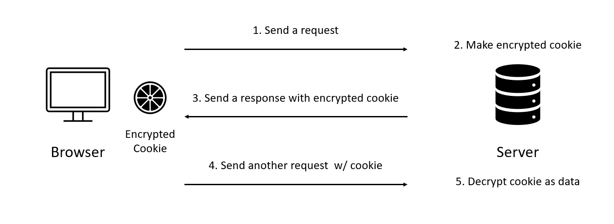

# Next.js Iron Session

## Iron Session

[iron-session](https://github.com/vvo/iron-session)은 암호화된 쿠키를 이용하는 **Node.js stateless session utility** 입니다. JWT와 비슷하지만, 전송되는 토큰 정보(`payload`)를 암호화 한다는 점에서 차이가 있습니다.

## 동작 방식

동작 방식은 `JWT`와 굉장히 흡사합니다. 다만 메타데이터를 완벽히 토큰에 저장하는 `JWT`와 약간 다르게 `iron-session`은 고유의 `session`을 가지고 있습니다. _(확인 중)_



```
1. 브라우저가 서버에 요청을 보냄.
2. 서버에서 정보를 암호화한 쿠키를 만듦.
3. 브라우저에게 응답을 보낼때 쿠키를 같이 보냄.
4. 브라우저는 암호화된 쿠키를 가지고, 이후 요청에 쿠키가 같이 보내짐.
5. 암호화된 쿠키를 받은 서버는 이를 복호화해 정보를 활용함.
```

여기에서 쿠키를 만들고, 브라우저에게 보내는 등의 작업을 저희가 직접 할 필요가 없습니다. 이 작업들을 도와주는 `helper function`들을 `Iron Session`에서 제공합니다.

## Install

`npm i iron-session`으로 설치하시면 됩니다.

## withIronSessionAPIRoute

이 함수를 설명하기 전에, `/api` 폴더 내에 `id`가 1번인 `user`의 정보를 주는 `API handler` 함수를 다음과 같이 만들 수 있습니다. `findUser` 함수는 `DB`에서 `id`에 해당하는 `user`를 찾는 함수입니다. ([코드 전문](https://github.com/Sinclairr08/velog-archive/tree/main/posts/next-tutorials/next-iron-session))

```ts
import { NextApiRequest, NextApiResponse } from "next";

export default async function handler(
  req: NextApiRequest,
  res: NextApiResponse
) {
  const id = 1;
  const foundUser = findUser(id);

  res.json({ ok: true, foundUser });
}
```

여기에서 `id`가 1번인 `user`가 아니라 현재 로그인 되어있는 `user`의 정보를 얻어 오려면 어떻게 해야할까요? 요청에서 `id`를 가져오는 작업이 필요하겠죠. 이를 도와주는 함수가 `withIronSessionAPIRoute` 입니다. 다음과 같이 코드를 변경해 봅시다.

```ts
import { NextApiRequest, NextApiResponse } from "next";
import { withIronSessionApiRoute } from "iron-session/next";
import { IronSessionOptions } from "iron-session";

const options: IronSessionOptions = {
  cookieName: "reservation-site",
  password: "VERYYLONGPASSWORDS1ab1323898esda345q6781!",
};

async function handler(req: NextApiRequest, res: NextApiResponse) {
  const id = req.session.user.id;
  const foundUser = await findUser(id);

  res.json({ ok: true, foundUser });
}

export default withIronSessionApiRoute(handler, options);
```

이 함수의 두 인자는 다음과 같습니다.

```
1. handler: 기존 API 핸들러 함수
2. options: IronSessionOptions 타입 객체. 쿠키 및 패스워드 정보를 가지고 있음
 - 2.1. cookieName: 브라우저에 저장되는 쿠키의 이름
 - 2.2. password: 32자 이상의 비밀번호. 데이터 암호화/복호화에 사용
```

위와 같이 기존 `handler` 함수를 인자로 받습니다. 즉, `withIronSessionApiRoute` 함수가 `handler` 함수를 감싸는 형태라고 생각하시면 됩니다. 이렇게 감쌀 경우, `handler` 함수 내부에서 다음과 같이 `session`을 사용할 수 있게 됩니다. 또한 세션 정보를 이용하는 것 외에 `handler` 함수의 동작을 변경하지는 않습니다.

```ts
const id = req.session.user.id;
```

요청의 쿠키에 `user`가 저장되어 있는 경우 위 코드와 같이 `req.session`을 이용해 가져올 수 있습니다.

## TypeScript

만약 위 코드를 그대로 사용했다면 타입스크립트가 에러를 띄울 것 입니다. 세션 내의 데이터에 대한 정보를 타입스크립트는 모르기 때문입니다. [세션 데이터 타입 작성하는 법](https://github.com/vvo/iron-session#typing-session-data-with-typescript)에 따라 다음과 같이 `declare module` 명령어를 이용해 작성합니다.

```ts
declare module "iron-session" {
  interface IronSessionData {
    user?: {
      id: number;
    };
  }
}
```

다만 이 경우에는 세션의 `user`가 `undefined`가 될 수 있으므로 `id`를 가져올 때 `session`의 유저가 있는지 확인해주는 작업을 추가해주면 됩니다.

```ts
const id = req.session.user ? req.session.user.id : 1;
```

## Save

지금까지 세션에서 데이터를 어떻게 가져오는지에 대해서만 얘기했습니다. 이번에는 세션에 데이터를 어떻게 저장하는지에 대해 알아 봅시다.

`POST` 요청이 들어왔을 때, 요청에서 `userId`를 추출해서 세션에 저장하는 코드는 다음과 같습니다.

```ts
if (req.method === "POST") {
  const {
    body: { userId },
  } = req;

  // Assign value
  req.session.user = {
    id: +userId,
  };

  // Save at a session
  await req.session.save();

  res.json({ ok: true });
}
```

위와 같이 세션에 값을 할당한 후 `save()` 함수를 실행시킵니다. 이러면 데이터가 세션에 저장될 뿐만 아니라, 이후에 응답을 보낼때 해당 정보가 암호화되어 쿠키로 브라우저에 보내 집니다.

이후 다른 요청이 들어오면, 그 요청에는 지금 저장한 정보가 쿠키에 실려서 같이 올 것입니다.

## 마치며

코드 원본은 [여기](./codes/2022-05-21.ts)를 참고해 주시면 됩니다.

## References

1. [Iron Session 페이지](https://github.com/vvo/iron-session)
2. [velog - Iron Session](https://velog.io/@with-key/Iron-sessions)
3. [Next JS 강의](https://nomadcoders.co/carrot-market)
