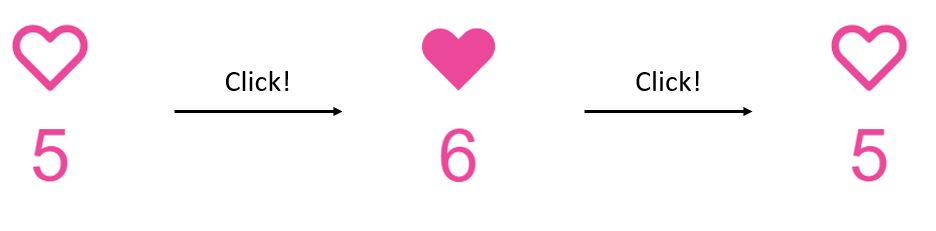

# Next.js SWR-2

## Mutate

이전 포스트에서는 `SWR`을 이용해 데이터를 가져오는 작업을 진행했습니다. 그러나 만약 가져온 데이터를 변경해야한다면 어떻게 해야 할까요? `SWR`은 [mutate](https://swr.vercel.app/docs/mutation)라는 함수를 제공함으로 인해 데이터를 변경할 수 있도록 제공합니다.

## Example

다음 그림과 같은 좋아요 기능을 추가한다고 생각해 봅시다. `velog`에도 있는 기능이죠.



```
1. 좋아요 상태가 아닐때 버튼을 클릭하면, 좋아요 상태로 바꾸고 좋아요 수 1 증가
2. 좋아요 상태일 때 버튼을 클릭하면, 좋아요가 아닌 상태로 바꾸고 좋아요 수 1 감소
```

아래 코드는 위 상태 변화를 구현한 코드 일부입니다. `API` 및 프론트엔드 부분에 대해서는 [코드 전문](https://github.com/Sinclairr08/velog-archive/tree/main/posts/next-tutorials/next-swr-2)을 참고해 주시기 바랍니다.

```ts
interface HeartInfo {
  isLiked: boolean;
  likes: number;
}

export default function ShopIdElement() {
  const { data, mutate } = useSWR<HeartInfo>("/api/heart");

  const onClicked = async () => {
    if (!data) return;

    // Change data
    mutate({
      isLiked: !data.isLiked,
      likes: data.isLiked ? data.likes - 1 : data.likes + 1,
    });

    // Send API request for heart
    await axios.post(`/api/heart`);
  };


```

여기서 `onClick` 함수 내에서 사용한 `mutate` 함수는 `SWR`에서 받아온 `data`를 변경하는 역할을 합니다. `mutate` 함수의 **첫 번째 인자**로 `data`가 변경되게 됩니다.

그러나 위 코드를 실행하면 잠시 변경되었다가 다시 원래대로 돌아올 거나, 아예 변하지 않을 것입니다. 왜 그럴까요?

## Revalidate

위 코드를 다시 살펴 봅시다.

```ts
// 1. Change local data first
mutate({
  isLiked: !data.isLiked,
  likes: data.isLiked ? data.likes - 1 : data.likes + 1,
});

// 2. Send API request for make/delete heart
await axios.post(`/api/heart`);
```

`mutate` 함수의 **두 번째 인자**에 `true` 혹은 빈 값을 준 경우, 다음과 같이 동작합니다.

```
1. 로컬 데이터를 변경한다.
2. SWR에서 데이터를 fetch 한다. (fetcher 함수 이용)
3. fetch한 값으로 데이터를 다시 변경한다.
```

이렇게 하는 이유는 우리가 로컬에서 변경한 데이터가 정말 유효한지 확인하기 위해서 검증(`revalidate`)하는 것입니다. 하지만 2번 과정에서 데이터를 가져올 때, 과거 데이터를 가져올 수 있게 됩니다. `POST` 요청을 통해 변경된 내역이 아직 기록되지 않았을 수 있으니까요. 따라서 과거 데이터로 돌아가는 듯한 모습을 보여주게 됩니다.

```ts
mutate(
  {
    isLiked: !data.isLiked,
    likes: data.isLiked ? data.likes - 1 : data.likes + 1,
  },
  false
);
```

위와 같이 두 번째 인자로 `false`를 주게 되면, 2,3번 검증 과정을 생략합니다. 이 방법은 제대로 동작할 뿐만 아니라, 실제 `DB`에 값이 반영되는 걸 기다리기 전에 미리 `local`의 값을 변경하므로 굉장히 빠르다고 느낄 수 있습니다.

## Unbound

지금까지 저희가 `mutate`를 진행했던 `data`는 `/api/heart`로 가져온 `data`입니다. 즉, `data`가 `/api/heart` 라는 `key`에 `bind` 되어 있다고 보시면 됩니다.

하지만 만약 좋아요 버튼을 눌렀을 때, 현재 페이지에서 사용되지 않는 데이터도 변경하고 싶다면 어떻게 해야할까요? 이를테면 유저 정보를 보는 페이지에서 사용하는 `/api/user` 에서 가져온 데이터도 바꾸고 싶다면 어떻게 해야 할까요?

다음과 같이 `mutate` 함수를 `useSWRConfig`에서 가져오면 됩니다.

```ts
const { data, mutate: boundMutate } = useSWR<HeartInfo>("/api/heart");
const { mutate: unboundMutate } = useSWRConfig();

const onClicked = async () => {
  if (!data) return;
  boundMutate(
    {
      isLiked: !data.isLiked,
      likes: data.isLiked ? data.likes - 1 : data.likes + 1,
    },
    false
  );
  unboundMutate("/api/user", (prev: any) => ({ ok: !prev.ok }), false);

  await axios.post(`/api/heart`);
};
```

이름이 겹치기 때문에 `/api/heart`에서 가져온 `mutate` 함수는 `boundMutate`, `useSWRConfig`에서 가져온 함수는 `unboundMutate`라고 명명합시다. `unboundMutate` 함수는 `boundMutate` 함수와 다음과 같은 차이점이 있습니다.

```
1. 첫 번째 인자로 mutate할 data의 key값을 준다. (어떤 data를 바꿀지 모르기 때문)
2. 두 번째 인자로 data가 아닌, data를 변경하는 함수를 준다. (data가 없기 때문)
```

`unboundMutate` 함수를 이용하면, 현재 페이지에서 가져오지 않은 데이터를 변경할 수 있게 됩니다.

## 결론

코드 원본은 [여기](./codes/2022-05-27/)를 참고해 주시면 됩니다.

## References

1. [SWR 공식 페이지](https://swr.vercel.app/ko)
2. [SWR Mutation](https://swr.vercel.app/docs/mutation)
3. [Next JS 강의](https://nomadcoders.co/carrot-market)
