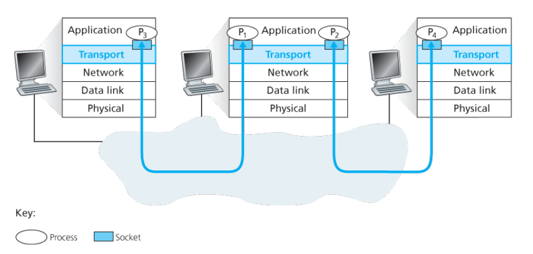
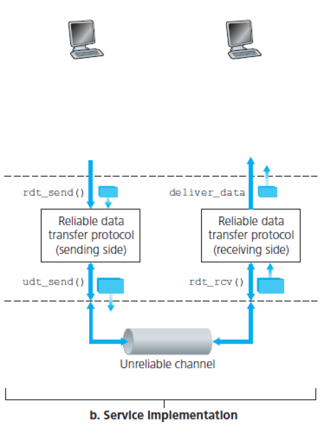

# Transport Layer

## Transport Layer란

Transport layer는 application layer와 network 계층 사이에 위치하는 계층으로, 서로 다른 호스트의 **프로세스**간의 **논리적 통신**을 제공.

Multiplexing, Demultiplexing등의 기능을 수행하고, TCP와 같은 연결지향적 프로토콜과 UDP와 같은 무연결 프로토콜을 사용.

## Multiplexing / Demultiplexing

**Multiplexing**: Application layer에서 소켓을 통해 받은 데이터를 segment로 만들고, source port 번호와 destination port 번호를 header에 추가하고 network layer에 넘겨주는 작업.

**Demultiplexing**: Network layer에서 받은 segment의 헤더에 있는 port number를 이용해, segment의 정보를 올바른 port를 가진 소켓으로 넘겨줌.

## UDP

UDP는 송신을 위해 무연결 통신을 제공하는 transport layer의 프로토콜.

- Transport layer의 프로토콜이 하는 최소한의 일만 함.
- 일부 데이터 손실을 허용하는 real-time application에 적합
- 데이터 전송을 위해 사전 연결이 필요 없음.
- 연결을 유지하지 않음.
- Packet header 오버헤드가 적음.
- 에러 검출을 위해 checksum을 사용.

## Reliable Datat Transfer (RDT)

불안정한 채널에서 데이터를 안정적으로 보내기 위한 알고리즘. Transport layer에서만 사용하는 것이 아니라 다른 layer에서도 사용됨. TCP 역시 불안정한 IP 위에서 동작하는 reliable data transfer protocol 중 하나.

표현하기 위해 Finite state machine을 이용. 채널이 속한 상황에 따라 다른 버전의 알고리즘이 됨.

## RDT 1.0

채널이 손실 없이 완전히 안정적인 경우. Sender는 패킷을 보내고 receiver는 패킷을 수신.

## RDT 2.0

채널이 불안정해서 패킷이 오염되는 현상이 생기는 경우. Receiver는 checksum을 이용해 값이 오염되었는지 확인하고, 만약 오염된 경우 NAK를, 그렇지 않은 경우 ACK를 sender에게 보냄. Sender는 NAK를 받는 경우 다시 송신.

Sender는 receiver에게 ACK를 받기 전까지는 다음 패킷을 보낼 수 없음. 이러한 프로토콜을 stop-and-wait protocol이라 함.

### RDT 2.1

RDT 2.0에서 더 나아가 ACK 혹은 NAK 자체가 오염되는 상황인 경우. Sender와 Receiver는 sequence number라는 추가적인 정보를 패킷에 담아 보냄.

이 값을 이용해 sender, receiver는 현재 받아야 할 sequence number과 다른 값을 받으면 패킷 혹은 ACK/NAK에 오염이 있다는 뜻이므로 다시 패킷을 전송하면 된다.

sequence number는 이전 패킷과 다른지를 나타내기 때문에 0과 1만 있으면 됨.

## RDT 2.2

RDT 2.1에서 receiver가 NAK를 보내는 대신 마지막으로 정상적으로 수신된 ACK를 보내면, NAK를 보내는 것과 같은 효과를 내게 됨. 이 방식으로 NAK 없이 ACK만으로 RDT를 구현할 수 있음.

## RDT 3.0

채널에서 패킷 오염에 더해 패킷 손실이 발생하는 경우. 타이머를 설정해 sender는 **합리적인** 시간동안 기다리고, 만약 timeout이 발생되는 경우 sender는 패킷을 재 전송함.

## Pipelined RDT

지금까지는 하나씩 패킷을 보내는 stop-and-wait 방식을 사용했지만, ACK를 기다리지 않고 한 번에 여러 개의 패킷을 보내면 훨씬 효율적임. 다만 패킷을 구분해야 하므로 sequence number는 더욱 증가해야 함.

## Go-Back-N

Receiver는 순차적으로 정상 수신한 가장 마지막 패킷의 ACK를 보냄(cumulative ACK). Sender는 가장 아직 ACK를 받지 않은 가장 작은 번호의 패킷에 타이머를 달아두는 방식. Timeout이 발생하면 ACK를 받지 않은 모든 패킷 재전송.

Sliding window protocol 중 하나.

## Selective Repeat

Receiver가 각 패킷마다 individual ACK를 보냄. Sender는 각 패킷마다 타이머를 달아두는 방식. 각 패킷의 타이머가 만료되면 해당 패킷만 재전송.

## TCP

TCP는 연결 지향적 통신을 제공하는, transport layer의 reliable data transfer protocol.

- 통신 전에 1대1로 연결이 이루어짐.
- 안정적이고 순차적인 대신, 통신에 시간이 소요됨.
- Flow control, congestion control을 제공함.

## Connection

TCP는 통신을 수행하기전에 연결을 만들고, 다 되면 연결을 종료해야 함. 연결을 만들기 위해 3-way handshake를, 연결을 끊기 위해 4-way handshake를 이용.

## 3-way handshake

1. 클라이언트가 서버에 연결을 위한 SYN 패킷을 보냄.
2. 서버가 클라이언트에 연결을 위한 SYN 패킷과, 1번에서 받은 패킷의 ACK를 보냄.
3. 클라이언트가 서버에 2번에서 받은 패킷의 ACK를 보냄.

## 4-way handshake

1. 클라이언트가 서버에 종료를 위한 FIN 패킷을 보냄.
2. 서버가 클라이언트에 2번에서 받은 패킷의 ACK를 보내고, 기다림.
3. 추가적인 패킷이 없다면 서버가 클라이언트에 종료를 위한 FIN 패킷을 보냄.
4. 클라이언트가 서버에 3번에서 받은 패킷의 ACK를 보냄. 이를 받으면 서버는 즉시 종료하고, 클라이언트는 추가적인 패킷을 기다린 후 종료.

## Flow Control

Sender가 너무 많은 양의 데이터를 보내 receiver가 받을 수 있는 양보다 많이 보내는 것을 막기 위해 receiver가 sender의 속도를 조절하는 과정.

TCP에서는 receiver가 남은 버퍼 공간을 보고 sender에게 최대 윈도우 크기를 정해주면, sender는 그 이하의 크기로 데이터를 보냄.

다만 receiver가 윈도우 크기를 0으로 정해주면, sender는 타이머를 설정하고, 타임아웃이 되면 receiver에게 1byte 크기의 패킷으로 최대 윈도우 크기를 다시 물어보는 과정을 수행.

## Congestion Control (TCP Reno)

Flow control과는 달리 네트워크 환경이 너무 복잡해서 윈도우 크기를 조절하는 알고리즘. slow start 모드와 congestion avoidance 모드를 오가며 조절.

## Slow start

TCP가 처음 시작되면 이 상태에 놓임. 처음 윈도우 크기를 1 MSS로 시작. 매 RTT마다 두 배로 늘리는 방법. 만약 그 크기가 임계 윈도우 크기(ssthresh)에 도달하면 congestion aviodance 모드로 전환.

## Congestion avoidance

매 RTT마다 윈도우 크기를 1 MSS씩 늘린다. 그리고 만약 패킷 손실이 일어나면 다음과 같이 행동함.

1. Timeout이 발생한다면 아주 혼잡하다는 뜻이므로 윈도우 크기를 1 MSS로 줄이고, slow start 모드로 전환.
2. Duplicate ACK이 연속으로 세 개 들어온다면 윈도우 크기를 절반으로 줄임. Congestion aviodance 모드 유지.

두 경우다 임계 윈도우 값을 손실이 일어난 윈도우 크기의 절반으로 설정.

## TCP fairness

연결이 TCP 밖에 없다면 congestion control에 의해 모든 연결의 throughput은 공평해짐. 다만 UDP와 같이 있다면 성립하지 않음.

## References

1. Computer Networking: A Top-Down Approach, James. F. Kurose and Keith W. Ross
