# DB Index-1

## Index란

파일 혹은 테이블에서 탐색 속도를 증가시키기 위해 사용하는 보조 자료 구조.

특정 field (혹은 column)의 값들을 이용해서 만듦. Field 값이 **key**이고, 해당 record에 대한 포인터가 **value**인 key-value 형식.

## Single level ordered index

인덱스를 key-value의 리스트 형태로 저장하는 방식. 어떤 field를 선택하냐에 따라 다음과 다른 방식들 존재.

### Primary Index

Index로 설정한 field의 값이 정렬되어 있고, 값이 모두 다른 경우 사용.

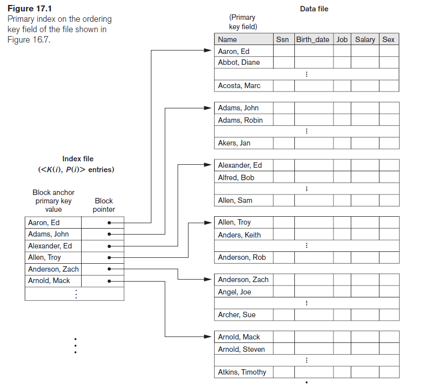

### Clustering Index

Index로 설정한 field의 값이 정렬되어 있지만, 중복된 값이 존재하는 경우 사용.

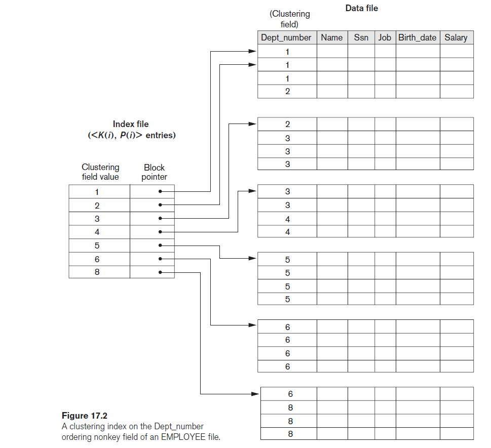

### Secondary Index

Index로 설정한 field의 값이 정렬되어 있지 않은 경우 사용.

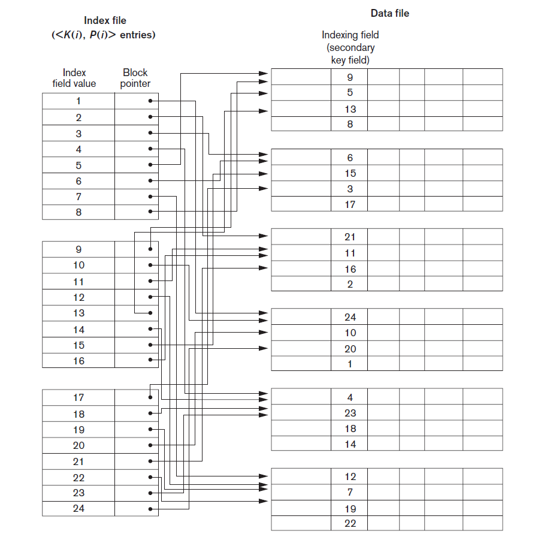

## Features

- 데이터를 찾는 데 있어서 O(logn)이 걸리는 만큼 빠르다.
- 삽입 / 삭제 / 갱신에 시간이 더 걸림.
- 추가 공간을 요구.
- 규모가 큰 테이블에 좋음.

## Index column choice

데이터베이스에서 인덱스로 사용될 column을 선정하는 방법.

- 데이터 중복도가 낮은 column.
- JOIN / WHERE / ORDER BY 등이 자주 발생하는 column.
- 삽입 / 삭제 / 갱신이 자주 발생하지 않는 column.

## B-tree

인덱스를 key의 tree형태로 구현하기 위해 사용되는 자료구조. 트리의 각 노드에 여러 개의 key를 저장.

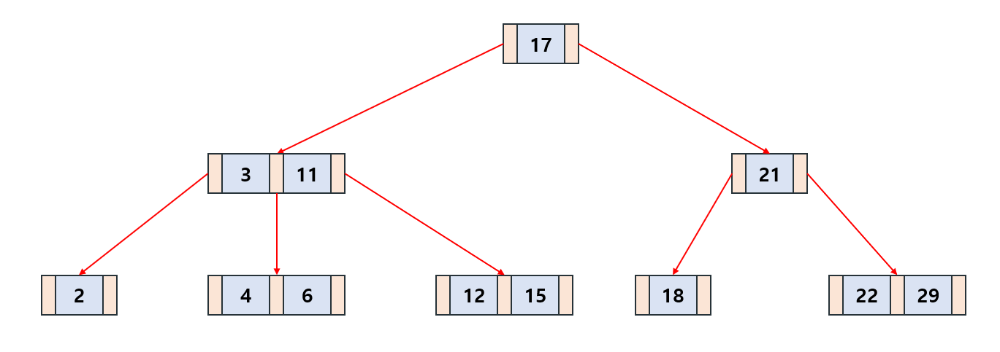

## Definition

차수 M인 B-tree는 다음과 같은 조건을 따르는 tree.

1. 모든 노드는 M/2개 이상, M개 이하의 자식을 가짐.
2. 모든 non-leaf 노드는 둘 이상의 자식을 가짐.
3. 모든 leaf 노드는 같은 level에 위치.
4. k개의 key를 가진 노드는 k+1개의 자식을 가짐.

## Features

- self-balancing을 통해 balanced tree를 유지.
- 삽입, 검색, 삭제에 O(logn) 소요.
- 부등호 연산 처리에 빠름. (B+ tree에 특히 해당)

## Search

Binary search tree와 같이 루트 노드부터 트리를 아래로 탐색하며 해당하는 값을 찾음.

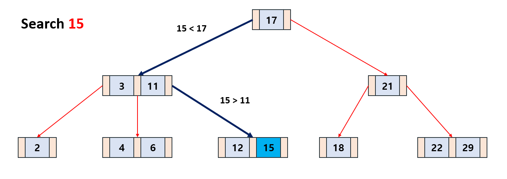

## Insertion

새로운 key 삽입은 leaf 노드에서 이루어짐. 해당 노드의 key 수가 M을 넘어간다면, 분할하는 과정이 이루어짐.

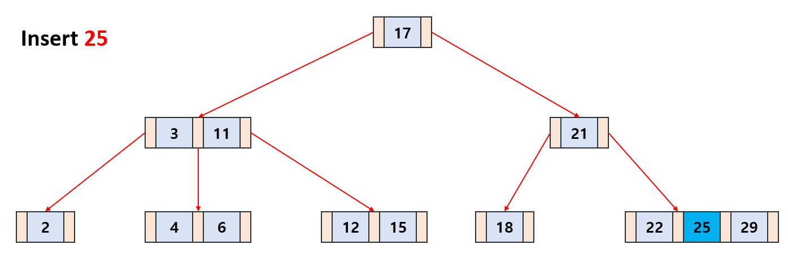

## Deletion

B-tree 내의 key 삭제는 여러 가지 경우로 나뉨. 삭제해도 해당 노드의 key 수가 M/2 이상인 경우는 제외함.

## Replace

삭제할 key를 자식 노드의 key와 교체 가능한 경우

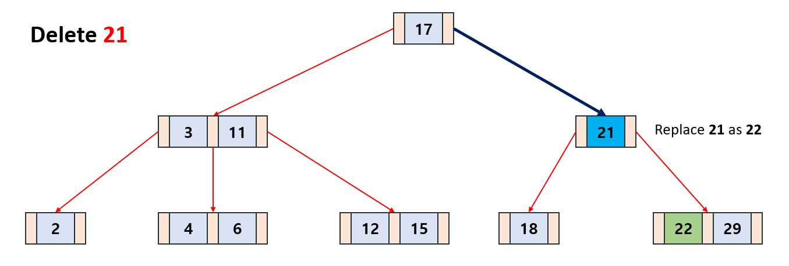
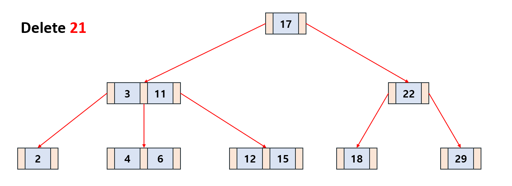

## Merge

삭제할 key를 자식 노드의 key와 교체 불가능한 경우. 부모 노드와 형제 노드를 병합, 자식 노드들을 병합 후 경우에 따라 분할을 수행한다.

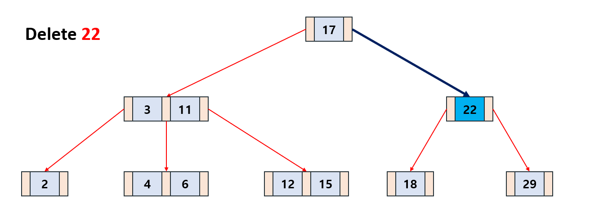
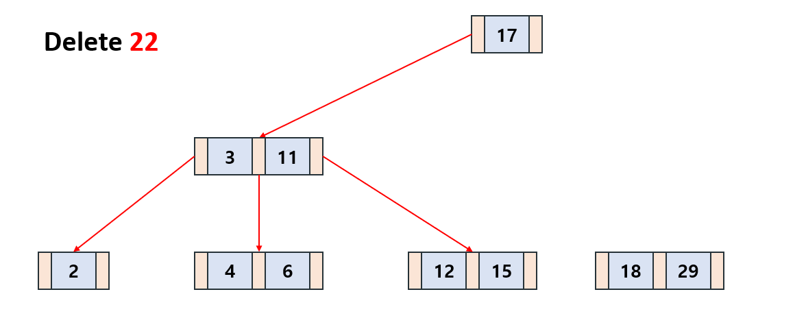
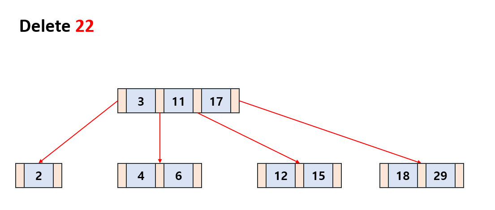
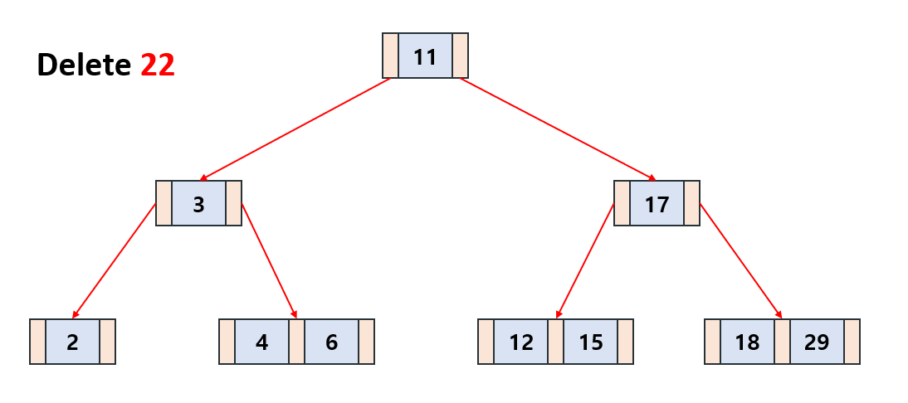

## B+ tree

기존 B tree를 변형해서 데이터를 leaf 노드에만 저장하는 tree. 모든 리프 노드는 linked list 형태로 연결되어 있어 부등호 연산이 굉장히 빠름.

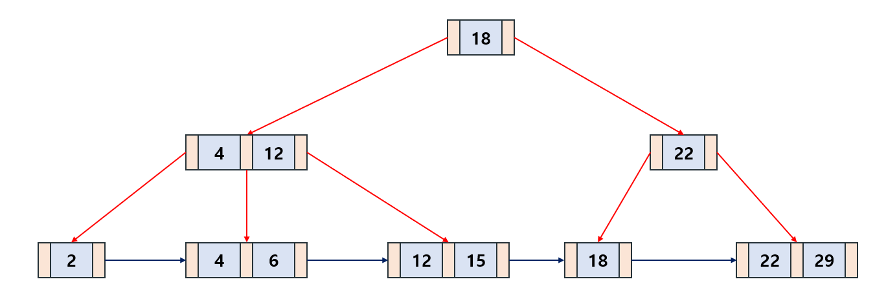

## Internal node

Leaf node를 제외한 B+ tree는 B tree와 동일한 구조. Leaf node의 부모 키는 leaf node의 첫번째 key 값보다 작거나 **같음**

## References

1. Fundamentals of Database Systems (7/E), Ramez Elmasri, Shamkant B. Navathe
2. [Index](https://siahn95.tistory.com/77)
3. [Index](https://siahn95.tistory.com/entry/DB-%EC%9D%B8%EB%8D%B1%EC%8A%A4%EB%9E%80-2-%EA%B5%AC%EC%A1%B0-B-Tree-%EA%B3%84%EC%97%B4%EC%9D%84-%EC%93%B0%EB%8A%94-%EC%9D%B4%EC%9C%A0)
4. [Index(Wiki)](https://en.wikipedia.org/wiki/Database_index)
5. [Index(D2)](https://d2.naver.com/helloworld/1155)
6. [B tree(wiki)](https://en.wikipedia.org/wiki/B-tree)
7. [B tree](https://velog.io/@emplam27/%EC%9E%90%EB%A3%8C%EA%B5%AC%EC%A1%B0-%EA%B7%B8%EB%A6%BC%EC%9C%BC%EB%A1%9C-%EC%95%8C%EC%95%84%EB%B3%B4%EB%8A%94-B-Tree)
