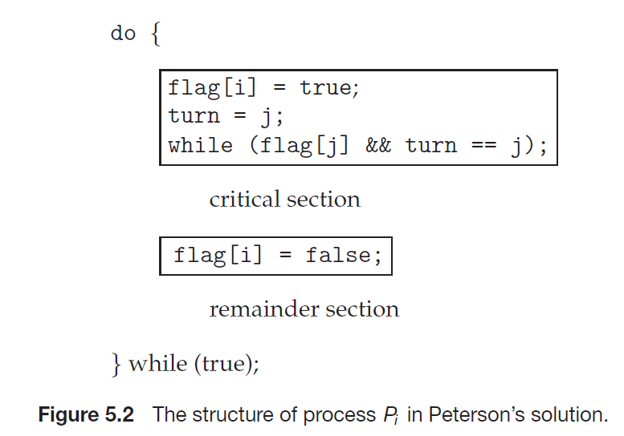

# Process Synchronization

# Process Synchronization 이란

여러 process는 concurrent / parallel하게 실행됨. Process간 공유하는 데이터에서 무결성 문제가 생길 수 있음.

## Race Condition

여러 프로세스가 동일한 데이터를 concurrent하게 조작할 때, 실행 순서에 따라 결과가 달라지는 현상을 의미.

이런 문제가 생기지 않게 하기 위해 프로세스간의 동기화(synchronization)가 필요.

## Critical Section

프로세스간 공통 변수를 교환하거나, 테이블을 업데이트하거나, 파일을 쓰는 등의 역할을 하는 코드.

두 개 이상의 프로세스가 critical section에서 실행되면 안 되고, 이 문제를 critical section problem이라 명명.

Critical section problem의 solution은 다음 세 가지 조건을 만족해야 함.

## Mutual Exclusion

어떤 프로세스가 critical section에서 실행 중이면 다른 프로세스는 critical section에서 실행이 불가능.

## Progress

Critical section에서 실행중인 프로세스가 없다면 cirtical section에 들어갈 수 있는 프로세스 중 하나를 선택해야 함. 이 결정은 무한히 연기되지 않음.

## Bounded Waiting

한 프로세스가 critical section에 진입 요청을 하면 그것이 허가되기 전에 다른 프로세스들이 critical section에 진입할 수 있는 횟수의 제한이 존재.

## Peterson's solution

Critical section problem의 solution 중 하나, 프로세스가 두 개일때 가능한 방법이다.



turn 과 flag라는 공유 변수를 통해 각 프로세스의 critical section 입장을 결정하며, mutual exculsion, progress, bounded waiting 만족.

다른 프로세스에게 critical section에 입장할 기회를 양보하는 것이 특징.

## Mutex Locks

Critical section에 대한 입장을 보호하는 도구. available이라는 변수를 이용해 critical section에 대한 출입을 잠구거나 해제.

```C
acquire() {
	while (!available)
		; /* busy wait */
	available = false;;
}

release() {
	available = true;
}
```

```C
do {
	acquire();

    //critical section

    release();

    //remainder section
} while (true);
```

acquire 함수를 통해 critical section에 입장하면서 다른 프로세스가 critical section에 입장할 수 없도록 잠금. Critical section이 끝나면 release 함수를 통해 critical section에 입장 가능하도록 잠금 해제.

## Busy Waiting

프로세스가 critical section에 입장이 가능해 질 때까지 loop를 계속 도는 현상. CPU 사이클을 낭비하는 등의 문제가 있지만, context switch가 별도로 필요하지 않아서 효율적인 경우 존재.

## Semaphores

Mutex Lock보다 더 정교한 도구. semaphore라는 이름의 정수 S와 wait, signal이라는 함수로 이루어짐. 다음은 semaphore 구현의 한 예시.

```c
wait(S) {
	while (S <= 0)
		; // busy wait
	S--;
}

signal(S) {
	S++;
}

```

S 값에 제약이 없는 경우 counting semaphore, S가 0 혹은 1인 경우 binary semaphore. Binary semaphore는 mutex lock과 거의 동일하나 semaphore는 mutex lock과 달리 소유권은 없음.

## Implementation

상기 언급한 semaphore 구현은 역시 busy waiting이 존재. Busy waiting 대신 block과 wakeup 함수를 이용해 semaphore 구현.

```c
typedef struct {
	int value;
	struct process *list;
} semaphore

wait(semaphore *S) {
	S->value--;
    if (S->value < 0){
    	add the PCB of this process to S->list;
        block();
    }
}

signal(semaphore *S) {
	S->value++;
	if (S->value <= 0) {
    remove a process P from S->list;
	wakeup(P);
	}
}
```

block 함수는 프로세스 실행을 중지, wakeup(P) 함수는 중지된 프로세스 P를 다시 실행하는 함수. list에는 PCB가 저장됨.

## Busy Waiting

Critical section이 긴 경우에만 block 과 wakeup을 사용하고, critical section이 짧은 경우에는 busy waiting을 사용하는 것이 효율적.

## Deadlock / Starvation

Critical section 진입에 deadlock 발생 가능. 프로세스를 큐에서 LIFO 순서로 꺼낸다면 starvation 발생 가능.

## Classic Problems

여러 process 동기화 문제들. Semaphore를 이용해 해결 가능

## Bounded-Buffer Problem

producer-consumer problem이라고도 불림. Producer는 데이터를 buffer에 넣고, consumer는 buffer 내의 데이터를 꺼냄.

mutex라는 semaphore는 critical section에 producer와 consumer가 동시에 접근 못 하게 함.

empty는 buffer가 가득 찼을 때 producer를 기다리게 하고, full은 buffer가 비어 있을 때 consumer를 기다리게 하는 semaphore.

```c
// 공유 부분
int n;
semaphore mutex = 1;
semaphore empty = n;
semaphore full = 0;
```

```c
// producer process
do {
	// produce an item

	wait(empty);
	wait(mutex);

	//add produced to the buffer */

    signal(mutex);
	signal(full);
} while (true);
```

```c
//consumer process
do {
	wait(full);
	wait(mutex);

    // remove an item from

	signal(mutex);
	signal(empty);

	// consume the item in next consumed
} while (true);

```

## Readers-Writers Problem

읽기만 하는 프로세스와 쓰는 프로세스 사이에 데이터베이스를 공유할 때 생기는 문제. 한 번에 여러 명의 reader는 데이터를 읽을 수 있지만, 한 명의 reader라도 있는 경우 writer는 쓸 수 없고, writer가 있다면 어떤 reader도 읽을 수 없음.

rw_mutex라는 semaphore를 통해 writer의 critical section 진입을 제어. Reader는 여러 명의 다른 reader가 데이터를 읽는 것을 허용.

```c
// writer
do {
	wait(rw mutex);
	// writing

	signal(rw mutex);
} while (true);
```

```c
//reader
do {
	wait(mutex);
	read_count++;
	if (read_count == 1)
		wait(rw mutex);
	signal(mutex);

	// reading

	wait(mutex);
	read_count--;
	if (read count == 0)
		signal(rw mutex);
	signal(mutex);
} while (true);
```

Reader와 writer 구분이 쉬운 경우, reader가 writer보다 많은 경우 유용.

## Dining philosophers Problem


철학자 5명이 5개의 자리에 앉고, 각 자리 사이에 젓가락이 하나 있을 때의 상황. 각 철학자가 배고파지면 식사를 하는데, 왼쪽 젓가락부터 집고, 오른쪽 젓가락을 하나씩 집음. 둘 다 집어야 식사가 가능하고, 식사가 완료되면 젓가락을 내려놓음. 다른 사람의 젓가락을 뺏을 순 없음.

이 문제는 젓가락을 semaphore로 표시하면 구현 및 해결 가능.

```c
semaphore chopstick[5];

do {
	wait(chopstick[i]);
	wait(chopstick[(i+1) % 5]);

	// eat

	signal(chopstick[i]);
	signal(chopstick[(i+1) % 5]);

	// think

} while (true);
```

그러나 deadlock 발생 가능. 모두가 본인의 왼쪽 젓가락을 든 경우에는 무한히 대기해야 하는 상태에 빠짐. 따라서 다음 방법으로 deadlock 해결 가능.

1. 4명만 자리에 앉을 수 있게 함.
2. 두 젓가락이 모두 사용 가능한 경우에만 젓가락을 집을 수 있게 함.
3. 홀수 번호는 왼쪽, 짝수 번호는 오른쪽 젓가락부터 집을 수 있게 함.

## References

1. Operating System Concepts 9th Edition, Silberschatz, Galvin and Gagne ©2013
