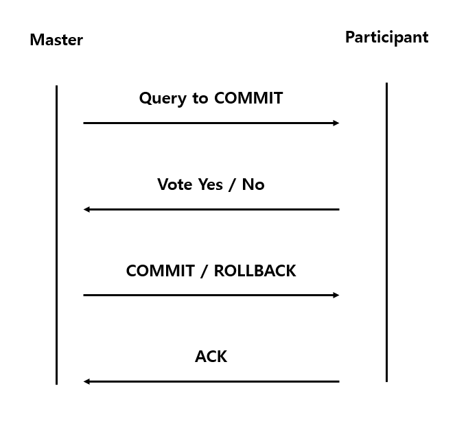

# Two-phase Commit

## Two-phase Commit 이란

- 분산 데이터베이스에서 여러 노드들 상에서 트랜잭션의 원자성을 달성하기 위한 프로토콜.
- 시스템 장애에도 트랜잭션을 수행 가능하기 때문에 많은 곳에서 사용됨.
- 마스터 노드 역할을 수행하는 코디네이터 존재. 이를 이용해 다른 여러 참가자 노드의 트랜잭션 관리.

## Algorithm

트랜잭션을 커밋하기 위해 다음과 같은 두 개의 단계를 수행.

1. Commit-request phase (voting)
2. Commit phase (completion)

## Commit-request phase

1. 코디네이터가 모든 참가자 노드에게 커밋 메시지에 대한 쿼리를 보내고 모든 응답을 받을 때 까지 대기.
2. 각 참가자 노드는 커밋하라고 요청받을 때 까지 트랜잭션 수행하고, undo log와 redo log에 기록.
3. 각 참가자 노드는 트랜잭션이 성공적으로 수행된 경우 동의 메시지를, 아닌 경우 중단 메시지를 보냄.

## Commit phase

- Success: 만약 코디네이터가 모든 참가자로부터 동의 메시지를 받은 경우

  1.  코디네이터는 모든 참가자 노드에게 커밋 메시지를 보냄.
  2.  각 참가자 노드는 연산을 완료하고, 자원들에 걸린 lock을 해제.
  3.  각 참가자 노드는 코디네이터에게 ACK를 보냄.
  4.  모든 참가자 노드에게 ACK를 받으면 코디네이터는 트랜잭션 종료.

- Failure: 만약 참가자 노드가 하나라도 중단 메시지를 보낸 경우
  1.  코디네이터는 모든 참가자 노드에게 롤백 메시지를 보냄.
  2.  각 참가자 노드는 undo log를 이용해 트랜잭션 이전 상태로 돌리고, 자원들에 걸린 lock을 해제.
  3.  각 참가자 노드는 코디네이터에게 ACK를 보냄.
  4.  모든 참가자 노드에게 ACK를 받으면 코디네이터는 트랜잭션을 이전 상태로 돌림.

## Message Flow

## 단점

가장 큰 단점은 프로세스를 block한다는 것. 만약 코디네이터가 영구적으로 손상된다면, commit phase의 참가자는 트랜잭션을 절대 풀 수 없다.

## References

1. https://en.wikipedia.org/wiki/Two-phase_commit_protocol
