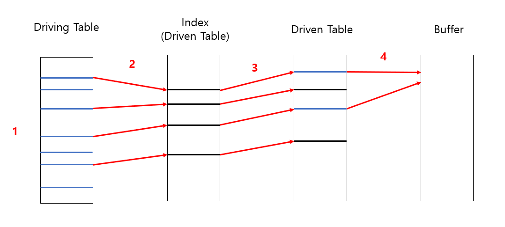

# NL Join

## NL Join 이란

Nested Loop Join의 약자로, 두 개의 루프를 통해 join을 수행하는 방법.

## 동작 방식

0. 먼저 접근할 테이블 (선행 테이블, Driving table) 과 나중에 접근할 테이블 (후행 테이블, Driven table)로 구분
1. 선행 테이블의 각 행에 접근해 조건에 맞는 행을 찾음. (Full scan)
2. 조건의 맞는 행에서 조인에 필요한 키 값이 후행 테이블에 존재하는 지 확인하기 위해 인덱스에 접근.
3. 키 값이 인덱스에 존재한다면 해당 값에 대한 행을 후행 테이블에서 찾음.
4. 후행 테이블의 행 중 조건에 맞는 행을 추출 버퍼에 넣음.
5. 모든 작업이 끝난 뒤 추출 버퍼에 있는 값을 출력.



## 특징

1. 선행 테이블은 풀 스캔을 하므로, 크기가 작거나 where 조건이 붙은 테이블을 선행 테이블로 선정하는 것이 유리.
2. 후행 테이블에서 조인에 사용되는 열에는 인덱스가 반드시 필요하고, 인덱스에 따라 조인 효율이 크게 달라짐.
3. 후행 테이블의 데이터를 읽을 때 한 번에 하나의 값을 읽는 random access가 발생함.
4. 4번의 이유 때문에 선행 테이블의 많은 행에 대해 조인 조건을 확인하는 경우에는 부적절.
5. 2중 for문과 유사한 방식으로 작동함.

## 힌트

선행 / 후행 테이블은 옵티마이저가 결정하지만, 다음과 같이 SQL에 힌트를 추가함으로 인해 선행 테이블을 정할 수 있음.

```
/*+ORDERED*/: FROM 절에서 앞에 오는 테이블을 선행 테이블으로
/*+LEADING {table_name}*/: table_name 테이블이 선행 테이블으로
```

## References

1. https://coding-factory.tistory.com/756
2. https://bangu4.tistory.com/83
3. https://hoon93.tistory.com/46
