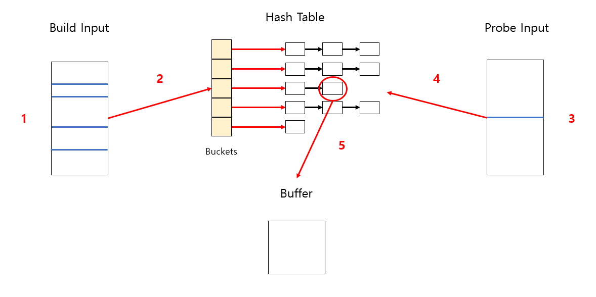

# Hash Join

## Hash Join 이란

키 값을 해싱해서 동일한 값에 대해 join을 수행하는 방법.

## 동작 방식

0. 먼저 접근할 테이블 (선행 테이블, Build Input) 과 나중에 접근할 테이블 (후행 테이블, Probe Input)로 구분
1. 선행 테이블에서 각 행에 접근해 조건에 맞는 행을 찾음. (Full scan)
2. 해당 행들에서 조인 키 값에 hash를 적용해서 해시 테이블 생성.
3. 후행 테이블에서 각 행에 접근해 조건에 맞는 행을 찾음. (Full scan)
4. 해당 행들에서 조인 키 값에 해당하는 해시 테이블의 버킷을 찾음.
5. 해당 버킷의 체인을 탐색하면서 일치하는 키 값이 존재하는지를 확인하고, 일치하는 경우 조인 결과를 추출 버퍼에 넣음.
6. 모든 작업이 끝난 뒤 추출 버퍼에 있는 값을 출력.

## 특징

1. NL Join과 달리 적절한 인덱스가 없어도 사용 가능.
2. 값이 일치하는 행들을 비교하므로 equi join만 수행 가능.
3. Random access에 대한 부하가 클 때 NL join보다 효율적.
4. 테이블이 굉장히 커서 정렬하는 데 부하가 크거나 두 테이블의 크기 차이가 심할 때 sort merge join보다 효율적. (배치 프로그램 등)
5. 쿼리 수행에 오래 걸리는 큰 테이블에 대한 조인 시 효율적.
6. 선행 테이블이 작거나 해시 값의 중복이 적은 경우 효율적.
7. CPU에서 작업을 수행하므로 CPU 성능에 영향을 받음. 만약 CPU 공간이 부족하다면 디스크 I/O로 인해 성능 저하.

## References

1. https://coding-factory.tistory.com/758
2. https://bangu4.tistory.com/83
3. https://hoon93.tistory.com/46
