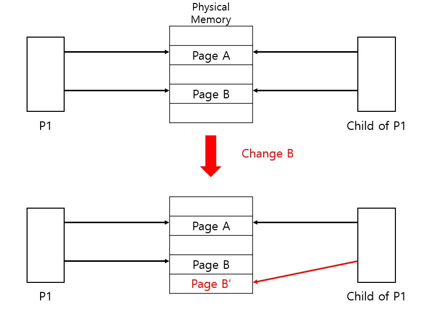

# Copy on Write

## Copy on Write란?

- 변경 가능한 리소스를 효율적으로 복사하기 위한 기법.
- 특정 리소스가 복사되었지만 변경되지는 않은 경우에는 새로운 리소스를 만들지 않음.
- 해당 리소스에 쓰기(변경)가 수행되면 그 때 실제로 복사본을 만들게 됨.

## Virtual Memory에서

- fork() 를 수행할 때 주로 사용됨.
- fork()로 자식 프로세스가 생기면, 자식 프로세스랑 부모 프로세스는 같은 페이지를 공유하게 됨.
- 만약 자식 프로세스가 특정 페이지를 변경하게 된다면 그 때 사본 페이지를 새로 만듦.
- 아래는 P1의 자식 프로세스가 Page B의 내용을 변경한 경우.



## Software에서

```cpp
std::string x("Hello");

std::string copied = x; // copied and x use same buffer

copied += " World!";  // copied now uses a new buffer
```

- C++ 98 기준으로 위 코드에서 copied는 처음에는 변수 x와 같은 버퍼를 사용.
- copied의 값이 바뀔 때 새로운 버퍼를 할당받아 사용하게 됨.

## DB 에서

- MS SQL Server 등의 데이터베이스에서 스냅샷의 기본 매커니즘으로 사용됨.
- 스냅샷의 경우 전체 데이터를 저장하는 것이 아닌 원본에서 수정된 데이터만 저장.

## References

1. https://en.wikipedia.org/wiki/Copy-on-write
2. https://code-lab1.tistory.com/58
3. https://talkingaboutme.tistory.com/entry/Study-Copy-On-Write-COW
