# AWS 실습: 프리 티어 계정 생성

## AWS 프리 티어 계정 생성

1. 무료 계정 생성을 클릭

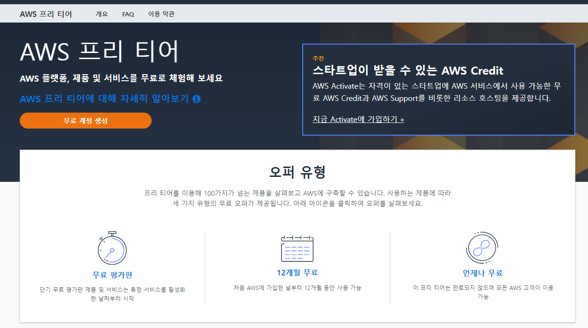

2. 이메일 / 이름 입력

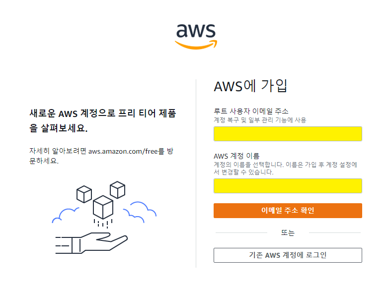

3. 확인 코드 입력

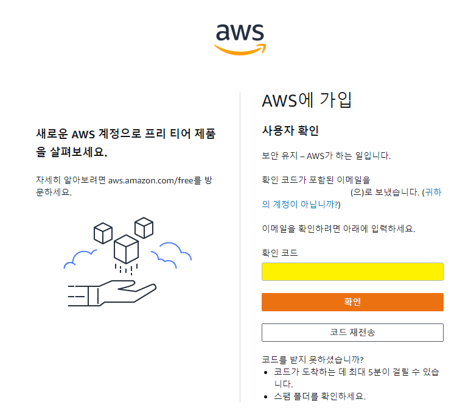

4. 암호 입력

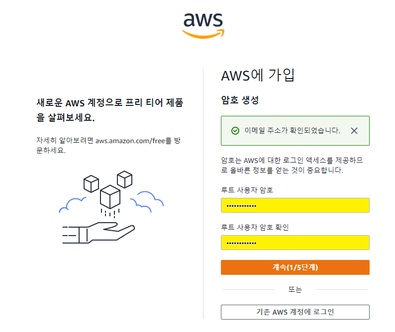

5. 연락처 정보 입력 ([영문 주소변환](https://www.jusoen.com/))

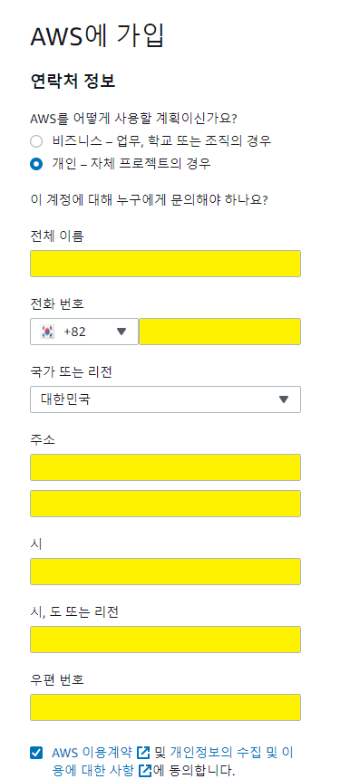

6. 결제 정보 입력

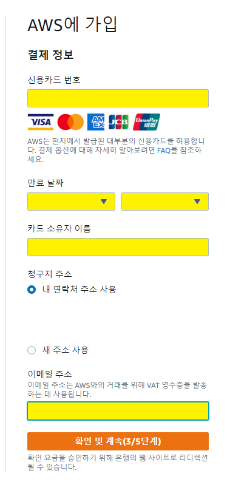

7. 전화번호 입력

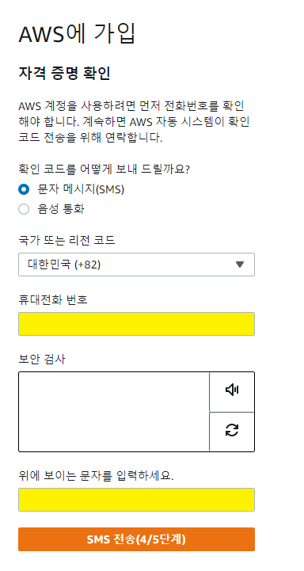

8. 기본지원 - 무료를 선택

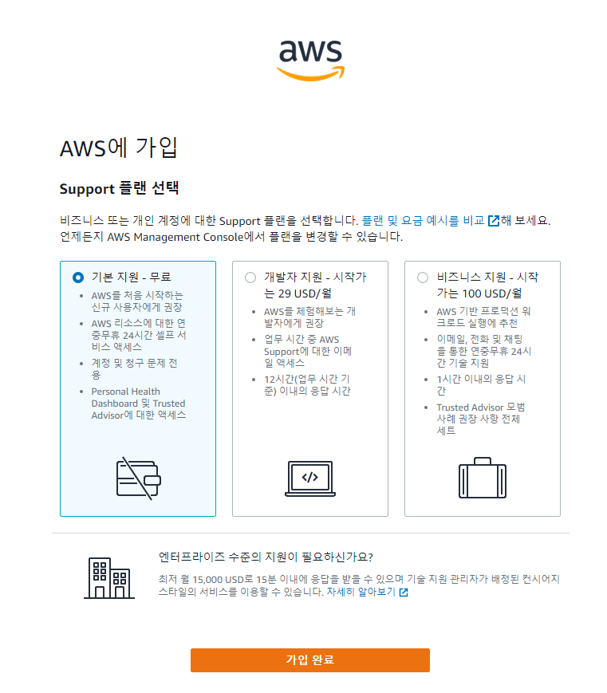

9. 가입 완료가 되면 AWS Management Console로 이동

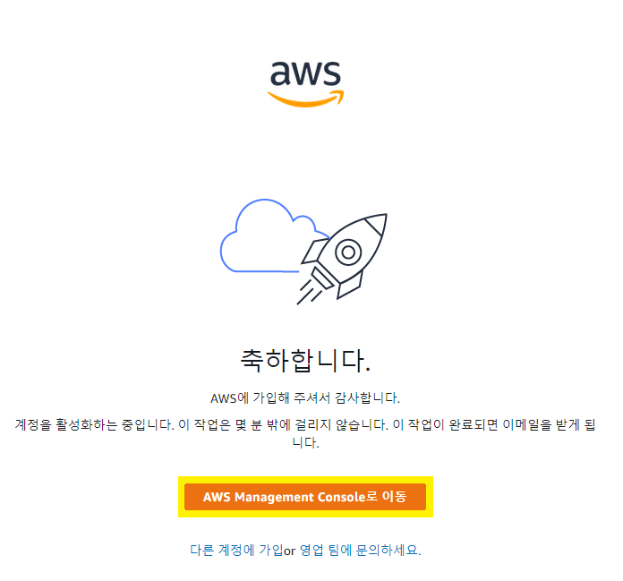

10. 이메일 및 비밀번호를 입력해서 로그인

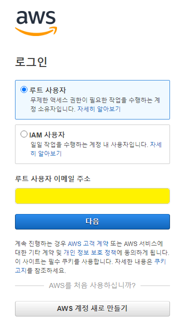

11. 콘솔 창을 열 수 있음.

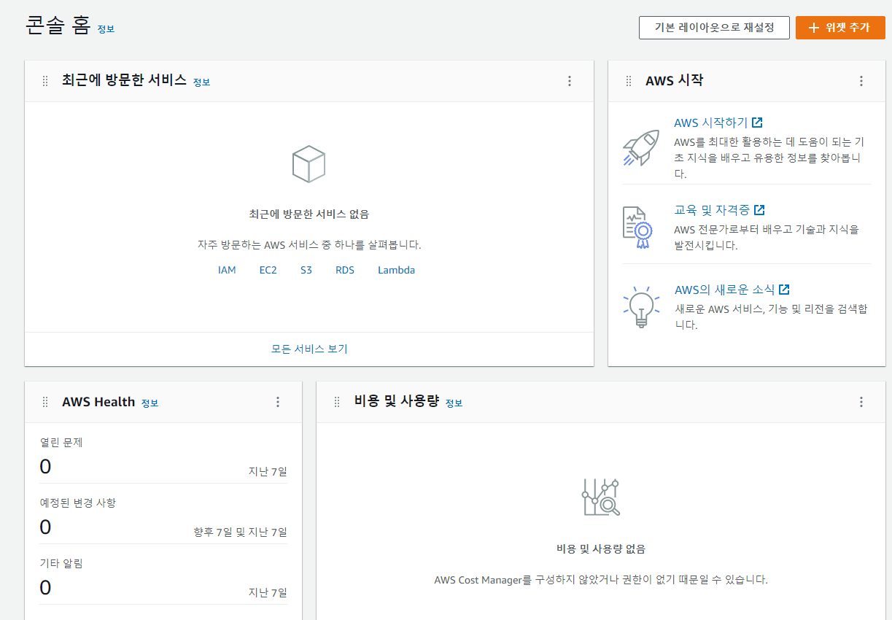

## References

1. https://aws.amazon.com/free/
