# AWS 실습: DynamoDB 시작

## AWS DynamoDB 시작

1. 콘솔에 DynamoDB를 입력해서 DynamoDB 서비스 입장.

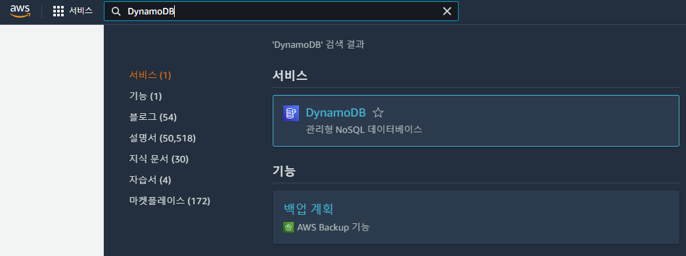

2. 테이블 생성을 눌러서 NoSQL 테이블 만들기.

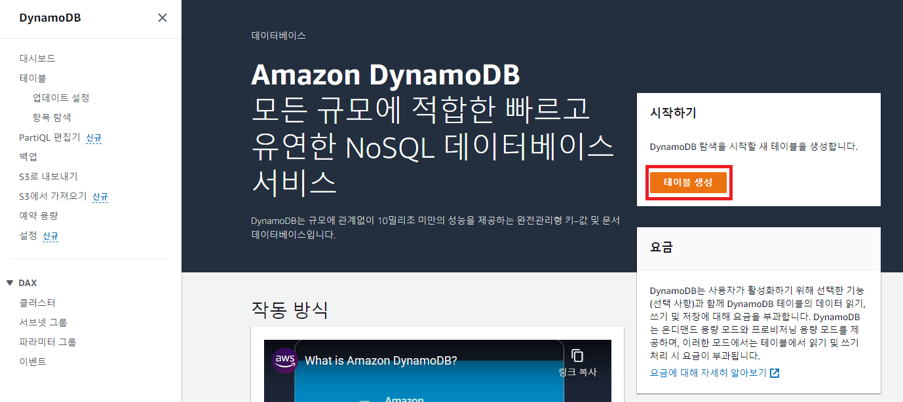

3. 테이블 명, 파티션에 사용할 키 이름, 정렬에 사용할 키 이름 등을 입력.

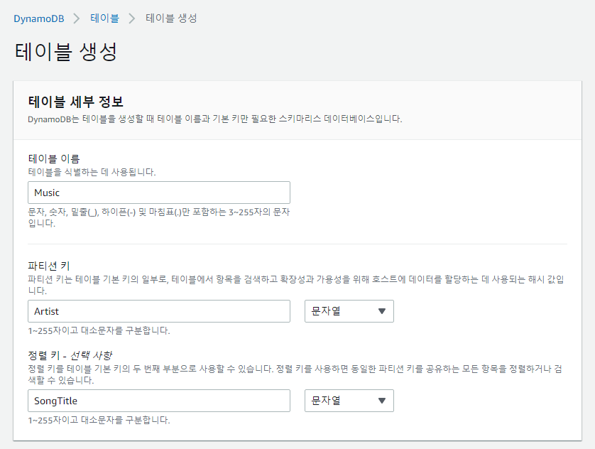

4. 3번 아래에 테이블 설정하는 부분이 존재. 테이블에 대한 설정을 수행 후 생성.

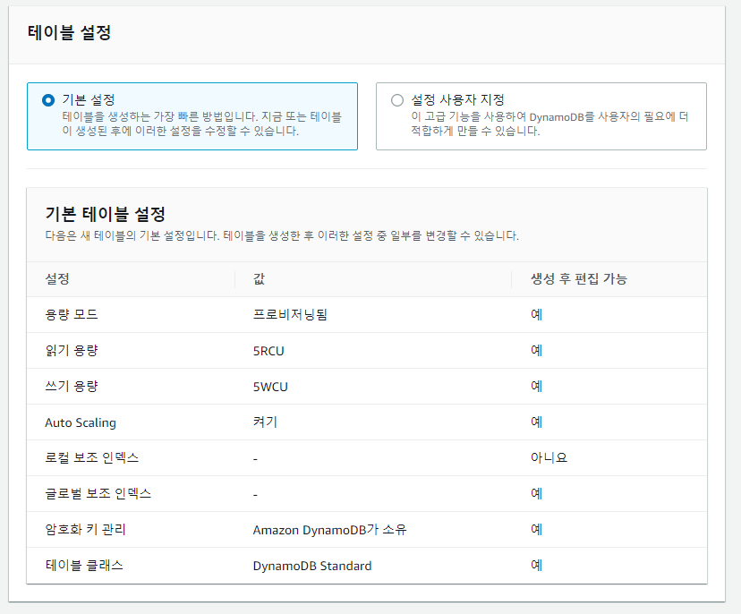

5. 테이블이 생성된 화면. 좌측의 업데이트 설정 혹은 테이블 이름을 클릭해 테이블로 이동 가능.

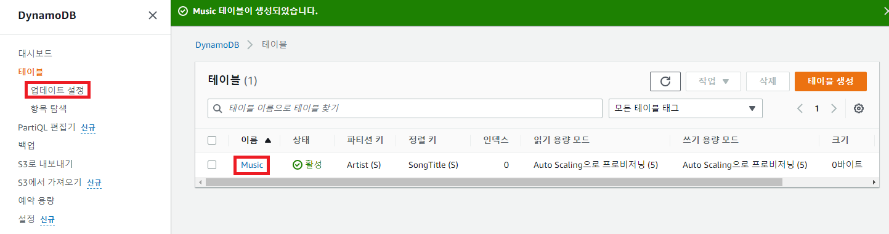

6. 작업 - 항목 생성에서 테이블의 항목들을 생성 가능.

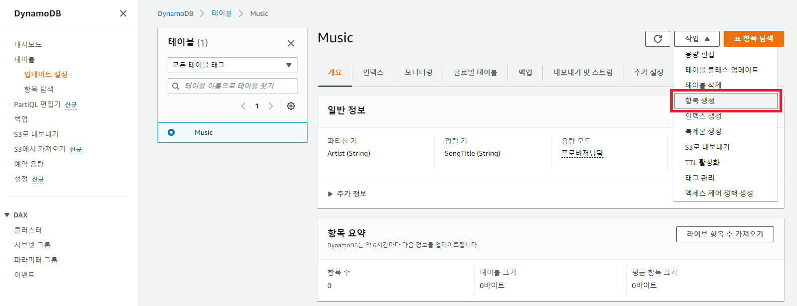

7. 다음과 같이 키 값들을 입력해서 항목 생성 가능.

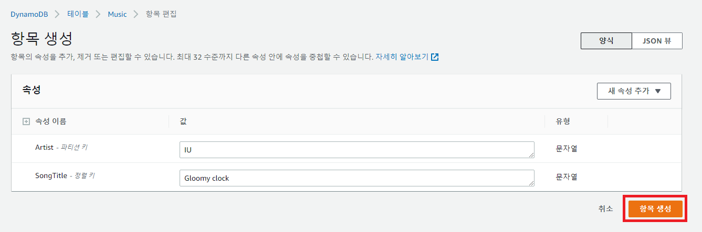

8. 항목 생성을 여러번 눌러 많은 데이터를 삽입 가능.

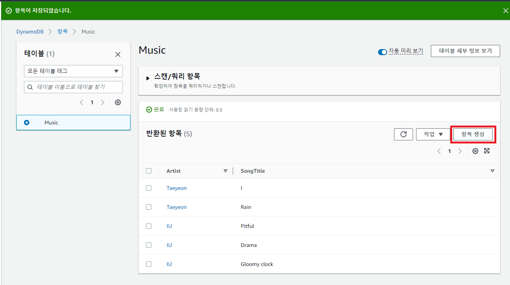

9. 스캔-쿼리 항목을 확장해 스캔 대신 쿼리를 선택하고, 파티션 키를 지정 후 실행해서 쿼리에 해당하는 항목들을 출력 가능.

- 아래는 Artist 값이 "IU"인 모든 항목을 출력한 예제.
- '스캔'은 모든 데이터를, '쿼리'는 조건에 맞는 데이터를 반환.

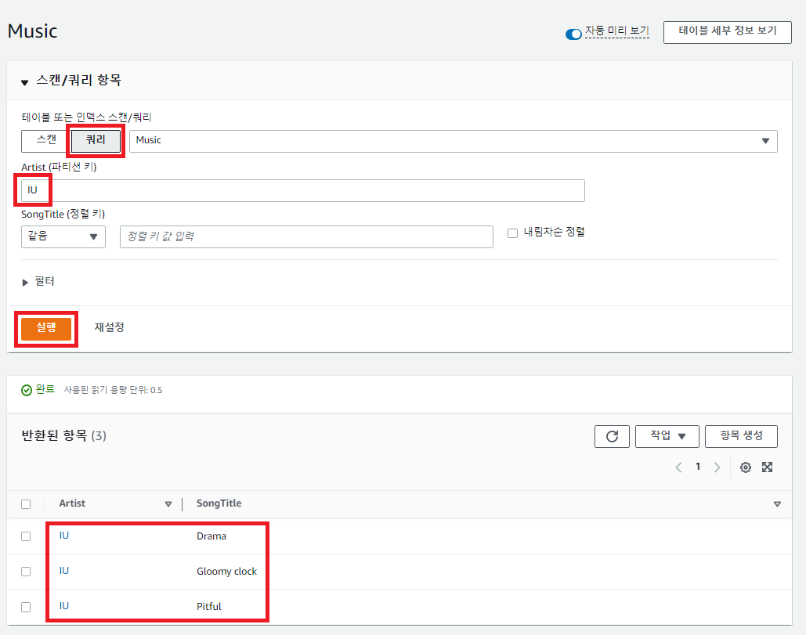

10. 9번에 추가해서 SongTitle이 "D"로 시작하는 항목만 출력하는 것도 가능.

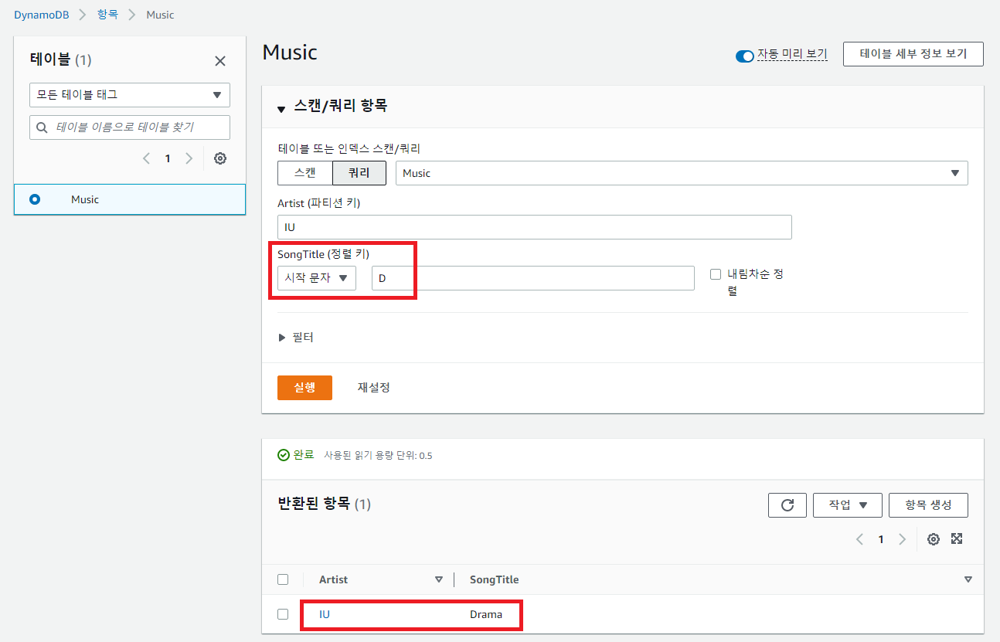

11. 작업 - 항목 삭제에서 특정 항목을 삭제 가능.

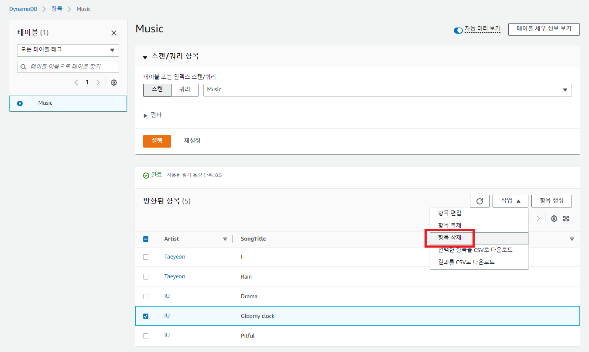

12. 사용이 끝난 테이블은 "테이블" 항목을 누른 뒤 삭제 버튼을 통해 삭제 가능.

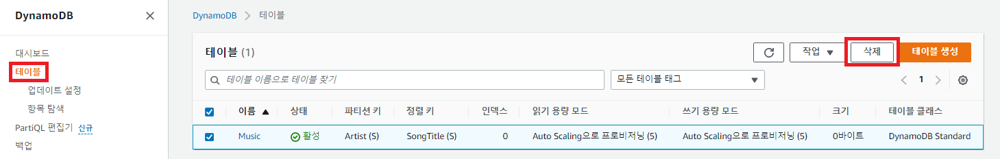

13. 삭제하기 전 테이블에 대한 백업을 생성할 수도 있음.

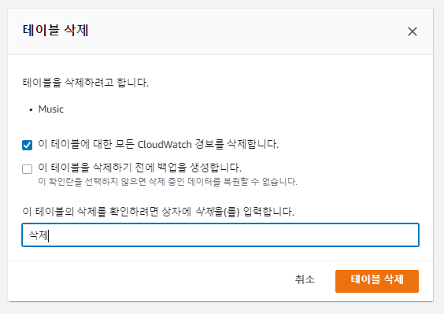

## References

1. https://aws.amazon.com/ko/getting-started/hands-on/create-nosql-table/
