# AWS 실습: S3 시작

## AWS S3 시작

1. 콘솔에 S3를 입력해서 S3 서비스 입장.

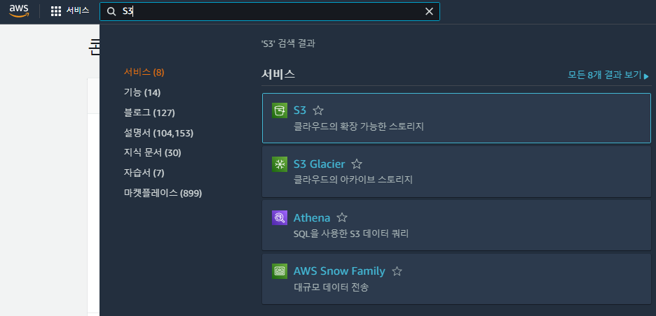

2. 버킷 만들기를 클릭해 새로운 버킷 생성.

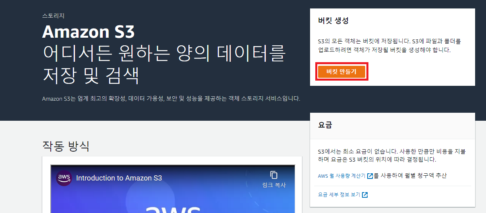

3. 버킷 이름과 리전을 선택. 버킷 이름은 **다른 모든 AWS 버킷과** 달라야 함.

- 이 버킷에 작성한 객체를 다른 AWS에서 소유 가능한지 결정 가능.
- 버킷 이름은 [규칙](https://docs.aws.amazon.com/AmazonS3/latest/userguide/bucketnamingrules.html)을 따름.
- 버킷 이름에 "." 보다 "-"를 사용할 것.

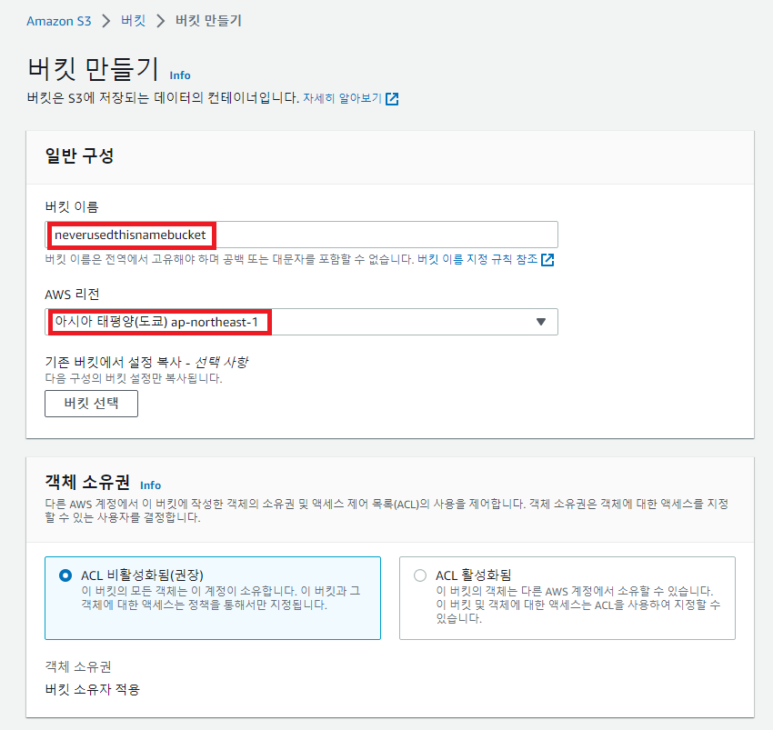

4. 3번 아래에서 다음과 같은 항목 설정 가능. 이후 버킷 만들기를 통해 버킷 생성.

- 버전 관리 활성화 여부: 객체의 여러 버전을 관리함으로써 장애로부터 복구를 쉽게 수행.
- 기본 암호화: 객체가 저장될 때 암호화해서 저장.
- 태그: 버킷과 태그를 연결

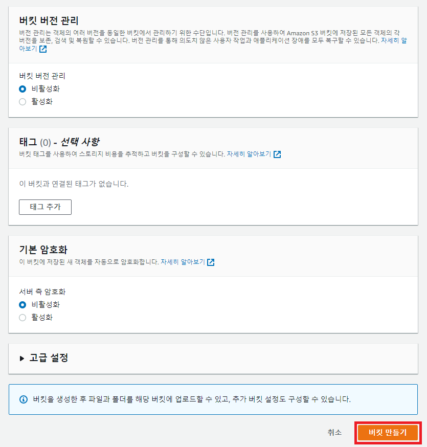

5. 버킷이 생성된 화면. 버킷 이름을 클릭해 버킷 내부로 들어가 볼 수 있음.

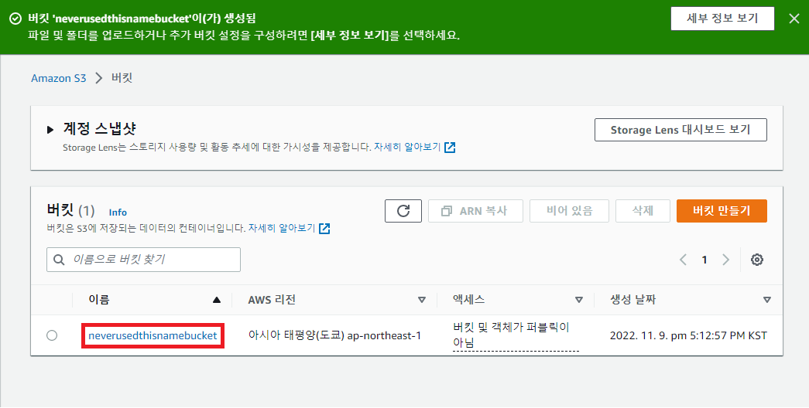

6. 업로드 버튼을 눌러 버킷 내의 객체를 업로드 가능.

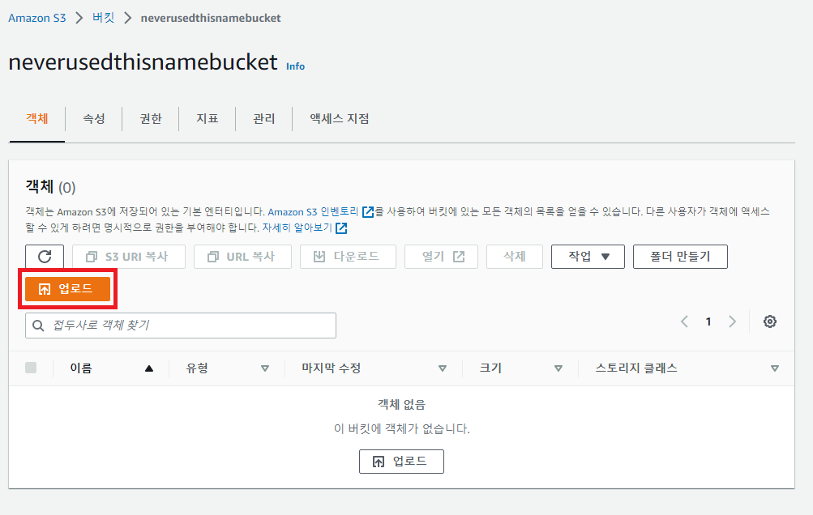

7. 파일 / 폴더 추가를 통해 파일 / 폴더를 업로드 가능.

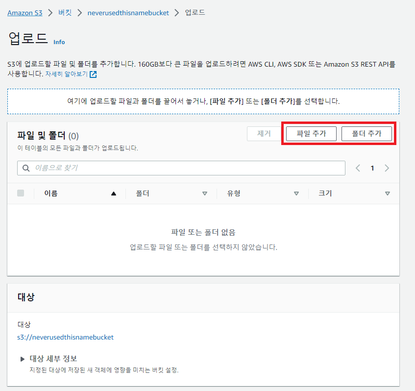

8. 업로드용.PNG 파일을 추가한 모습. 업로드 버튼을 통해 업로드 가능.

- 권한 항목에서 다른 AWS 계정이 이 객체에 접근 가능한지 여부 설정 가능.
- 속성 항목에서 스토리지 클래스, 암호화 등을 설정 가능.

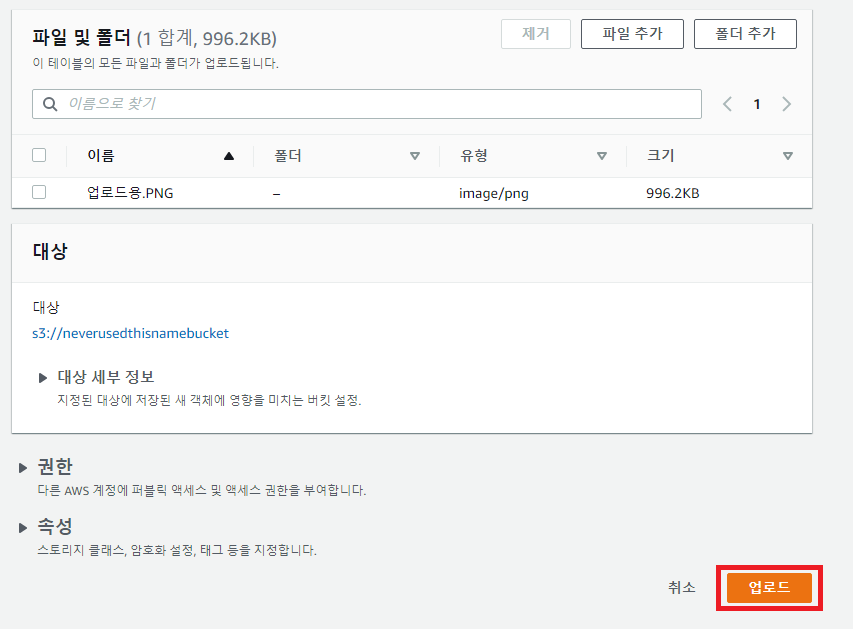

9. 업로드가 완료되면 다음과 같은 창이 뜸. 닫기를 클릭.

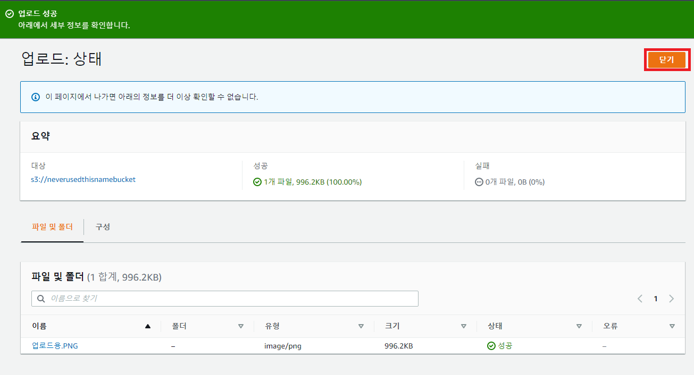

10. 업로드한 객체들을 다운로드 혹은 삭제 가능.

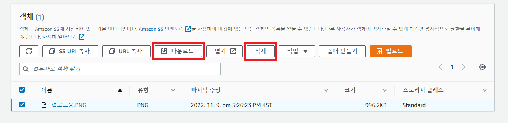

11. 객체 삭제를 누른 경우 다음과 같이 다시 한 번 확인.

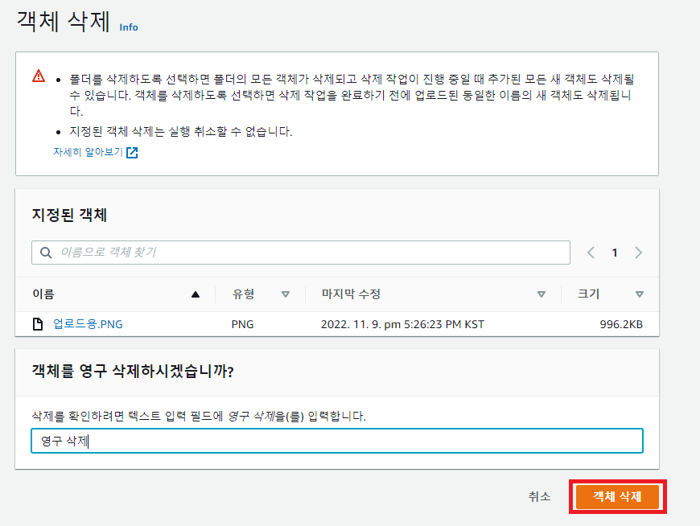

12. 버킷 항목을 눌러 버킷 이동.

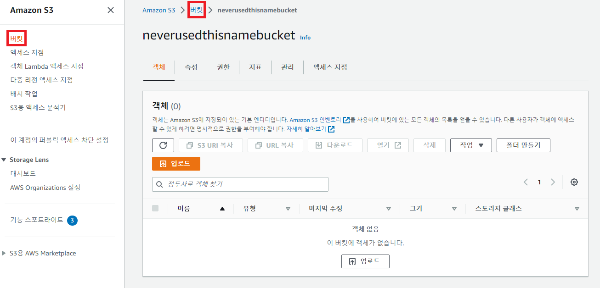

13. 버킷을 선택하고 삭제를 누르면 버킷 자체를 삭제 가능.

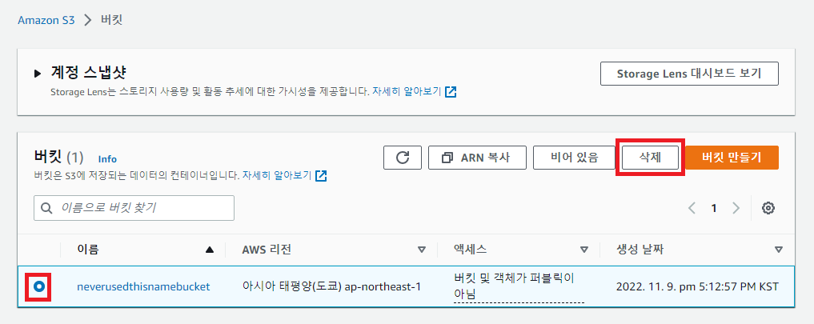

14. 버킷 삭제를 누른 경우 다음과 같이 최종적으로 확인. 삭제된 버킷 이름은 다른 사용자가 사용 가능.

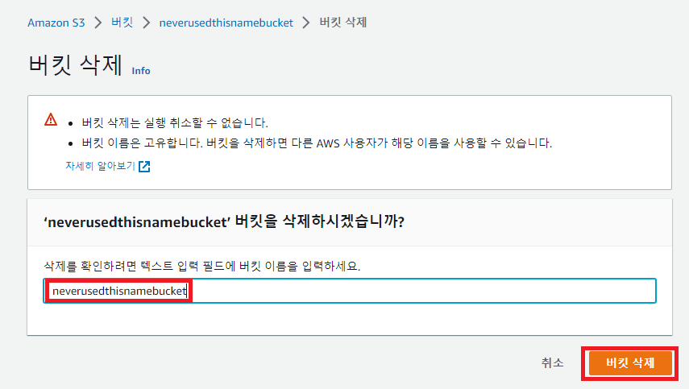

## References

1. https://aws.amazon.com/ko/getting-started/hands-on/backup-files-to-amazon-s3/
