# AWS 실습: EC2 시작

## AWS EC2 시작

1. 콘솔에 EC2를 입력해서 EC2 서비스 입장.

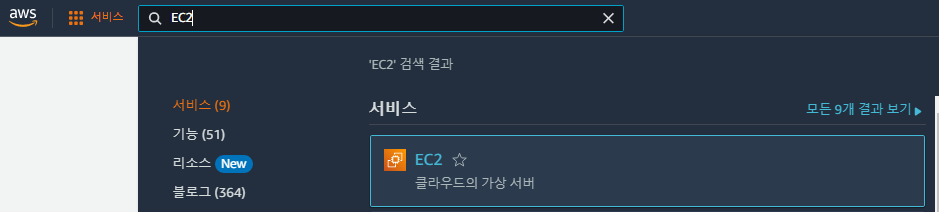

2. 우측 상단의 지역(리전)을 설정한 후, "인스턴스 시작" 클릭.

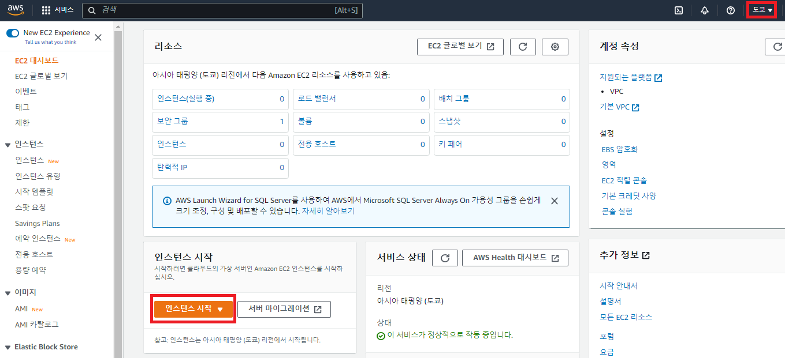

3. 인스턴스 이름 설정.

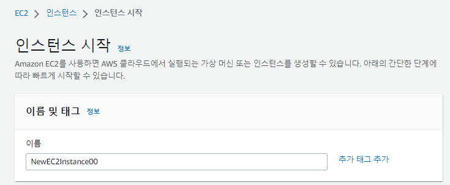

4. OS 이미지 선택. "프리 티어 사용 가능" 이라고 표기된 이미지 사용. (기본 설정대로 사용하면 됨)

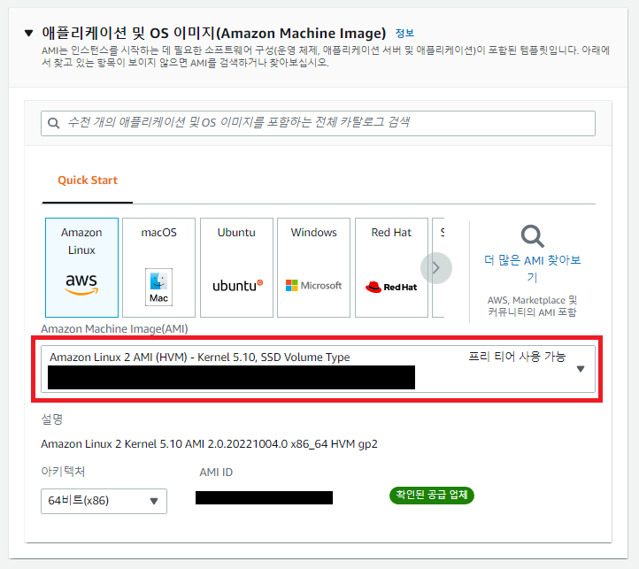

5. 인스턴스는 t2.micro 선택. 별도의 키 페어가 없는 경우 "키 페어 없이 계속 진행" 선택.

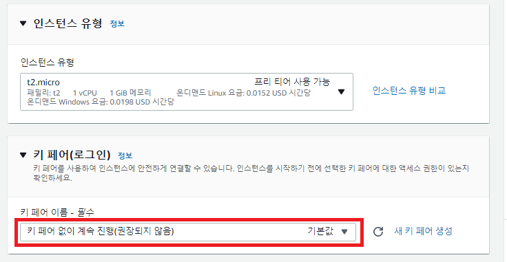

6. 기본 값 그대로 네트워크 설정.

- 여기에서는 모든 IP에서 오는 SSH 트래픽을 허용했지만, 실제로는 보안을 위해 알려진 IP만 접근 가능하도록 설정해야 함.

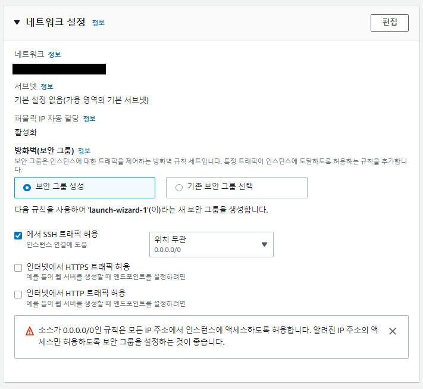

7. 스토리지 구성 정보 입력. 프리 티어의 경우 30GB까지 사용 가능하므로 30 이하의 크기 입력.

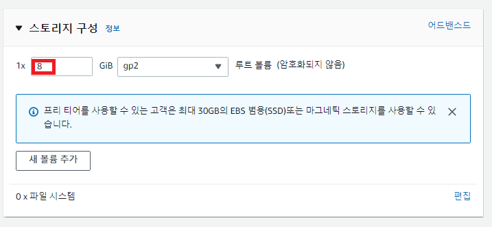

8. 인스턴스 정보를 확인한 후 시작.

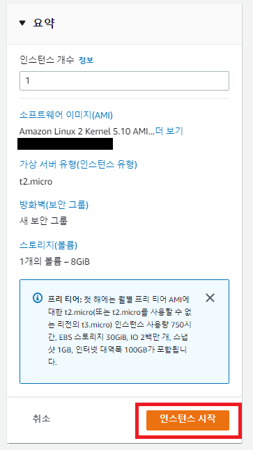

9. 인스턴스가 생성됨.

- "모든 인스턴스 보기"를 클릭시 10번으로 이동.
- "인스턴스에 연결" 을 클릭시 11번으로 이동.

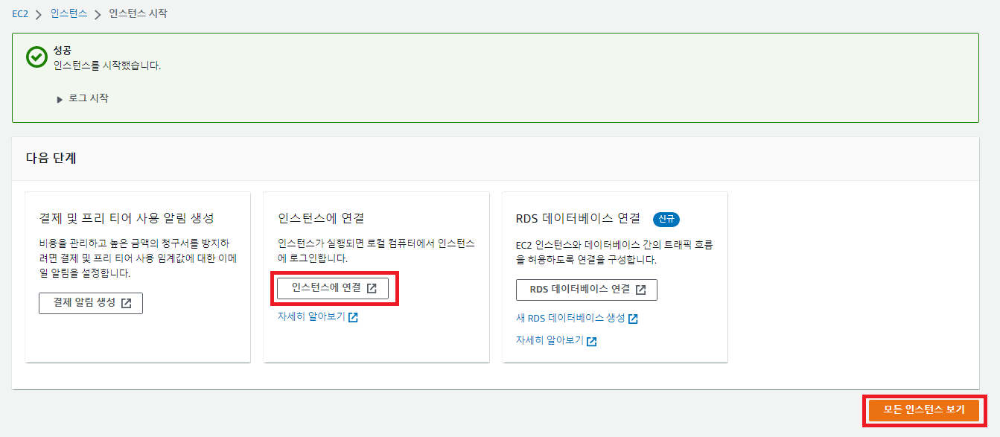

10. 생성된 인스턴스를 확인 가능하며, "연결" 클릭으로 인스턴스에 연결 가능.

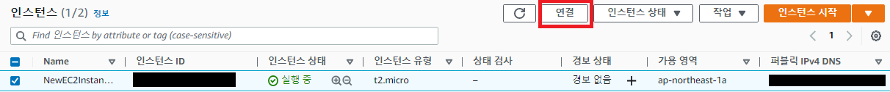

11. EC2 인스턴스에 연결 가능함. "연결" 클릭.

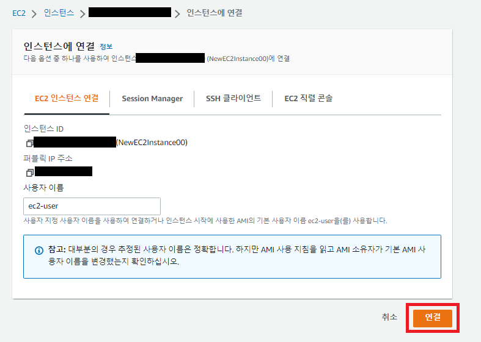

12. 아래와 같은 커맨드창을 확인 가능하고, 실제로 동작함.

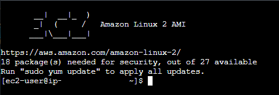

13. "인스턴스 종료"를 눌러 사용이 끝난 인스턴스를 종료시킬 수 있음. 종료된 인스턴스는 삭제됨.

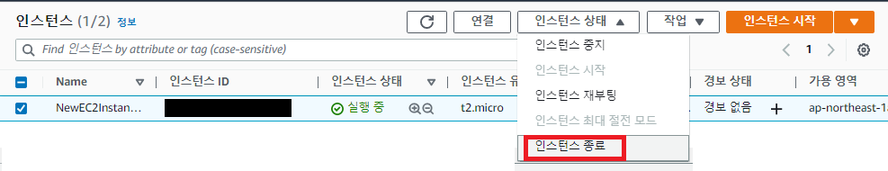

14. 인스턴스 종료 확인 문구.

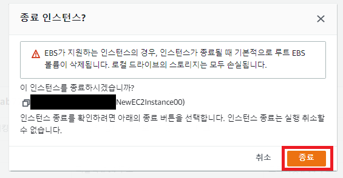

15. 정상적으로 종료된 것을 확인할 수 있음.

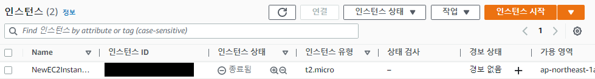

## References

1. https://aws.amazon.com/ko/ec2/getting-started/
