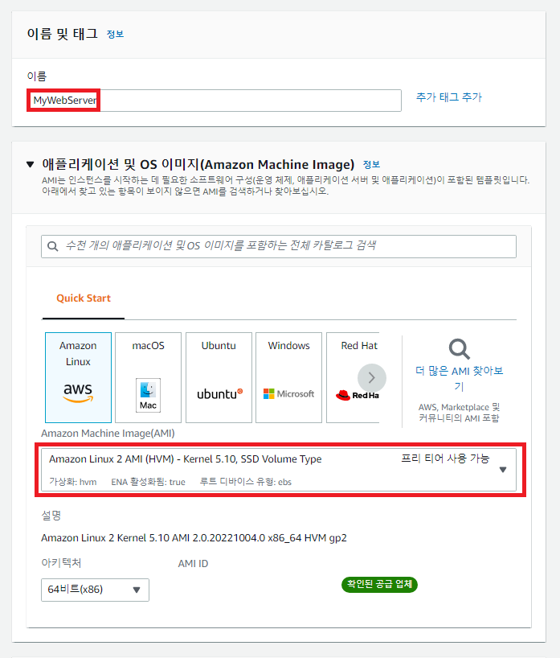
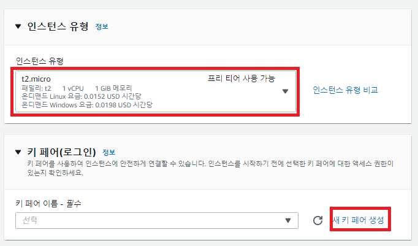
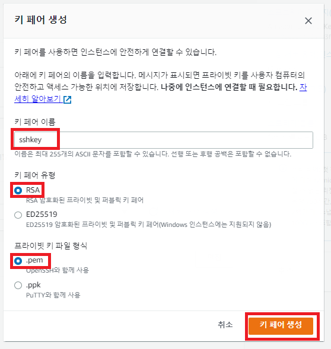
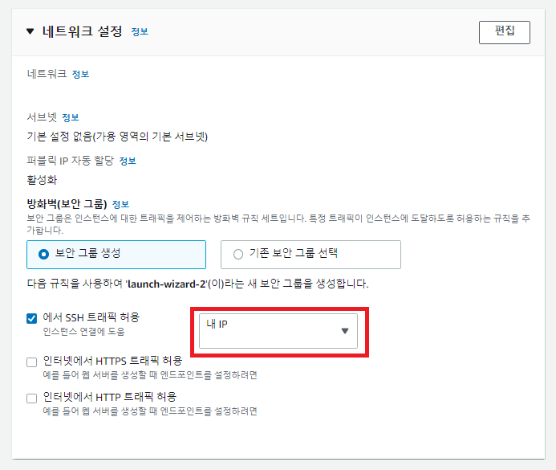
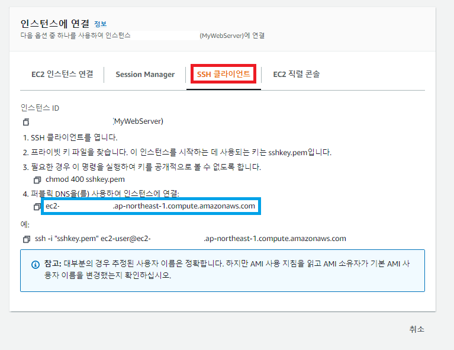
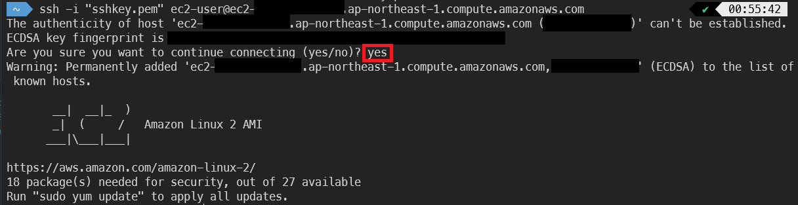
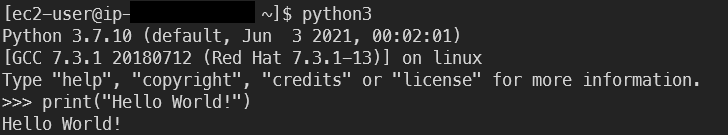
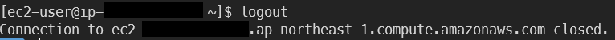
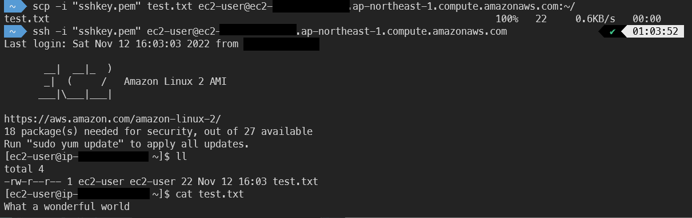

# AWS 실습: EC2를 SSH로 연결

## 선행 포스트

- [AWS 실습: EC2 시작](./2022-11-14.md)
- [SSH](./2022-11-15.md)

## AWS EC2를 SSH로 연결

0. 본 실습은 WSL을 기준으로 진행됨. WSL 혹은 리눅스 환경을 세팅.

1. MyWebServer라는 이름의 EC2 인스턴스 생성.



2. t2.micro를 선택하고, SSH 연결을 위해 "새 키 페어 생성"을 클릭.



3. 키 페어 이름을 정하고, RSA 유형과 .pem 형식을 선택해서 키 페어 생성을 클릭.

- 이 때 로컬에 키를 다운받게 됨. 이 키를 적절한 위치에 저장.



4. 네트워크 설정의 "에서 SSH 트래픽 허용" 항목을 내 IP로 설정.

- 사용자 지정으로 별도 IP를 설정할 수 있음.



5. 인스턴스 생성 후 연결 페이지로 이동하면, "SSH 클라이언트" 항목을 선택해서 연결을 수행하는 방법을 알 수 있음.

- 파란색 네모 부분을 public DNS라 하고, 이를 이용해 인스턴스에 연결 가능.



6. Command line으로 이동해서 3번에서 저장한 key의 권한 변경.

```
chmod 400 sshkey.pem
```

7. 5번에서 가져온 public DNS를 이용해 SSH로 연결.

- 이 때 중간에 SSH 연결을 할 것이냐는 질문이 나오는데, yes를 입력해 주면 됨.

```
ssh -i "{KEY_NAME}" ec2-user@{PUBLIC_DNS}
```



8. python 등의 프로그램을 실행해서 잘 동작되는 것 확인.



9. logout을 통해 연결 해제 가능.



10. scp를 이용해 로컬의 파일을 EC2 인스턴스에 전송하고, SSH로 접속해서 확인해 볼 수 있음.

```
scp -i "{KEY_NAME}" {FILE_NAME} ec2-user@{PUBLIC_DNS}:{PATH}
```



11. 반대로 EC2 인스턴스에서 로컬로 파일을 다운받는 것도 가능.

```
scp -i "{KEY_NAME}" ec2-user@{PUBLIC_DNS}:{PATH}/{FILE_NAME} {LOCAL_PATH}
```

## References

1. https://docs.aws.amazon.com/ko_kr/AWSEC2/latest/UserGuide/AccessingInstancesLinux.html
