# AWS 실습: RDS 시작

## AWS RDS 시작

0. 실습 진행 전 MySQL workbench 설치 필요.

1. 콘솔에 RDS를 입력해서 RDS 서비스 입장.

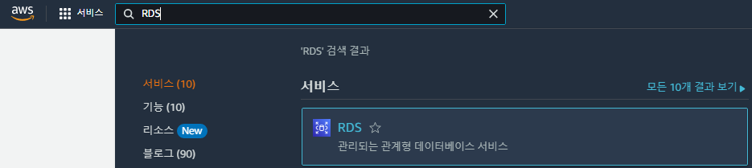

2. 지역을 선택 후 "데이터베이스 생성"을 클릭해 DB 생성.

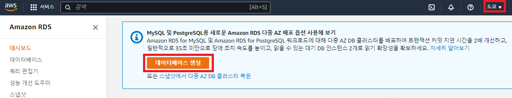

3. 데이터베이스 생성 방식을 "표준 생성"으로, 엔진을 "MySQL"로 설정.

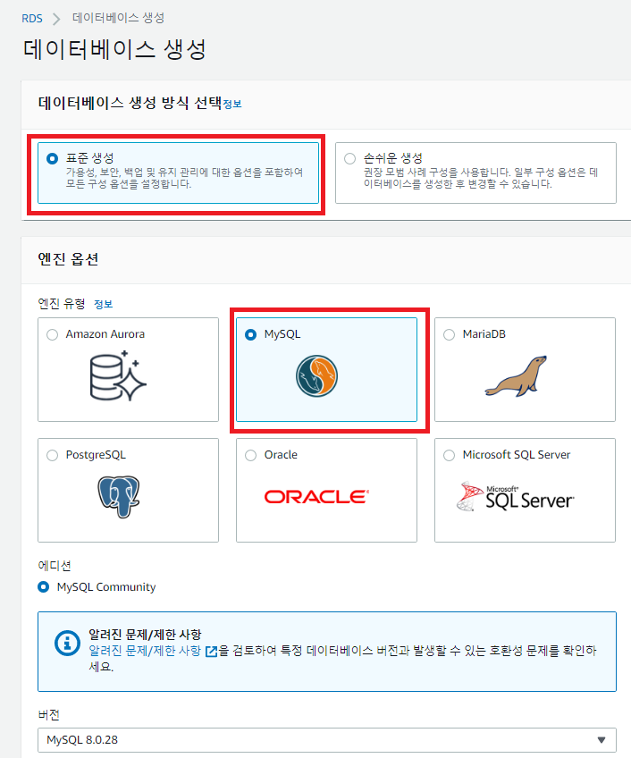

4. "프리 티어" 템플릿 선택

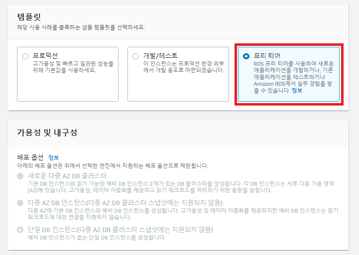

5. DB 인스턴스 식별자(이름), 마스터 사용자 이름, 마스터 암호 등을 설정.

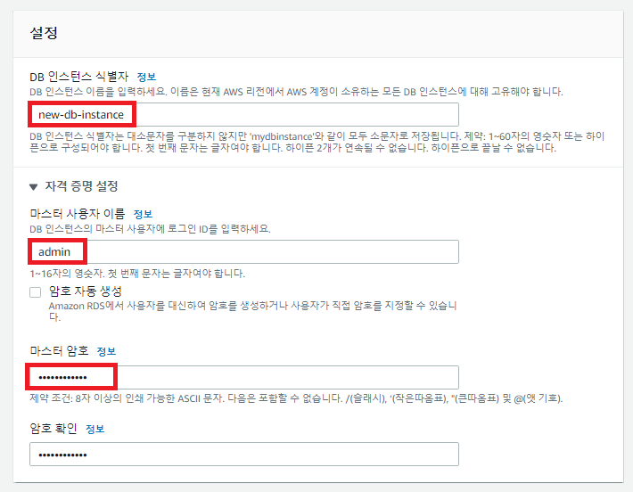

6. 인스턴스로 t2.micro를 선택하고, SSD gp2 스토리지를 선택 후 20GB 이상의 용량 선택.

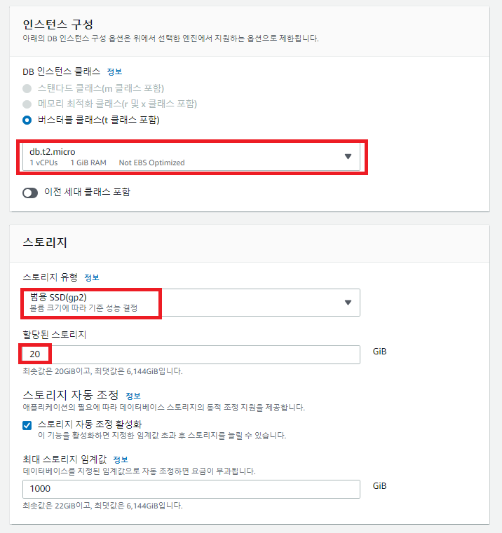

7. 이 실습에서는 "EC2 리소스에 연결 안 함"을 선택하고, VPC와 DB 서브넷 그룹을 다 기본으로 설정. 퍼블릭 엑세스 역시 허용.

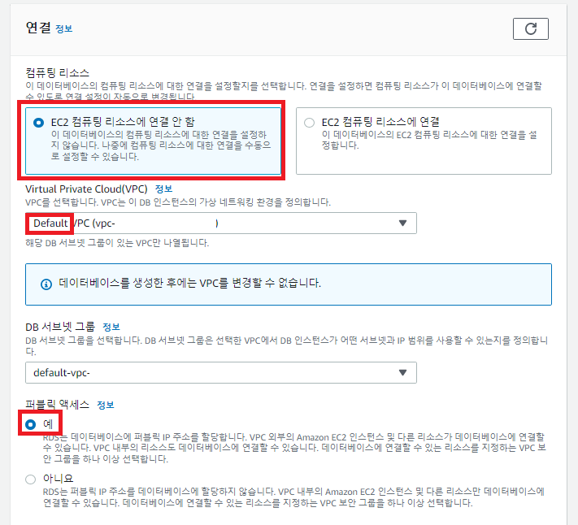

8. VPC 보안 그룹을 새로 생성하고, 그룹 이름을 작성. 인증 방식은 암호를 통한 인증 선택.

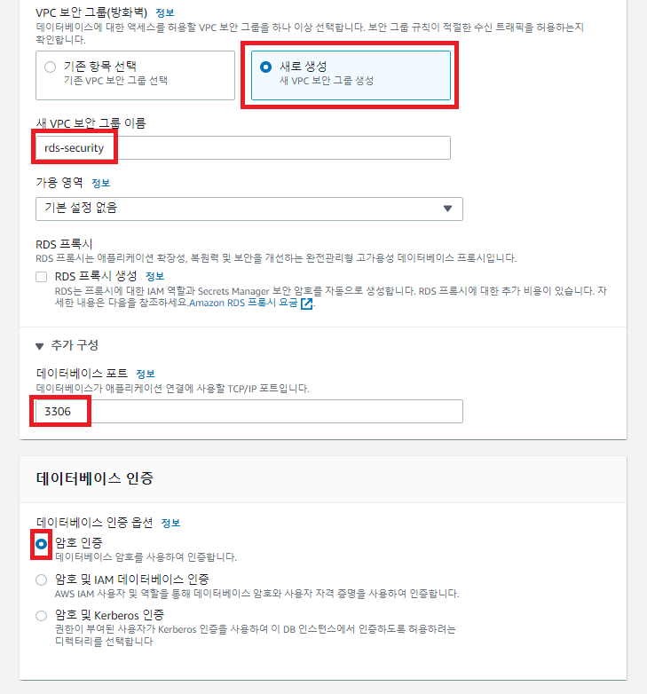

9. "추가 구성"에서 초기 데이터베이스 이름과 백업 관련 설정등을 지정함.

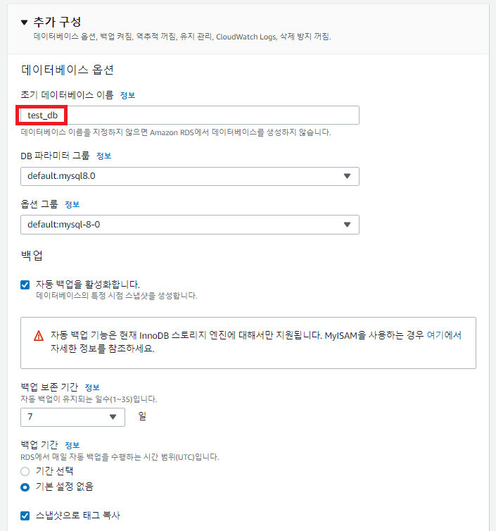

10. 월별 추정 요금 등을 확인한 후 "데이터베이스 생성" 클릭.

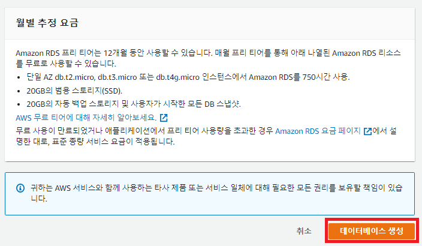

11. 데이터베이스 인스턴스가 생성되면 이름을 클릭.

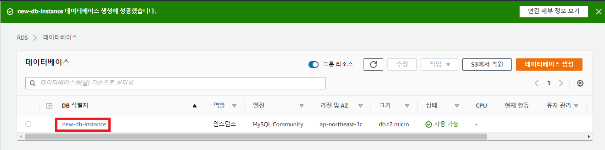

12. 연결 & 보안 탭의 엔드포인트 주소를 확인. 이 주소를 통해 연결해야 하므로 기록해 둠.

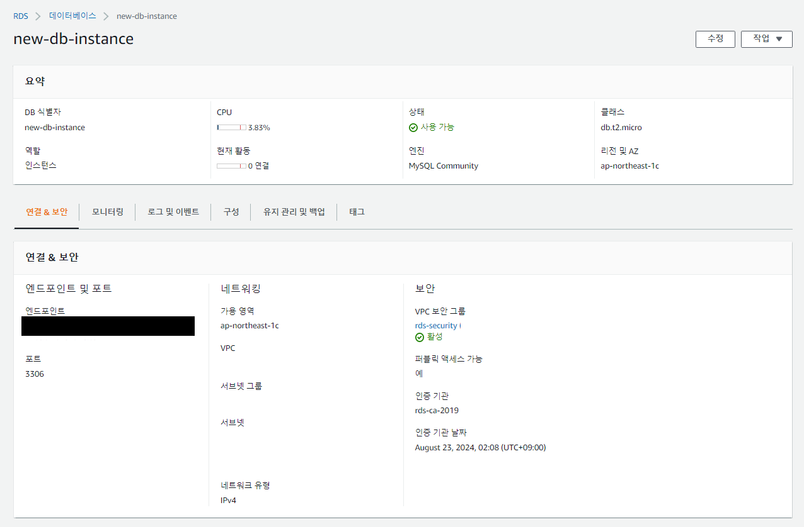

13. MySQL workbench에서 "Database" - "Connect to Database"를 클릭.

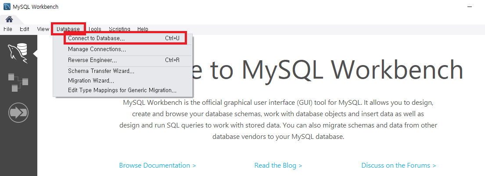

14. 다음과 같이 입력

- Hostname: 12번에서 기록해 둔 엔드포인트 주소
- Port: 3306
- Username: 5번에서 입력한 마스터 사용자 이름

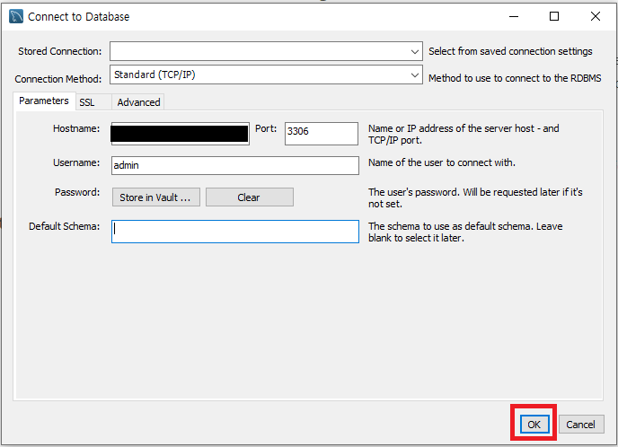

15. 5번에서 입력한 마스터 암호 입력

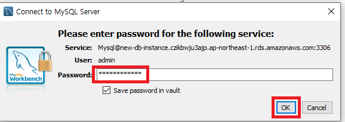

16. 다음과 같이 잘 연결되는 것이 확인 됨.

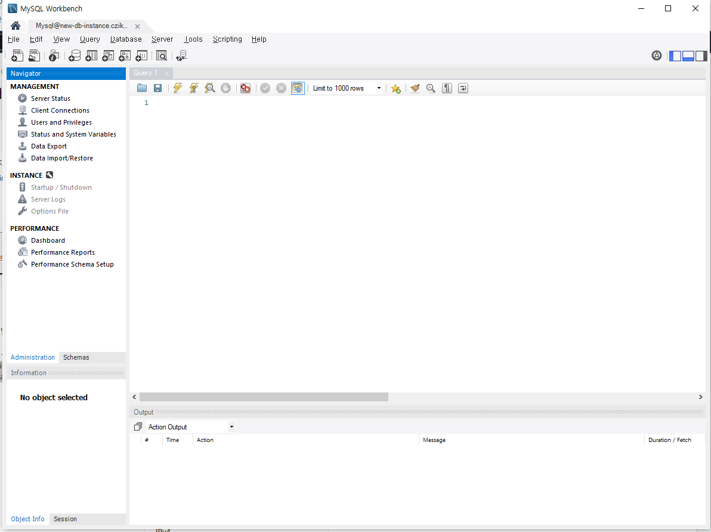

17. 다음 명령어를 입력해 test_db로 이동.

```sql
use test_db;
show tables;
```

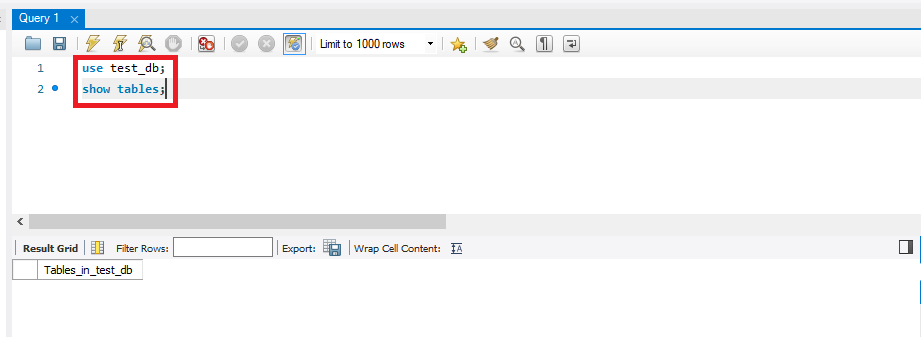

18. 직접 테이블을 생성하고 입력, 조회해서 잘 동작하는 것 확인.

```sql
CREATE TABLE users(
    uid INT PRIMARY KEY,
    score INT
);

INSERT INTO users VALUES (1, 30), (2, 18);

SELECT FROM users;
```

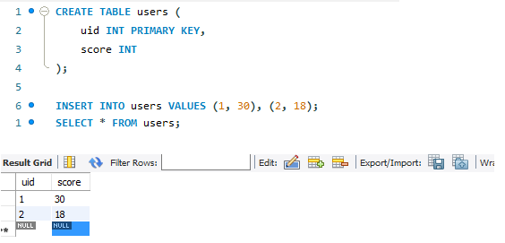

19. DB 인스턴스를 삭제하고 싶다면 RDS 콘솔에서 "작업" - "삭제"를 누름.

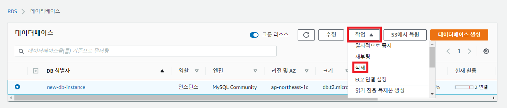

20. 백업 / 스냅샷 여부를 설정하고 삭제.

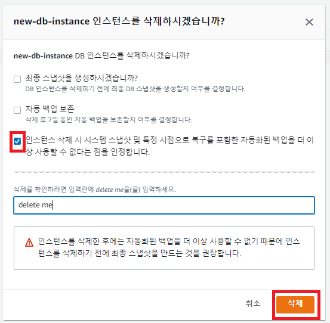

## References

1. https://aws.amazon.com/ko/getting-started/hands-on/create-mysql-db/
