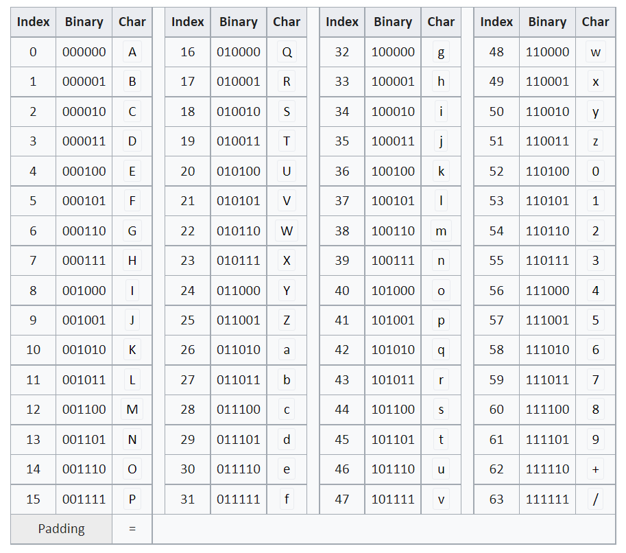

# Base64

## Base64

- 8bit의 순열로 이루어진 이진 데이터를 인코딩하는 방법
- 문자 코드에 영향을 받지 않는 형태로 데이터를 전송 가능
- JWT등 HTTP 환경에서 긴 정보를 식별할때 유용

## 인코딩 방식

1. 8bit로 데이터 세 개를 붙여 24bit의 데이터를 만듦
2. 24bit 데이터를 네 부분의 6bit로 쪼갬
3. 각 6bit를 위 표에 따라 해당하는 문자로 변환

## Padding

- 원본 데이터의 길이를 24bit로 쪼갰을 때, 마지막 부분이 딱 떨어지지 않고 16bit 혹은 8bit가 남을 수도 있음.
- 이 경우 원본 binary 데이터에 `0`을 추가로 붙여 각각 18 bit / 12bit로 만듦
- 각각 24bit에서 6bit / 12bit 만큼 부족하므로, 해당 부분을 padding하는 문자인 `=`을 삽입
- padding은 붙이지 않아도 인코딩 및 디코딩 결과에 영향은 없으나 좀 더 편해짐

## Base64 url safe

- URL에서 base64를 사용하기 위해서는, URL에서 특별한 의미를 가지는 `+`, `/`를 그대로 사용 불가
- 따라서 Base64 url safe 인코딩은 `+`를 `-`로, `/`를 `_`로 대신해 사용
- JWT, youtube 등에서 사용

## References

1. https://en.wikipedia.org/wiki/Base64
