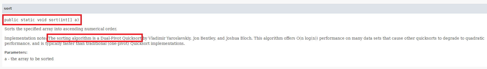
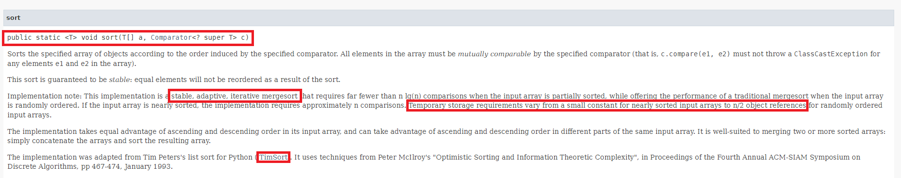
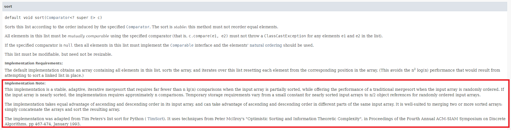
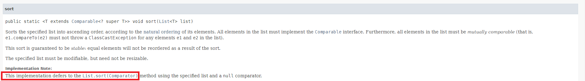

# Java Sort Comparison

## Java sort

- Java에서는 다음과 같은 여러 경우의 데이터를 `sort` 메소드로 정렬 가능
  1.  Primitive type의 값으로 이루어진 array
  2.  레퍼런스 변수로 이루어진 array
  3.  레퍼런스 변수로 이루어진 List
- 데이터를 정렬하기 위해 2, 3 번의 경우에는 객체가 `Comparable interface`를 구현하거나, `sort` 메소드 인자에 별도로 `Comparator` 객체를 제공해야 함
- `sort` 메소드를 실행했을 때 정렬하는 방법이 조금 다름. Java11 기준으로 설명

## Primitive Type Array

- Primitive Type의 경우에는 Dual Pivot QuickSort를 사용
- 다른 Quick sort보다 빠르고 `O(N^2)`의 시간 복잡도가 덜 발생

## Reference Variable Array

- TimSort라는 정렬 방법을 사용
- Stable한 iterative merge sort의 일종이며, insertion sort와 merge sort를 합침
- 데이터가 정렬되어 있는 경우 `O(NlogN)`보다 적게 비교하며, 거의 정렬된 경우 `O(N)`
- 다만 정렬을 위해 추가적인 공간(N/2 이하)이 필요

## Reference Variable List

- List의 sort 함수는 Array와 동일하게 TimSort 사용

- 별개로 Collections.sort() 함수도 List의 sort()함수와 동일하게 실행됨

## Sort Method Comparison

- Dual Pivot QuickSort의 경우 여전히 최악의 경우 O(N^2)의 시간이 소요
  - 일부 코딩 테스트 문제에서 사용하면 시간 초과가 남
- 반면 TimSort의 경우 최악, 평균 모두 O(NlogN)이며, 최선의 경우 O(N)까지 줄어듦
- 특히 현실 세계의 데이터는 부분적으로 정렬되거나 거의 정렬된 경우가 많은 데, 이럴 때 TimSort가 굉장히 효율적
- 다만 TimSort는 데이터의 초기 상태에 따라 추가적인 공간이 필요하고, 이 부분을 잘 고려해야 함

## References

1. https://docs.oracle.com/en/java/javase/11/docs/api/java.base/java/util/Arrays.html
2. https://docs.oracle.com/en/java/javase/11/docs/api/java.base/java/util/Collections.html#sort(java.util.List)
3. https://docs.oracle.com/en/java/javase/11/docs/api/java.base/java/util/List.html#sort(java.util.Comparator)
4. https://codingnojam.tistory.com/38
