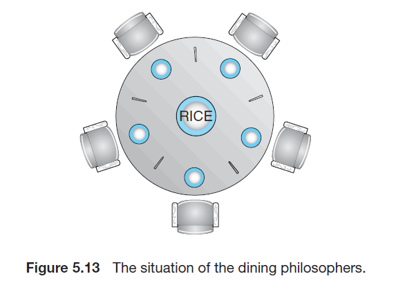

# Process Synchronization-3

## Classic Problems of Process Synchronization

- Semaphore를 이용해 해결 가능한 race condition 및 critical section 관련 여러 고전 문제들이 존재
  - Bounded buffer problem
  - Readers writers problem
  - Dining philosophers problem

## Bounded Buffer Problem

- Producer-consumer problem 이라고도 하는 문제
- 여러 `producer` 프로세스와 `consumer` 프로세스가 존재하고, 여러 프로세스가 **유한한 크기**의 버퍼를 조작하는 문제
  - `producer`는 버퍼에 데이터를 넣음, 꽉 차있으면 대기
  - `consumer`는 버퍼에서 데이터를 꺼냄, 비어 있으면 대기
- 다음과 같이 세 개의 semaphore를 이용해서 해결 가능
  - `mutex`: 임계 영역에 `producer`와 `consumer`가 동시에 접근하지 못하도록 하는 semaphore
  - `empty`: 버퍼가 다 차는 경우 `producer`가 데이터를 못 넣게 하는 semaphore
  - `full`: 버퍼가 비어 있는 경우 `consumer`가 데이터를 못 꺼내게 하는 semaphore

```c
// 공유 변수
int n;
semaphore mutex = 1;
semaphore empty = n;
semaphore full = 0;
```

```c
// producer process
do {
	/** produce an item **/

	wait(empty);    // empty <= 0 인 경우 대기
	wait(mutex);

	/** add produced to the buffer **/

  signal(mutex);
	signal(full);   // full += 1
} while (true);
```

```c
//consumer process
do {
	wait(full);     // full <= 0 인 경우 대기
	wait(mutex);

  /** remove an item from **/

	signal(mutex);
	signal(empty);  // empty += 1

	/** consume the item in next consumed **/
} while (true);

```

## Readers-Writers Problem

- 읽기만 하는 프로세스 `reader`와 쓰는 프로세스 `writer`이 DB를 공유하는 문제
  - 한 번에 여러 명의 `reader`가 데이터를 읽을 수 있음
  - `reader`가 한 명이라도 있는 경우 `writer`는 데이터를 쓸 수 없음
  - 한 명의 `writer`가 쓰고 있는 경우 `reader` 및 다른 `writer`는 모두 접근 불가
- 다음과 같이 두 개의 semaphore와 한 개의 변수를 이용해서 해결
  - `mutex`: `read_count`에 접근하기 위한 semaphore
  - `read_count`: 읽고 있는 사람의 수를 저장하는 변수. 여러 사람이 읽는 것은 허용하기 위함
  - `rw_mutex`: 읽고 있을 때 쓰는 걸 막거나, 쓰고 있을 때 다른 사람이 읽거나 쓰는 것을 막기 위한 semaphore
- `reader`와 `writer` 구분이 쉽고, `reader`가 `writer`보다 많은 경우 유용

```c
// writer
do {
	wait(rw_mutex);       // Writer가 있는 경우 읽거나 쓰는 것 모두 안 됨

  /** write **/

	signal(rw_mutex);
} while (true);
```

```c
//reader
do {
	wait(mutex);          // Semaphore for read_count
	read_count++;
	if (read_count == 1)  // 여러 사람이 읽는 것을 허용
		wait(rw mutex);
	signal(mutex);

	/** read **/

	wait(mutex);
	read_count--;
	if (read count == 0)  // 읽는 사람이 한 명도 없어야 writer가 쓸 수 있음
		signal(rw mutex);
	signal(mutex);
} while (true);
```

## Dining Philosophers Problem



- 문제는 다음과 같음
  - 철학자 5명이 원탁의 5개의 자리에 앉고, 각 자리에 젓가락이 하나씩 있음
  - 각 철학자는 배고파지면 식사를 하는데, 왼쪽 젓가락부터 집고, 오른쪽 젓가락을 집음
  - 두 젓가락을 다 집어야 식사가 가능
  - 식사가 완료되면 젓가락을 내려놓음
  - 다른 사람의 젓가락을 뺏을 수 없음
- 각 젓가락을 semaphore로 두고 semaphore 배열을 이용해 해결

```c
semaphore chopstick[5];

do {
	wait(chopstick[i]);
	wait(chopstick[(i+1) % 5]);

	/** eat **/

	signal(chopstick[i]);
	signal(chopstick[(i+1) % 5]);

	/** think **/

} while (true);
```

## Deadlocks of Dining Philosophers Problem

- 모두가 본인의 왼쪽 젓가락을 든 경우 deadlock 발생 가능
- 다음 세 가지 방법을 이용해 deadlock 해결 가능
  1. 4명만 자리에 앉을 수 있게 함
  2. 두 젓가락이 모두 사용 가능한 경우에만 젓가락을 집을 수 있게 함
  3. 홀수 번호는 왼쪽, 짝수 번호는 오른쪽 젓가락부터 집을 수 있게 함

## References

1. Operating System Concepts 9th Edition, Silberschatz, Galvin and Gagne ©2013

## 기타

2022-07-30에 작성된 `Process Synchronization` 문서를 정리하고 보완하는 중
