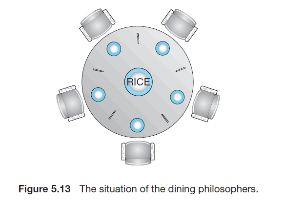

# Process Synchronization

## Race Condition

- 여러 프로세스가 공유하는 데이터에 concurrent하게 접근하는 상황에서, 접근하는 순서에 따라 결과가 달라지는 현상
- 실행할 때 마다 결과가 달라질 수 있기 때문에 발생하면 안됨
- 자원의 일관성을 유지하기 위해 프로세스간의 동기화(synchronization)가 필요

## Critical Section

- 프로세스간 공유 변수를 사용하거나 파일을 쓰는 등의 역할을 하는 코드 구역
- 두 개 이상의 프로세스가 critical section (임계 영역)에서 실행되면 race condition이 발생됨
- Race condition을 방지하고 임계 영역을 보호하기 위해서는 다음 조건들을 만족해야 함
  1. Mutual Exclustion
     - 한번에 한 프로세스만 임계 영역에서 실행 가능
     - 임계 영역에서 실행 중인 프로세스가 있다면 다른 프로세스는 임계 영역에서 실행 불가
  2. Progress
     - 임계 영역에 실행 중인 프로세스가 없는 경우, 임계 영역에 들어갈 수 있는 프로세스 중 하나를 선택해서 진입시켜야 함
     - 이 결정이 무한히 연기되면 안 됨
  3. Bounded Waiting
     - 한 프로세스가 임계 영역에 진입 요청을 한 경우, 요청이 허가되기 전에 다른 프로세스들이 임계 영역에 진입할 수 있는 횟수 제한 존재
     - 즉, 유한한 시간 내에 임계 영역에 언젠가는 들어갈 수 있다는 의미

## Peterson's solution

```c
// Process i의 경우
do {
   flag[i] = true;               // Process i 가 임계 영역에 들어갈 준비가 됨
   turn = j                      // Process j에게 입장 기회를 넘김
   while(flag[j] && turn == j);  // Process j가 임계 영역에 입장 가능하고 입장 기회가 있다면 대기

   /** Critical section **/

   flag[i] = false;              // Process i가 임계 영역을 다 사용함을 표시

   /** Remainder section **/
}
```

- 프로세스가 두 개(i, j)일 때 임계 영역을 보호하기 위해 사용 가능한 방법
- `turn` 과 `flag` 라는 두 개의 공유 변수를 이용하며, 세 가지 조건을 모두 만족
  - `flag[i]`: i번째 프로세스가 임계 영역에 들어갈 준비가 되었는지 여부
  - `turn`: 임계 영역 입장할 프로세스의 순번 (i인 경우 P_i가 임계 영역에 입장)
- 다른 프로세스에게 임계 영역에 우선적으로 입장할 기회를 양보하고 대기
- 3개 이상의 프로세스에서는 사용이 불가하며, `Busy waiting` 문제가 존재

## Busy Waiting

- 프로세스가 임계 영역에 입장 가능해 질 때 까지 while loop를 계속 도는 현상
- 계속 loop를 도므로 임계 영역이 긴 경우 CPU 사이클을 낭비한다는 단점이 존재
- 임계 영역이 짧은 경우에는 효율적일 수 있음

## Mutex Locks

```C
acquire() {
	while (!available)
		; // busy waiting
	available = false;
}

release() {
	available = true;
}
```

```C
do {
	acquire();

    /** critical section **/

    release();

    /** remainder section **/
} while (true);
```

- 임계 영역에 대한 입장을 보호하는 도구
- `available`이라는 변수와 `acquire`, `release` 함수로 구성됨
- 임계 영역 이전에 `acquire` 함수를 실행하면서 다른 프로세스의 임계 영역 접근을 막음
  - 만약 다른 프로세스가 임계 영역을 사용하고 있다면, 현재 프로세스가 `busy waiting`이 걸림
- 임계 영역 이후에 `release` 함수를 실행하면서 다른 프로세스의 임계 영역 접근을 허용
- 어떤 프로세스가 임계 구역에 들어갈 때 `lock`을 획득하고, 나올 때 `lock`을 반환하는 형태

## Semaphores

- `Mutex lock` 보다 정교한 도구이며, 특정 프로세스가 `lock`의 소유권을 가지지 않음
  - `Mutex lock`은 **lock을 소유한 프로세스만** 직접 release 가능
  - `Semaphore`는 **어떤 프로세스든** signal을 보내서 semaphore를 제어 가능
- `Semaphore`라는 정수 값과 `wait`, `signal` 함수로 구성됨
- `Busy waiting` 혹은 `block / wakeup`을 이용한 구현이 가능
- 다음과 같이 두 가지 종류로 구분
  - Counting sempahore: 임계 영역에 접근이 가능한 프로세스 수가 N개일때 사용, 0 ~ N 사이의 정수값을 이용
  - Binary semaphore: 임계 영역에 접근이 가능한 프로세스 수가 1개일때 사용, 0 혹은 1의 정수값을 가짐

## Semaphore 구현 (Busy Waiting)

```c
wait(S) {
	while (S <= 0)
		; // busy waiting
	S--;
}

signal(S) {
	S++;
}

```

- `Busy waiting`을 이용한 구현. `Mutex lock`과 유사
- `wait` 함수는 `acquire` 함수와, `signal` 함수는 `release` 함수와 유사
- 임계 영역이 짧은 경우에는 효과적

## Semaphore 구현 (block / wakeup)

```c
typedef struct {
	int value;
	struct process *list;
} semaphore

wait(semaphore *S) {
	S->value--;
    if (S->value < 0){
    	add the PCB of this process to S->list;
        block();
    }
}

signal(semaphore *S) {
	S->value++;
	if (S->value <= 0) {
    	remove a process P from S->list;
		wakeup(P);
	}
}
```

- `block / wakeup` 함수를 통한 semaphore 구현
- list라는 멤버 변수에 PCB 배열을 저장
- wait
  - `block()` 함수는 프로세스 실행을 중지하는 함수
  - 만약 임계 영역에 진입이 불가한 경우 block 함수를 통해 현재 프로세스를 중지시키고 PCB를 리스트에 넣음
- signal
  - `wakeup(P)` 함수는 중지된 프로세스 `P`를 다시 실행하는 함수
  - 리스트에 중지된 프로세스가 있다면 wakeup 함수를 통해 해당 프로세스를 다시 실행시키고 PCB를 리스트에서 제거
- 장점
  - 임계 영역이 길수록 효과적
  - `Busy waiting`을 사용하지 않아도 됨
- 단점
  - 임계 영역을 진입함에 있어 `deadlock` 발생 가능
  - 프로세스를 큐에서 꺼낼 때 LIFO 순으로 꺼낸다면 `starvation` 발생 가능

## 기타 Synchronization 도구

- `Monitor`: 잘못된 `semaphore`의 사용을 방지해주는 고급 자료 구조
- `Condition Variable`: 프로세스들의 실행 순서를 보장하면서 `semaphore`의 `deadlock`과 `starvation` 문제를 해결

## Classic Problems of Process Synchronization

- Semaphore를 이용해 해결 가능한 race condition 및 critical section 관련 여러 고전 문제들이 존재
  - Bounded buffer problem
  - Readers writers problem
  - Dining philosophers problem

## Bounded Buffer Problem

- Producer-consumer problem 이라고도 하는 문제
- 여러 `producer` 프로세스와 `consumer` 프로세스가 존재하고, 여러 프로세스가 **유한한 크기**의 버퍼를 조작하는 문제
  - `producer`는 버퍼에 데이터를 넣음, 꽉 차있으면 대기
  - `consumer`는 버퍼에서 데이터를 꺼냄, 비어 있으면 대기
- 다음과 같이 세 개의 semaphore를 이용해서 해결 가능
  - `mutex`: 임계 영역에 `producer`와 `consumer`가 동시에 접근하지 못하도록 하는 semaphore
  - `empty`: 버퍼가 다 차는 경우 `producer`가 데이터를 못 넣게 하는 semaphore
  - `full`: 버퍼가 비어 있는 경우 `consumer`가 데이터를 못 꺼내게 하는 semaphore

```c
// 공유 변수
int n;
semaphore mutex = 1;
semaphore empty = n;
semaphore full = 0;
```

```c
// producer process
do {
	/** produce an item **/

	wait(empty);    // empty <= 0 인 경우 대기
	wait(mutex);

	/** add produced to the buffer **/

  signal(mutex);
	signal(full);   // full += 1
} while (true);
```

```c
//consumer process
do {
	wait(full);     // full <= 0 인 경우 대기
	wait(mutex);

  /** remove an item from **/

	signal(mutex);
	signal(empty);  // empty += 1

	/** consume the item in next consumed **/
} while (true);

```

## Readers-Writers Problem

- 읽기만 하는 프로세스 `reader`와 쓰는 프로세스 `writer`이 DB를 공유하는 문제
  - 한 번에 여러 명의 `reader`가 데이터를 읽을 수 있음
  - `reader`가 한 명이라도 있는 경우 `writer`는 데이터를 쓸 수 없음
  - 한 명의 `writer`가 쓰고 있는 경우 `reader` 및 다른 `writer`는 모두 접근 불가
- 다음과 같이 두 개의 semaphore와 한 개의 변수를 이용해서 해결
  - `mutex`: `read_count`에 접근하기 위한 semaphore
  - `read_count`: 읽고 있는 사람의 수를 저장하는 변수. 여러 사람이 읽는 것은 허용하기 위함
  - `rw_mutex`: 읽고 있을 때 쓰는 걸 막거나, 쓰고 있을 때 다른 사람이 읽거나 쓰는 것을 막기 위한 semaphore
- `reader`와 `writer` 구분이 쉽고, `reader`가 `writer`보다 많은 경우 유용

```c
// writer
do {
	wait(rw_mutex);       // Writer가 있는 경우 읽거나 쓰는 것 모두 안 됨

  /** write **/

	signal(rw_mutex);
} while (true);
```

```c
//reader
do {
	wait(mutex);          // Semaphore for read_count
	read_count++;
	if (read_count == 1)  // 여러 사람이 읽는 것을 허용
		wait(rw mutex);
	signal(mutex);

	/** read **/

	wait(mutex);
	read_count--;
	if (read count == 0)  // 읽는 사람이 한 명도 없어야 writer가 쓸 수 있음
		signal(rw mutex);
	signal(mutex);
} while (true);
```

## Dining Philosophers Problem



- 문제는 다음과 같음
  - 철학자 5명이 원탁의 5개의 자리에 앉고, 각 자리에 젓가락이 하나씩 있음
  - 각 철학자는 배고파지면 식사를 하는데, 왼쪽 젓가락부터 집고, 오른쪽 젓가락을 집음
  - 두 젓가락을 다 집어야 식사가 가능
  - 식사가 완료되면 젓가락을 내려놓음
  - 다른 사람의 젓가락을 뺏을 수 없음
- 각 젓가락을 semaphore로 두고 semaphore 배열을 이용해 해결

```c
semaphore chopstick[5];

do {
	wait(chopstick[i]);
	wait(chopstick[(i+1) % 5]);

	/** eat **/

	signal(chopstick[i]);
	signal(chopstick[(i+1) % 5]);

	/** think **/

} while (true);
```

## Deadlocks of Dining Philosophers Problem

- 모두가 본인의 왼쪽 젓가락을 든 경우 deadlock 발생 가능
- 다음 세 가지 방법을 이용해 deadlock 해결 가능
  1. 4명만 자리에 앉을 수 있게 함
  2. 두 젓가락이 모두 사용 가능한 경우에만 젓가락을 집을 수 있게 함
  3. 홀수 번호는 왼쪽, 짝수 번호는 오른쪽 젓가락부터 집을 수 있게 함

## References

1. Operating System Concepts 9th Edition, Silberschatz, Galvin and Gagne ©2013
2. https://jooona.tistory.com/12
3. https://eunsolsblog.tistory.com/20
4. https://velog.io/@doyuni/%EC%9A%B4%EC%98%81%EC%B2%B4%EC%A0%9COS-6.-Process-Synchronization 3. https://rebro.kr/176

## 기타

2022-07-30에 작성된 `Process Synchronization` 문서를 `2023-02-21` ~ `203-02-23` 간 다시 정리하고 부족한 내용을 보충해서 완성
