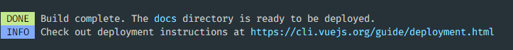
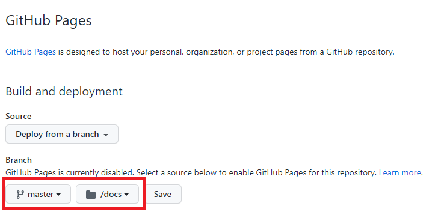

# Vue Github Pages

## Vue-cli로 만든 프로젝트에서 github pages를 이용해 배포하는 법

1. Vue 프로젝트 내에 `vue.config.js` 파일을 생성하고 `publicPath` 항목과 `outputDir` 항목을 입력
   - `publicPath`: 루트 도메인으로부터의 경로를 나타내는 항목. 레포지토리 이름을 입력하면 됨
   - `outputDir`: 빌드된 파일의 저장 경로를 나타내는 항목. Github pages를 이용하기 위해서는 `"docs"`라고 입력하면 됨
   - 다음은 실제 `vue.config.js` 파일 예시

```js
const { defineConfig } = require("@vue/cli-service");
module.exports = defineConfig({
  transpileDependencies: true,
  publicPath: "/{YOUR_REPOSITORY_NAME}",
  outputDir: "docs",
});
```

2. npm run build를 통해 프로젝트 빌드
   - 다음과 같이 docs 폴더가 생성됨을 확인할 수 있음



3. 깃허브 repository에 push

4. 깃허브 repository의 `Settings`에서 `Pages` 탭에 들어감
   - 브랜치를 `master`로, 경로를 `docs`로 설정후 저장



5. 다음과 같이 정상적으로 배포됨을 확인


## References

1. https://velog.io/@byungjur_96/vue.js-Github-Pages%EB%A1%9C-%EB%B0%B0%ED%8F%AC%ED%95%98%EA%B8%B0
