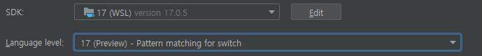
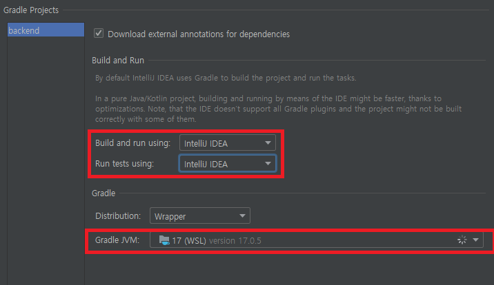

# Intellij IDEA WSL Spring

## Intellij IDEA로 WSL에서 Spring 프로젝트 설정

1. 하단에 `Microsoft Defender configuration` 이 뜨면 `Automatically`를 눌러 해결
2. PowerShell에 들어가서 다음을 입력
   > New-NetFirewallRule -DisplayName "WSL" -Direction Inbound -InterfaceAlias "vEthernet (WSL)" -Action Allow
   > Get-NetFirewallProfile -Name Public | Get-NetFirewallRule | where DisplayName -ILike "IntelliJ IDEA\*" | Disable-NetFirewallRule
3. `Settings -> Tools -> Terminal`에서 Shell path를 `wsl.exe`로 변경
4. `Project Structure -> Project`에 들어가서 다음과 같이 설정
   - SDK를 wsl에 설치된 JDK로 변경
   - Language level을 맞춤
   - 
5. `build.gradle`을 이용해 gradle 프로젝트 load
   - 에러 창이 나온 경우 6번으로
6. 에러 창의 `Open gradle settings`를 눌러 다음과 같은 설정 변경
   - 위 네모 부분을 `Intellij IDEA`로 변경
   - `Gradle JVM`을 2번에서 사용한 wsl의 JDK로 변경
   - 적용하면 gradle build가 시작됨
   - 

## References

1. https://hou27.tistory.com/entry/Spring-%ED%94%84%EB%A1%9C%EC%A0%9D%ED%8A%B8-%EC%8B%A4%ED%96%89-with-Intellij-from-WSL
2. https://velog.io/@juhyeon1114/IntelliJ-%ED%84%B0%EB%AF%B8%EB%84%90-wsl2%EB%A1%9C-%EB%B0%94%EA%BE%B8%EA%B8%B0
3. https://www.jetbrains.com/help/idea/how-to-use-wsl-development-environment-in-product.html#debugging_system_settings
