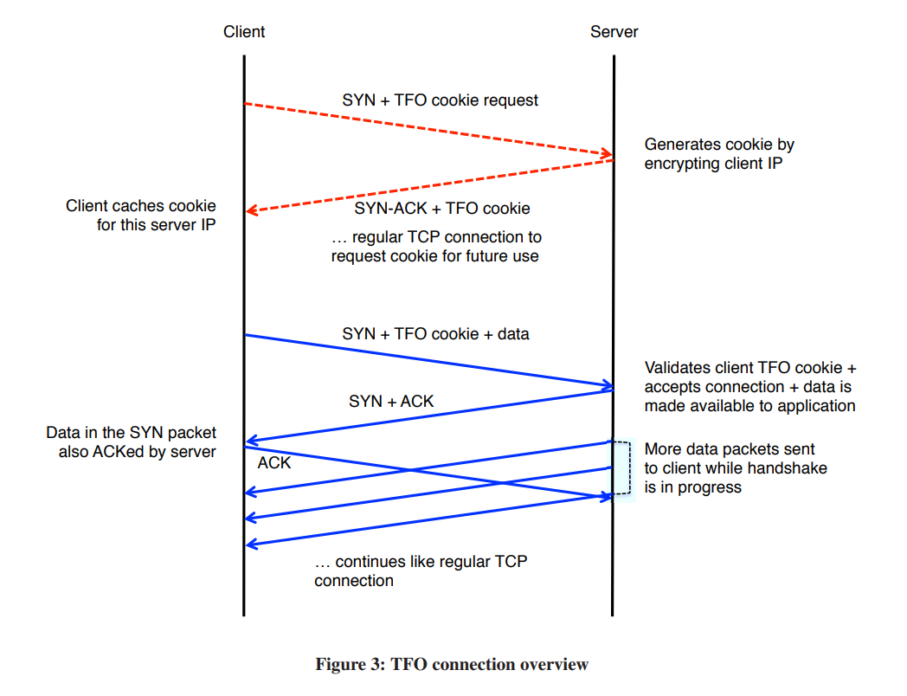

# TCP Fast Open

## TCP Fast Open (RFC 7413)

- TCP의 연결 시작 속도를 높이는 TCP 연결의 확장
- 초기 연결시 클라이언트는 서버로부터 받은 TFO 라는 암호화 쿠키를 저장함
- 이후 클라이언트가 연결될 때 SYN 패킷과 TFO 쿠키를 보내면, 서버는 3-Way handshake가 일어나기 전에 클라이언트로 데이터를 보낼 수 있음
- 데이터 전송 시 대기 시간을 감소시키는 효과 발생
- `메시지 인증 코드` 값을 사용해 서드 파티가 IP 주소를 위조해서 스푸핑을 하기 힘들게 만듦

## References

1. https://en.wikipedia.org/wiki/TCP_Fast_Open
2. http://static.googleusercontent.com/media/research.google.com/en/us/pubs/archive/37517.pdf
