# Google OAuth Settings

## Google OAuth Settings

1. https://console.cloud.google.com 로 이동해서 `프로젝트 선택` 클릭

2. `새 프로젝트` 클릭

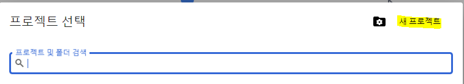

3. 프로젝트 이름을 입력하고 `만들기` 클릭 (약간 시간 소요)

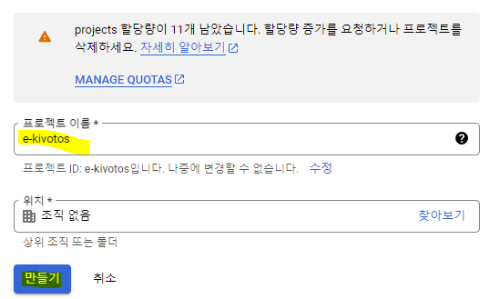

4. 1번과 같이 `프로젝트 선택`을 누른 후 방금 만든 `프로젝트 이름` 클릭

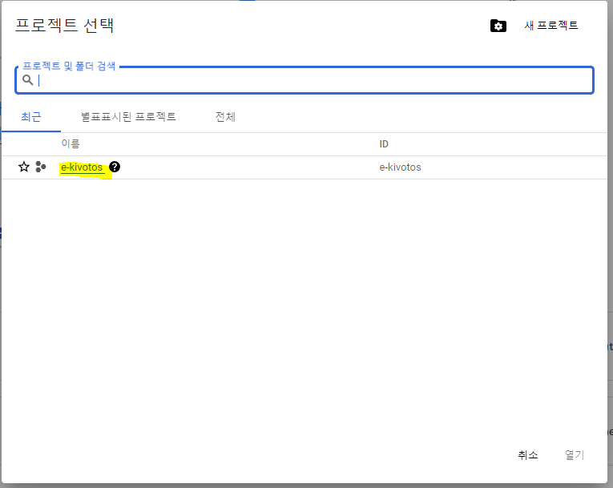

5. `왼쪽 메뉴 버튼` -> `API 및 서비스` -> `사용자 인증 정보` 순서대로 클릭

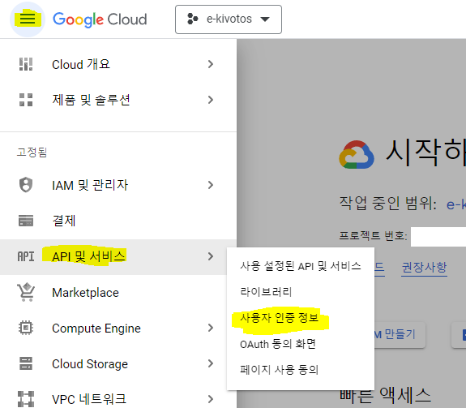

6. `사용자 인증 정보 만들기` -> `OAuth 클라이언트 ID` 클릭

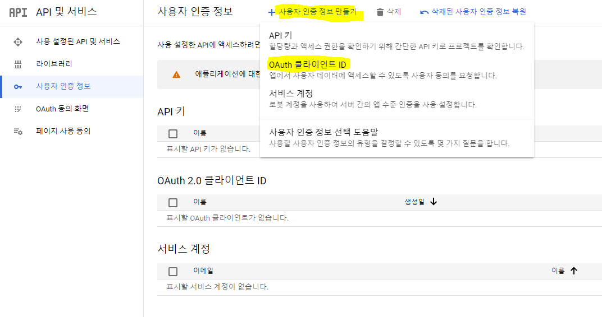

7. `동의 화면 구성` 클릭

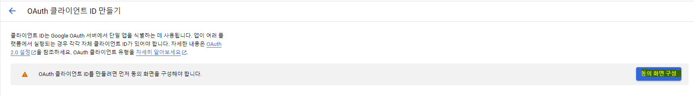

8. 넘어간 페이지에서 User Type을 `외부`로 선택하고 `만들기` 클릭

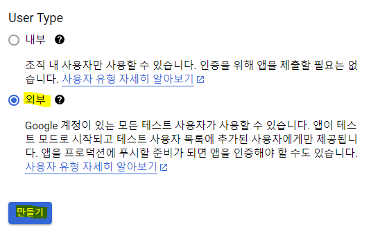

9. 앱 이름과 사용자 지원 이메일, 이메일 주소를 입력한 후 `저장 후 계속` 클릭

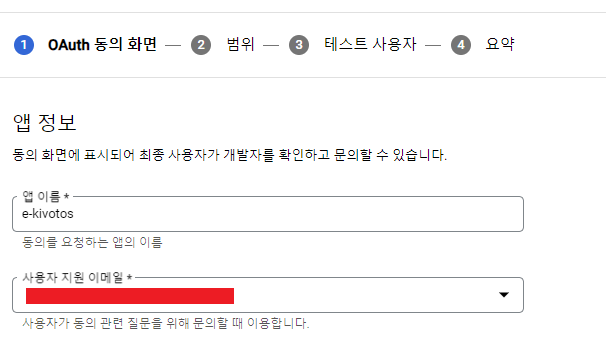
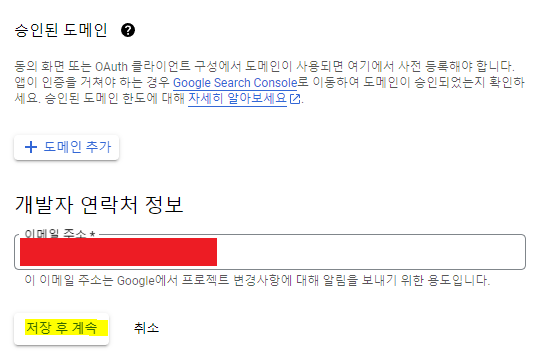

10. `범위 추가 또는 삭제` 클릭 후 우측에 3개 항목 선택, 이후 `업데이트` 클릭 하고 다음 단계로 넘어가기

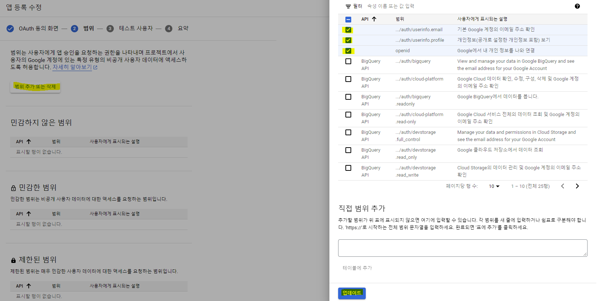

11. `Add Users` 클릭 후 이메일을 `추가` 한 후, `저장 후 계속` 클릭

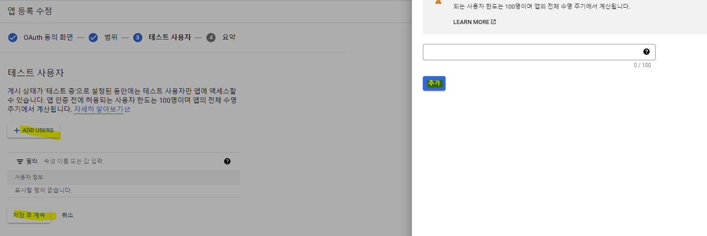

12. 6번 과정을 동일하게 수행한 후 다음 과정 수행

- 넘어간 화면에서 애플리케이션 유형을 `웹 애플리케이션`으로 선택
- 애플리케이션 이름 입력
- 리다이렉션 URI를 입력
- `만들기` 클릭

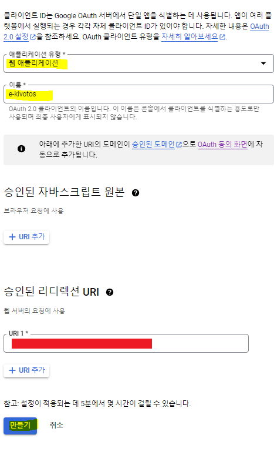

13. `사용자 인증 정보` 화면에서 앱 이름을 클릭

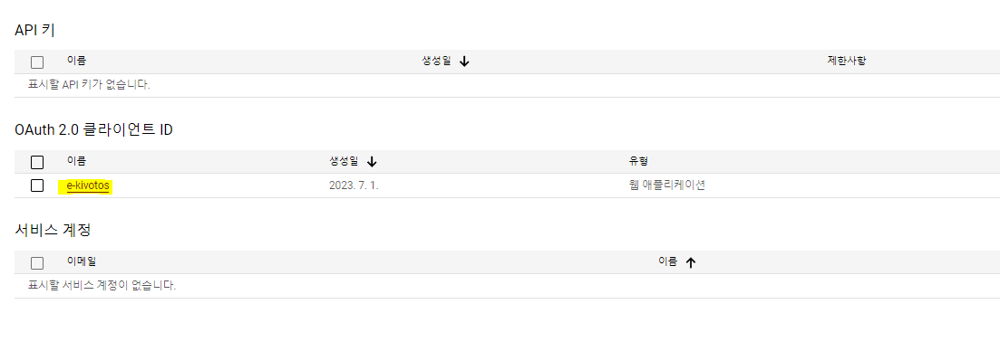

14. 다음과 같이 클라이언트 ID, 클라이언트 보안 비밀번호를 얻을 수 있음. 이 값들을 이용해 개발하는 애플리케이션에 OAuth를 적용 가능

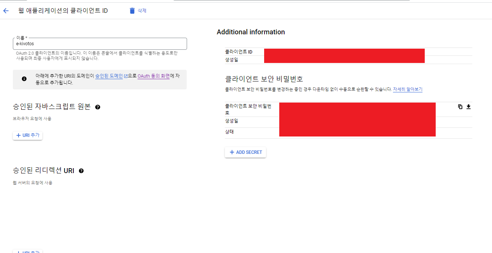

## References

1. 스프링 부트와 AWS로 혼자 구현하는 웹 서비스
