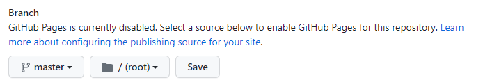
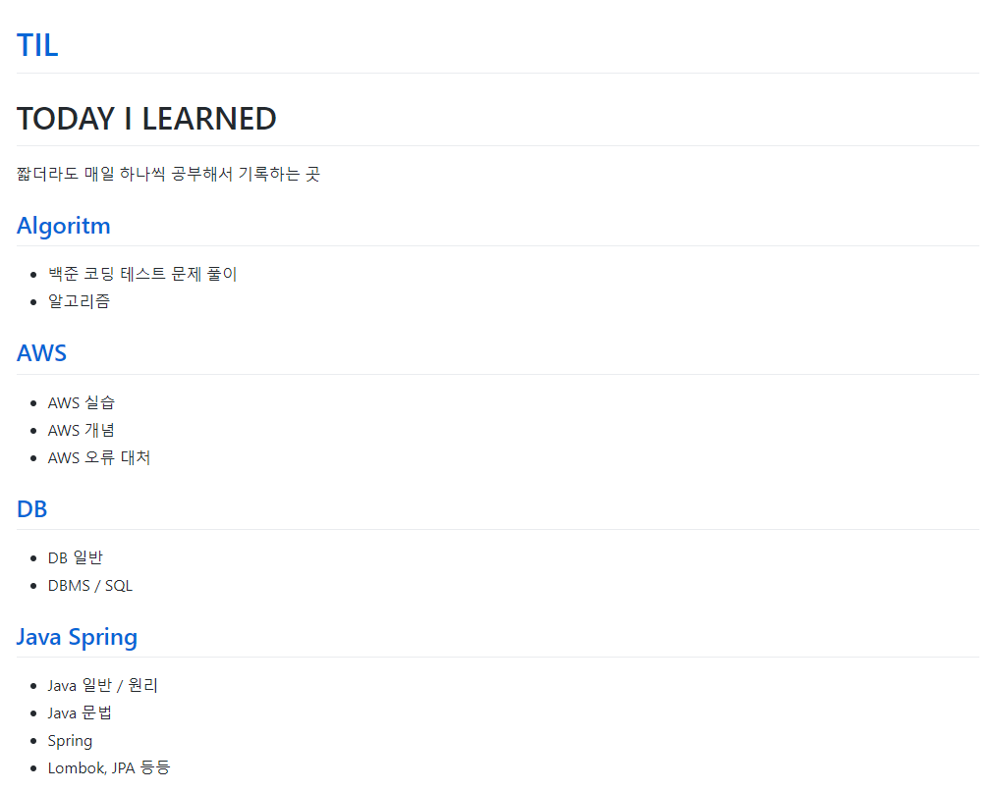
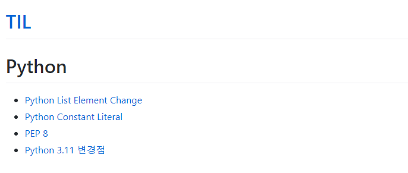
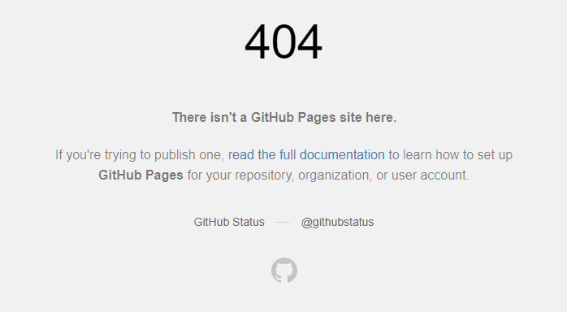
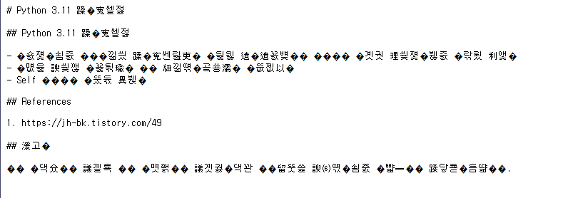

# GitHub Pages 도입 1

## 도입기

- TIL을 쓰면서, 내가 정리한 내용들을 `블로그 형태로`, `나만의 사이트를 만들어서` 외부에 공유하고 싶다는 생각이 있었다.
- 이를 위해 GitHub Pages를 도입해서 외부에 공개하려고 한다
- 여러 기능도 추가하고, 취향대로 꾸며보기도 하려 한다
- 이 전체적인 과정을 상세히 기록으로 남겨 두려 한다
- 또한 내용을 작성함에 있어, 다음 항목들을 지키려 한다
  - 출처가 불분명한 글을 참조하지 말기 (확실한 곳에서만 참조)
  - 다른 사이트 혹은 글을 단순히 베끼는 것은 금지
  - 나만의 언어로 정리하되, 읽는 사람이 최대한 쉽도록 배려해서 정리하기
  - 상황에 따라 사실에 기반한 나의 생각을 추가하기
  - 틀린 내용이 있지 않도록 최대한 많이 검수하기
  - 위 내용에 해당하는 기존 글들을 **모두 수정하기**

## 진척

- 가장 먼저 한 일은, Github의 Settings에서 `Pages` 항목의 `Branch`에서, Github Pages를 `master` 브랜치의 내용을 페이지의 source로 정한 것이다

- 당연히 안 될 것이라 생각하고, `https://sinclairr08.github.io/TIL/` URL을 쳐 보니, 놀랍게도 다음과 같이 페이지가 호스팅 된 것을 확인했다!
  - `index.html`을 설정해 주지 않았지만, `README.md` 파일을 `index.html` 파일로 인식해 주는 것 같았다
  - GitHub Page는 `Jekyll`로 작동하기 때문에 그런 것으로 보인다

## 문제점

- 잘 돌아가는 것처럼 보이지만, 두 가지 문제가 있다.
- 경로 문제 발생
  - 다음과 같이 메인 페이지에서 Python 페이지로 들어가면, 잘 보이는 것을 확인할 수 있다
  - `https://sinclairr08.github.io/TIL/subjects/Python.html` 경로로 이동한다
    
  - 그러나 이 페이지에서 한 번 더 클릭하는 경우, 다음과 같이 404 에러가 나온다
  - 다음 경로로 이동하기 때문... `https://sinclairr08.github.io/contents/2023-08/2023-08-30.md`
    
  - `/contenst`경로 앞에 `/TIL` 이 들어가야 하는데, 들어가지 않는다. 설정이 잘못된 것 같으므로, 확인해 볼 예정이다
- 한글 깨짐 문제
  - 말 그대로 한글이 깨진다. 인코딩 문제인 듯 하다
  - 로컬 파일은 `UTF-8` 로 인코딩 된 것이 맞으므로, 내일 더 찾아보고 해결해 봐야 할 것 같다
    

## 할 일

- 문제 해결하기
  - 경로 문제
  - 한글 깨짐 문제
- 별도의 브랜치를 만들어, 개발 / 배포 브랜치의 구분
- 로컬에서 테스트가 가능한 환경 만들기 (Jekyll을 사용해야 하는 지 잘 모르겠으므로, 확인해 보자)
- 여러 가지 테마로 꾸며 보기

## References

1. https://docs.github.com/ko/pages/getting-started-with-github-pages/configuring-a-publishing-source-for-your-github-pages-site
2. https://jekyllrb-ko.github.io/
