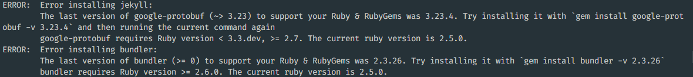

# GitHub Pages 도입 3

## Ubuntu 18.04 로컬에 루비 설치 (실패)

- 로컬 개발 환경(Ubuntu 18.04) 에서 ruby, gem, jekyll을 설치하려고 했다
- [Jekyll 공식 문서](https://jekyllrb-ko.github.io/docs/installation/ubuntu/)를 따라 실행했다
- ruby 2.5.1 버전 설치

```shell
sudo apt upgrade
sudo apt update
sudo apt install ruby-full build-essential zlib1g-dev

ruby -v
```

- gem 2.7.6 버전 설치

```shell
echo '# Install Ruby Gems to ~/gems' >> ~/.zshrc
echo 'export GEM_HOME="$HOME/gems"' >> ~/.zshrc
echo 'export PATH="$HOME/gems/bin:$PATH"' >> ~/.zshrc
source ~/.zshrc

gem -v
```

- 이 때 다음 명령어를 수행하니, jekyll 및 bundler가 버전 문제로 설치되지 않았다

```shell
gem install jekyll bundler
```



- Ubuntu 18.04에서 `apt`를 통해 다운받을 수 있는 루비 버전의 한계로 보인다. 따라서 다른 방법으로 루비를 설치하기로 했다

## Ubuntu 18.04에 Ruby 최신 버전 설치

- Go Rails 공식 홈페이지의 [ruby 설치 가이드](https://gorails.com/setup/ubuntu/18.04)를 참고했다.
- 다음 순서를 따라 진행했다. 진행 전에 미리 설치해 둔 ruby 는 삭제했다
- 필요한 패키지 설치

```shell
sudo apt-get update
sudo apt-get install git-core zlib1g-dev build-essential libssl-dev libreadline-dev libyaml-dev libsqlite3-dev sqlite3 libxml2-dev libxslt1-dev libcurl4-openssl-dev software-properties-common libffi-dev
```

- `asdf`라는 버전 매니저를 설치

```shell
cd
git clone https://github.com/excid3/asdf.git ~/.asdf
echo '. "$HOME/.asdf/asdf.sh"' >> ~/.zshrc
echo '. "$HOME/.asdf/completions/asdf.bash"' >> ~/.zshrc
echo 'legacy_version_file = yes' >> ~/.asdfrc
echo 'export EDITOR="code --wait"' >> ~/.zshrc
exec $SHELL
```

- `asdf`를 통해 루비 및 gem 설치

```shell
asdf plugin add ruby

asdf install ruby 3.2.2
asdf global ruby 3.2.2
gem update --system
```

- ruby 는 `3.2.2`, gem은 `3.4.19` 버전으로 설치

```shell
ruby -v
gem -v
```

- Jekyll 역시 `4.3.2` 버전으로 잘 설치되었다

```shell
gem install jekyll bundler
jekyll -v
```

## References

1. https://jekyllrb-ko.github.io/docs/installation/ubuntu/
2. https://gorails.com/setup/ubuntu/18.04
