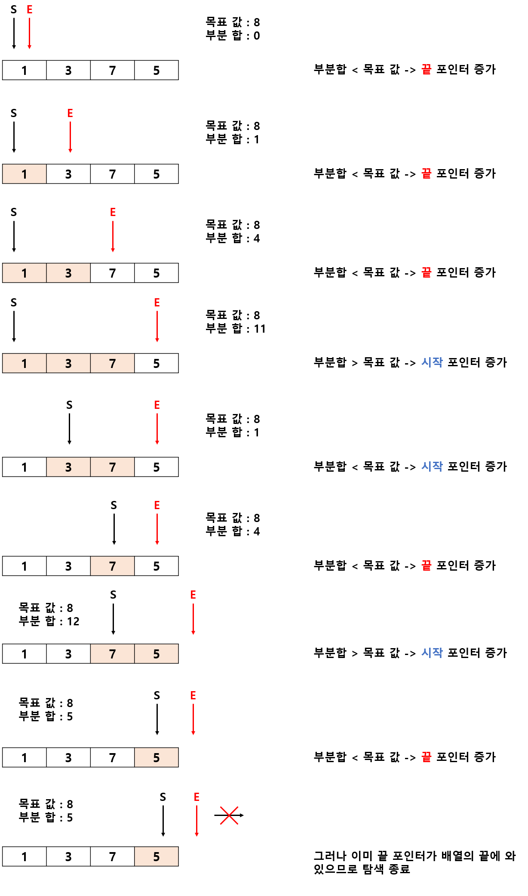
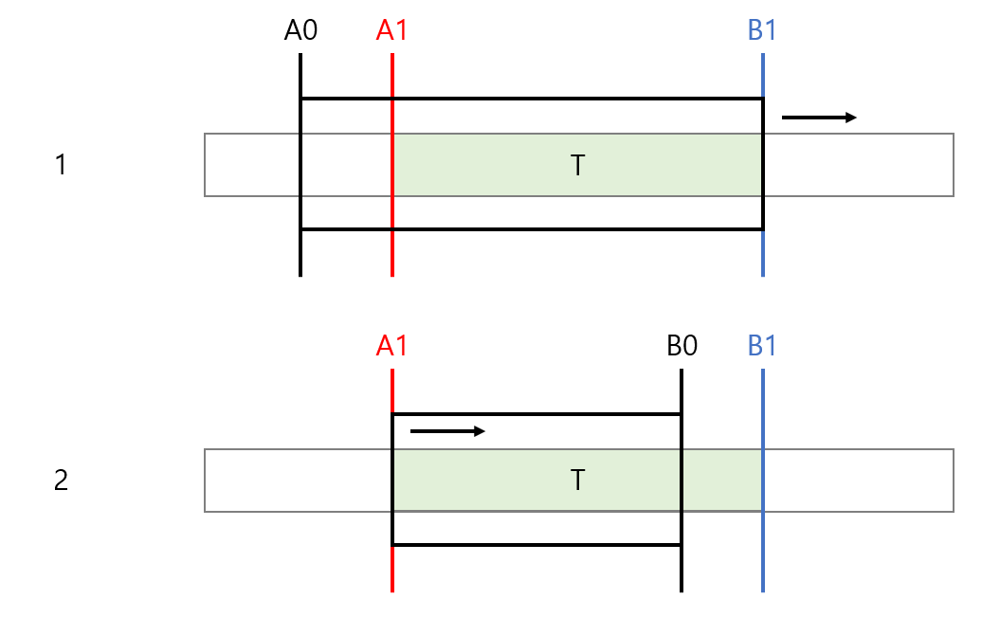

# BOJ 1806

## 문제 설명

- 문제: [백준 1806](https://www.acmicpc.net/problem/1806)

이 문제는 자연수 배열을 받아서, 부분합 중 주어진 값을 넘는 가장 짧은 부분합의 길이를 구하는 문제입니다. 배열의 길이 N이 `100,000` 이하이므로, $O(N^2)$의 알고리즘으로는 주어진 시간 내에 푸는 것은 사실상 불가능합니다.

## 사전 지식

이 문제를 풀기 위해, `two pointers`(투 포인터) 알고리즘과 그것을 사용하는 이유에 대해 간단하게 설명해보려 합니다. 그전에 용어를 정리하고 갑시다. 어떤 배열 arr과 이 배열의 인덱스 A, B에 대해, A 이상 B 미만의 인덱스를 가지는 부분 배열을 [A, B)라고 표현하고, `arr[A]`부터 `arr[B-1]`까지의 모든 값을 합친 것을 [A, B)의 부분합이라고 합시다.

### 투 포인터

자연수 배열에서 부분합을 다룰 때, 투 포인터라는 알고리즘을 사용합니다. 주어진 문제를 조금만 단순하게 만들어봅시다.

> 길이가 N인 자연수 배열과 자연수 T가 존재한다. 이 자연수 배열에서, 부분합이 T인 부분합의 개수는 얼마일까?

가장 단순하게 생각해서 배열이 가지는 모든 부분합에 대해, 각 부분합이 T인지 검사하면 됩니다. 모든 부분합에 대해 검사를 수행하므로 부분합을 구하는 과정을 차치하더라도 최소 부분합의 개수만큼의 시간 복잡도를 가집니다. 부분합은 시작과 끝 점의 쌍에 대응이 되므로, 부분합의 총개수는 $\binom{N}{2}$이 됩니다. 즉, 최소 $O(N^2)$의 시간 복잡도를 가지게 됩니다.

하지만 이 방법은 너무 비효율적이기 때문에, 투 포인터라는 방법을 이용하려고 합니다. `start, end`라는 0 이상의 정수 값을 가지는 인덱스를 둡니다. 이때 `[start, end)`의 부분합을 계산해 보는 것입니다. `start, end`가 0에서부터 시작되므로 부분합도 0에서 출발합니다. 그 후 다음 과정을 반복합니다.

```
1. 현재 부분합이 T보다 작으면 end 포인터를 증가 -> arr[end] 값만큼 부분합 증가.
2. 현재 부분합이 T보다 크거나 같다면 start 포인터를 증가  -> arr[start] 값만큼 부분합 감소.
3. 이 과정을 end값이 배열의 크기보다 커지면 종료.
```

이 과정이 가능한 것은 배열의 원소가 자연수이기 때문입니다. `arr[end]`를 더하면 부분합이 증가, `arr[start]`를 빼면 부분합이 감소한다는 것을 보장하기 때문입니다. 여기에서 매 과정마다 현재 부분합이 T인지 체크하는 과정을 더해주면 주어진 문제를 풀 수 있습니다.

이를 그림으로 설명하면 다음과 같습니다.



### 시간 차이의 이유

위에 설명한 방법의 시간 복잡도는 얼마일까요? 시작 포인터와 끝 포인터가 이동하는 횟수는 총 2N 이하입니다. 즉, 시간 복잡도는 $O(N)$입니다. 모든 부분합을 탐색하는 경우 ($O(N^2)$)와 왜 시간 차이가 날까요?

언뜻 생각해보면 모든 부분합을 세는 방법과 투 포인터를 사용하는 방법이 차이가 없어 보일 수도 있습니다. 하지만 부분 배열 `[start, end)`의 부분합이 T보다 크다면 `start`의 값을 증가시킨다는 것에 주목해야 합니다.

즉, `[start,end+1)`, `[start, end+2)`, ... 와 같은 부분 배열들을 고려하지 않습니다. 왜냐하면 이 부분 배열들의 부분합은 T보다 무조건 크기 때문입니다. 따라서 필요 없는 경우의 수를 세지 않게 되는 것이 시간 차이의 가장 큰 요인입니다.

### 확실한 보장

이제 이 방법이 필요 없는 부분합을 제거하는 것을 확인했습니다. 그런데 과연 이 방법으로 모든 경우의 수를 다 확인했다고 얘기할 수 있을까요? [이 글](https://m.blog.naver.com/kks227/220795165570)을 참고해 작성되었습니다.

[$A_1, B_1$) 의 부분합이 T이면서 투 포인터 방법으로 탐색되지 않는 부분 배열이라고 생각해 봅시다. 이렇게 되려면 다음 두 경우 중 하나여야 합니다.

1. Start 포인터가 $A_1$에 도달하기 전에 end 포인터가 $B_1$을 초과해야 함

2. End 포인터가 $B_1$에 도달하기 전에 Start 포인터가 $A_1$을 초과해야 함



1번을 만족시키는 부분이 존재한다고 생각해봅시다. 이 부분은 [$A_0, B_1$) 에서 end 포인터를 증가시켜서 만들어진 부분입니다. 여기서 주어진 조건 때문에 $A_0 < A_1$이고, 따라서 [$A_0, B_1$) 는 T 초과입니다. 따라서 Start 포인터를 증가시켜야 하는데, 이는 end 포인터가 증가된다는 가정에 어긋납니다.

2번 역시 이를 만족시키는 부분이 존재할 때, 이 부분은 [$A_1, B_0$) 에서 start 포인터를 증가시켜서 만들어진 부분입니다. 여기서 주어진 조건 때문에 $B_0 < B_1$이고, 따라서 [$A_1, B_0$) 는 T 미만입니다. 따라서 End 포인터를 증가시켜야 하는데, 이 역시 start 포인터를 증가시킨다는 가정에 어긋납니다.

따라서 어떤 부분의 부분합이 T라면, 그 부분은 무조건 투 포인터 방법에 의해 탐색된다고 할 수 있습니다.

## 접근 방법

### 투 포인터 문제의 응용

이 문제는 투 포인터 문제를 조금 응용해서 풀 수 있을 것 같아 보입니다. 하지만 여기에는 중요한 차이가 있습니다. 바로 부분합이 T이상인 부분합 중 길이가 가장 작은 것을 구해야 한다는 것입니다.

부분합이 T 이상인 것의 개수를 구하는 것은 투 포인터만으로는 풀기 힘든 문제입니다. 왜냐하면 2.2에서 언급한 바와 같이 투 포인터를 통해 구한 `[Start, End)`의 부분합이 T 이상이면, `[Start, End+1)`은 투 포인터로 탐색될 수 없지만, 부분합은 T 이상이기 때문입니다.

따라서 투 포인터를 이용해 주어진 문제를 풀기는 힘들어 보입니다만, 문제에서 요구하는 값은 T 이상의 값을 가지는 부분합의 최소 길이를 구하는 것입니다. 따라서 부분합이 T 이상인 모든 부분 배열을 조사하는 것이 아니라 투 포인터에서 탐색한 부분 배열들의 길이만 비교해서 최솟값을 구하면 됩니다.

여기서 2.3과 비슷한 의문이 생깁니다. T이상의 부분합을 가지면서, 투 포인터로 탐색된 T 이상의 부분합을 가지는 임의의 부분보다 길이가 작은 어떤 부분 배열 P = [$A_1, B_1$)가 존재할 수 있을까요? (이러한 P가 존재할 수 없다는 것이 당연하다고 생각된다면 바로 코드 설명을 보셔도 됩니다.)

이 가정이 성립하기 위해서는 P는 투 포인터로 탐색되면 안 됩니다. 따라서 2.3과 같이 다음 조건들 중 하나를 만족해야 합니다.

```
1. Start 포인터가 $A_1$에 도달하기 전에 end 포인터가 $B_1$을 초과해야 함
2. End 포인터가 $B_1$에 도달하기 전에 start 포인터가 $A_1$을 초과해야 함
```

1번일 경우, 어떤 부분 [$A_0, B_1$)에서 `end`값을 증가시켜서 만들어진 포인터인데, ($A_0 < A_1$) 이 배열의 부분합은 T보다 무조건 크므로, `end` 값을 증가시킬 수 없기 때문에 이 경우는 존재하지 않습니다.

2번인 경우는 [$A_1, B_0$)에서 `start`값을 증가시켜서 만들어진 포인터입니다. ($B_0 < B_1$) 이 배열의 부분합은 T보다 작을 수도 클 수도 있습니다. 따라서 다음 두 가지 경우를 한번 더 살펴봅니다.

- [$A_1, B_0$)의 부분합이 T보다 작은 경우

이 경우 `start`값을 증가시킬 수 없으므로, 이 경우는 존재하지 않습니다.

- [$A_1, B_0$)의 부분합이 T보다 큰 경우

이 경우는 투 포인터로 탐색된 부분 배열 `[$A_1, B_0$)`의 길이가 P보다 작습니다. 따라서 투 포인터로 탐색된 T 이상의 부분합을 가지는 임의의 부분 배열보다 길이가 작다는 가정에 어긋납니다.

요약하면, T이상의 부분합을 가지며 최소 길이를 가질 수 있는 모든 부분 배열은 반드시 투 포인터로 탐색이 됨을 확인할 수 있습니다.

## 코드 설명

부분합과 `start, end` 포인터 값을 모두 0으로 설정합니다. 이후 부분합이 `target` 값보다 큰 경우, `arr[end]`를 기존 부분합에 더하고 `end` 포인터 값을 증가시킵니다. 반대인 경우, `arr[start]`를 기존 부분합에서 빼고 `start` 값을 증가시킵니다.

```cpp
long long partial_sum = 0;
int start = 0, end = 0;

while(end <= arr_size){
	if(partial_sum < target){
		partial_sum += arr[end++];
	}
	else if(partial_sum >= target){
		if((end - start) < min_arr_size)
			min_arr_size = end - start;
		partial_sum -= arr[start++];
	}

}
```

## 마치며

투 포인터에 대한 설명글입니다. 참고한 블로그([1](https://ssungkang.tistory.com/entry/Algorithm-Two-Pointers-%ED%88%AC-%ED%8F%AC%EC%9D%B8%ED%84%B0), [2](https://m.blog.naver.com/kks227/220795165570))들의 설명이 너무 좋기 때문에 읽어보시길 바랍니다.

투 포인터 자체가 $O(N^2)$이 걸리는 문제를 간단한 아이디어로 $O(N)$으로 낮추기 때문에 굉장히 매력적입니다. 다만 이 포스트에서는 엄밀하게 하려다 보니 증명이 너무 많아졌습니다. 코드 원본은 [여기](./codes/2021-05-20.cpp)를 참고해 주시면 됩니다.

## References

1. [투 포인터 블로그 - 1](https://ssungkang.tistory.com/entry/Algorithm-Two-Pointers-%ED%88%AC-%ED%8F%AC%EC%9D%B8%ED%84%B0)
2. [투 포인터 블로그 - 2](https://m.blog.naver.com/kks227/220795165570)
3. [백준 1806](https://www.acmicpc.net/problem/1806)
