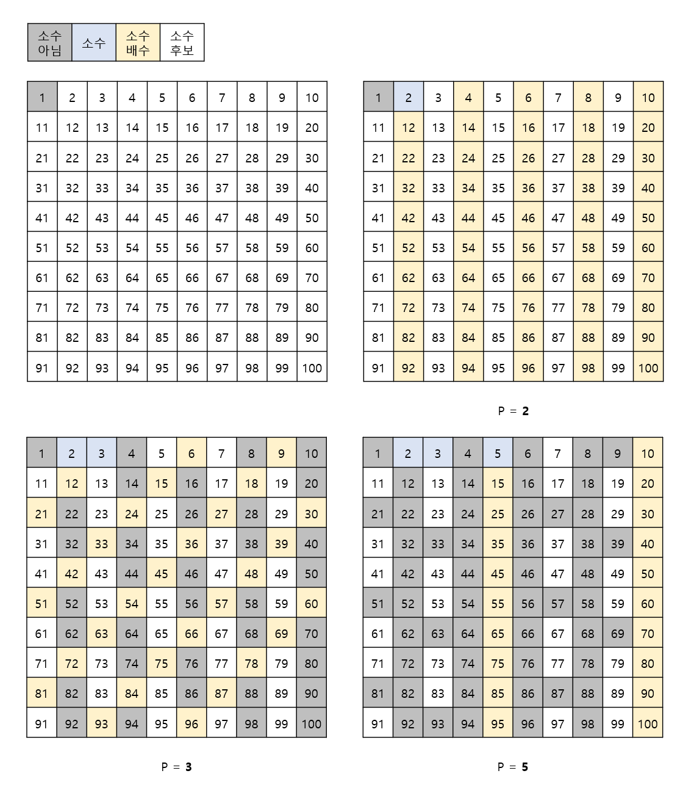

# BOJ 1929

## 문제 설명

- 문제: [백준 1929](https://www.acmicpc.net/problem/1929)

이 문제는 주어진 두 수 사이의 모든 소수를 찾는 문제입니다. 주어지는 M,N 이 $10^6$이하이므로 $O(N^2)$이상의 시간 복잡도가 아닌 이상 크게 시간 제약을 받는 문제는 아닙니다.

## 사전 지식

### 소수 판별 시간 복잡도

다들 아시겠지만 소수(素數)란 자기 자신과 1을 제외하고는 어떤 자연수로도 나누어지지 않는 1보다 큰 자연수를 의미합니다. 대표적으로 2, 3, 5, 7, 11 등등이 있습니다.

그렇다면 특정한 자연수가 소수인지를 알 수 있는 방법은 뭘까요? 간단합니다. 1을 제외한 자기 자신보다 작은 수로 모두 나누어 봤을 때, 한 번이라도 나누어지면 소수가 아닌 합성수, 모든 수에 대해 나누어지지 않으면 소수입니다. 이 방법대로 하면 어떤 수 N에 대해 소수를 판별하는 시간은 O(N)입니다.

하지만 굳이 N보다 작은 모든 수에 대해 나눠봐야 할까요? N이 어떤 수 a로 나누어진다고 생각해봅시다. N = a \* b 꼴의 형태로 표현되는데, 간단히 a, b 중 하나는 $\sqrt{N}$ 보다 작아야 함을 알 수 있습니다. (직접 증명해보세요!) 즉, 소수를 판별하기 위해서는 1보다 크고 $\sqrt{N}$보다 작거나 같은 모든 자연수들에 대해서만 나누어 보면 되므로, $O(\sqrt{N})$의 시간 복잡도를 가집니다.

이 방법으로 1부터 N까지의 모든 수의 소수를 판별하려면, $O(N\sqrt{N})$의 시간복잡도를 가지게 됩니다. 나쁜 시간 복잡도는 아니지만, "이전 수의 소수 여부를 판단한 과정"을 이용하지 못하는 점이 아쉽습니다.

## 접근 방법

### 에라토스테네스의 체

1부터 N까지의 모든 수의 소수를 조금 더 효율적으로 구하는 방법을 알아 봅시다. 우선 어떤 수의 배수는 무조건 소수가 될 수 없다는 것을 기억합시다. 그렇다면, 작은 수부터 키워 가면서, 각 수들에 대해 해당 수의 배수들은 모두 소수 후보에서 배제하면 되겠죠.

하지만 모든 수에 대해서 배수를 확인해야 할까요? 당연히 아닙니다. 이를테면 모든 4의 배수는 2의 배수에 포함이 됩니다. 즉, 어떤 수x가 다른 수 a의 배수인 경우, x의 배수들은 이미 a에 의해 소수에서 배제되었기 때문에 확인할 필요가 없습니다.

자기보다 작은 수의 배수가 아닌 수는, 정의에 이해 소수입니다. 즉, 우리는 소수에 대해서만 그 수의 배수를 확인해 소수 후보에서 제외시키면 됩니다. 이를 구조화하면 다음과 같습니다.

```
1. 2부터 N까지의 모든 수를 소수 후보로 두고, i를 2부터 N까지 증가시켜가면서 다음을 반복한다.
2. i번째 수가 소수 후보인 경우, 해당 수를 소수로 확정짓고, i의 배수들을 모두 소수 후보에서 제외한다.
3. i번째 수가 소수 후보가 아닌 경우, 다음 수로 넘어간다.
4. 2,3을 반복해서 i가 N일때까지 반복해서 모든 소수를 구한다.
```



위 그림을 살펴본다면, 제일 처음 발견한 2를 소수로 두고 2의 배수를 후보에서 제외합니다. 그 다음 발견 한 수 3, 5에대해서도 같은 과정을 반복합니다. 이 과정을 거치면 모든 소수를 구할 수 있습니다

그렇다면 이 방법의 시간 복잡도는 어떻게 될까요? N보다 작은 어떤 소수 p에 대해, p의 배수 중 N보다 작거나 같은 것은 대략 n/p개가 됩니다. 이 배수의 갯수들만큼 연산하면 되므로, 연산 수는 모든 p에 대해 n/p를 합한 수와 같습니다. 식으로 정리하면 다음과 같습니다.

$$
\sum_{p \leqslant n, p \in \mathbb{P}}\frac{n}{p}
$$

[여기](https://en.wikipedia.org/wiki/Divergence_of_the_sum_of_the_reciprocals_of_the_primes)를 참고한다면 위 식의 시간복잡도는 O(NloglogN)이 됨을 알 수 있습니다. 소수 역수들의 합에 대한 내용은 수학적인 내용이라 자세한 설명은 생략하겠습니다.

## 코드 설명

### 에라토스테네스의 체

에라토스테네스의 체 구현만 설명하겠습니다. 우선 소수인지 여부를 결정하는 is_prime 배열을 만듭니다. 이 배열의 i번째 값은 이 값이 소수이면 true, 아니면 false 값을 가집니다. 2 이상의 모든 수가 소수 후보이므로 소수라고 해둡니다. 이후 2부터 차례로 값을 키워가며 i번째 값이 소수인 경우, 해당 소수의 배수(2i, 3i, 4i,...)이면서 N 이하의 값들을 모두 소수가 아니라고 표시합니다. 반대로 i번째 값이 소수가 아니면 무시합니다.

```cpp
bool is_prime[max_num + 1] = {false};

for(int i = 2; i <= max_num; i++){
    is_prime[i] = true;
}

for(int i = 2; i <= max_num; i++){
    if(is_prime[i]){
        multiple = i + i;
        while(multiple <= max_num){
            is_prime[multiple] = false;
            multiple += i;
        }
    }
}
```

## 결론

에라토스테네스의 체를 활용한 문제입니다. 코드 원본은 [여기](./codes/2021-07-18.cpp)를 참고해 주시면 됩니다.

## References

1. [백준 1929](https://www.acmicpc.net/problem/1929)
2. [Sieve of Eratosthenes](https://en.wikipedia.org/wiki/Sieve_of_Eratosthenes)
3. [Divergence of the sum of the reciprocals of the primes](https://en.wikipedia.org/wiki/Divergence_of_the_sum_of_the_reciprocals_of_the_primes)
