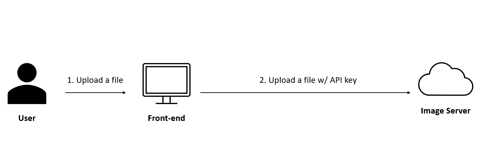
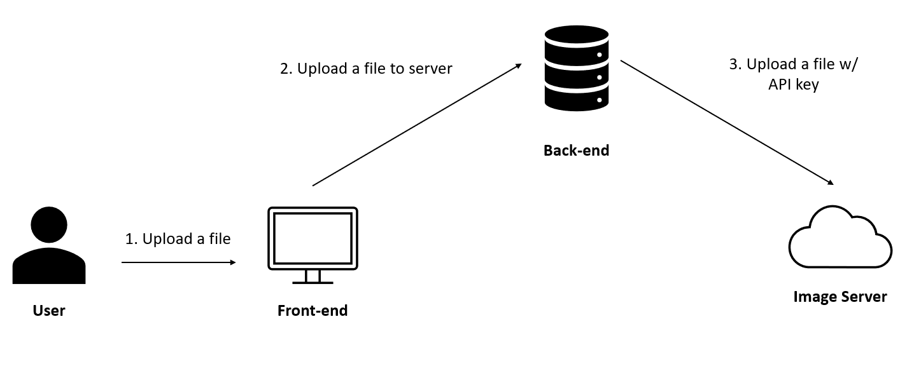
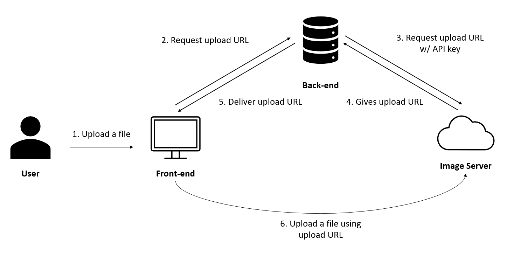
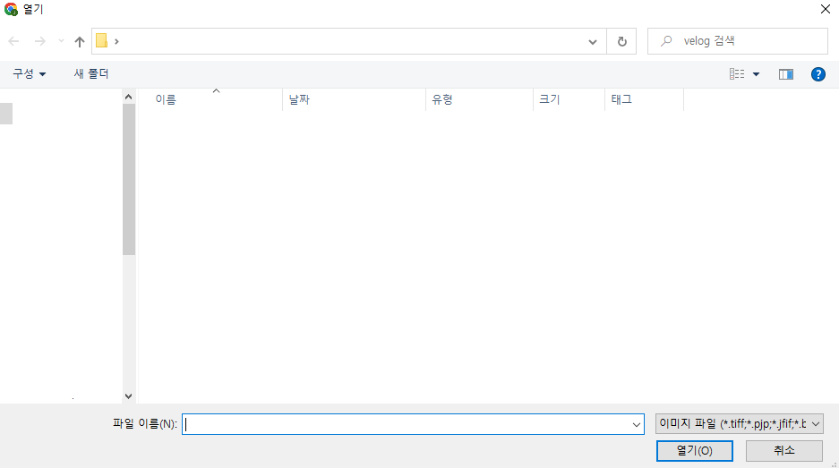

# Next.js Cloudflare Image API

## Front-end Upload

`next.js` 프로젝트에서 이미지 호스팅 서버에 이미지를 올리려면 어떻게 해야 할 까요? 다음과 같은 방법을 생각할 수 있습니다.

> 1. 사용자에게 이미지를 입력받는다.
> 2. 프론트엔드에서 직접 api를 이용해 이미지 호스팅 서버에 이미지를 올린다.



이 방법은 굉장히 위험합니다. 왜냐하면 프론트엔드(브라우저)에서 직접 이미지 호스팅 서버에 접근하게 되고, 이 과정에서 사용하는 API 키가 사용자에게 노출될 수 있습니다.

## Back-end Upload

프론트엔드에서 바로 업로드를 하는 것이 위험하다는걸 알았으니, 백엔드에 서버를 두면 어떨까요?

> 1. 사용자에게 이미지를 입력받는다.
> 2. 백엔드 서버에 **이미지 파일**을 전달한다.
> 3. 백엔드 서버에서 api를 이용해 이미지 호스팅 서버에 **이미지 파일**을 올린다.



위와 같이 백엔드 서버를 거쳐 업로드를 진행하면 API 키가 사용자에게 노출되는 일은 없을 것입니다. 하지만 문제가 위 그림을 보면 알 수 있듯이 이미지가 두 번 전달이 되는데, 이 과정에서 많은 자원이 낭비됩니다.

그래서 제안하는 방법은 `Direct Creator Upload` 입니다.

## Direct Creator Upload

`Cloudflare Image`에서 제공하는 `Direct Creator Upload` API 문서는 [여기](https://developers.cloudflare.com/images/cloudflare-images/upload-images/direct-creator-upload/)를 참고해 주시면 됩니다.

이 방법은 다소 복잡한 방법을 사용합니다.

> 1. 사용자에게 이미지를 입력받는다.
> 2. 프론트엔드는 백엔드 서버에 이미지를 올릴 **업로드 URL**을 요청한다.
> 3. 백엔드 서버에서 api를 이용해 **업로드 URL**을 요청한다.
> 4. 이미지 호스팅 서버에서 백엔드 서버에 **업로드 URL**을 보낸다.
> 5. 백엔드 서버는 **업로드 URL**을 다시 프론트엔드에 전달해 준다.
> 6. 업로드 URL을 이용해 프론트엔드에서 **직접** 이미지 서버에 파일을 올린다.



위 방법은 기존 방법과 두 가지 차이가 있다는 것을 알 수 있습니다. 첫 번째로는 **백엔드 서버에 이미지 파일을 올리지 않는다**는 점이고, 두 번째로는 프론트엔드에서 직접 파일을 올리되, **API 키를 필요로 하지 않는다**는 점입니다.

이 방식을 통해 보안성과 효율성을 둘 다 높일 수 있습니다.

## Implementaion

이제 Direct Creator Upload를 Next.js 프로젝트에서 구현해봅시다. 이를 위해서는 세 가지를 구현해야 합니다.

> 1. 사용자가 브라우저에 올린 파일을 받기
> 2. 백엔드에서 업로드 URL을 요청하고 받은 URL은 프론트엔드에 전달하기
> 3. 업로드 URL을 통해 파일을 실제로 이미지 서버에 올리고 가져오기

### 1. 사용자 파일 받기

사용자가 파일을 올리려면 어떻게 해야 할 까요? HTML에서 input 태그의 type을 file로 주면, 파일 입력을 받을 수 있습니다. 더 나아가 accept="image/\*"를 이용해 이미지 파일만 받게 할 수 있습니다.

```html
<form>
  <input type="file" accept="image/*" />
</form>
```



브라우저에서 파일 선택을 누르면 위와 같이 이미지 입력만 받을 수 있는 창이 나타납니다.

그렇다면 위 input에서 받는 데이터 타입은 어떻게 될까요? 위 input은 파일들의 리스트를 받을 수 있으므로, FileList라는 타입의 입력을 받습니다.([FileList 문서](https://developer.mozilla.org/ko/docs/Web/API/FileList))

이번 구현에서는 하나의 파일만 입력으로 받으므로, 리스트의 첫 번째 원소를 가져오면 됩니다. `react-hook-form`과 `typescript`를 활용해 다음과 같이 입력받은 파일을 콘솔에 출력하는 코드를 구현할 수 있습니다.

```tsx
import { useForm } from "react-hook-form";

interface ImageForm {
  image: FileList;
}

export default function () {
  const { register, handleSubmit } = useForm<ImageForm>();
  const onValid = async ({ image }: ImageForm) => {
    if (image && image.length > 0) {
      console.log(image[0]);
    }
  };
  return (
    <form onSubmit={handleSubmit(onValid)}>
      <input {...register("image")} type="file" accept="image/*" />
      <button>Submit</button>
    </form>
  );
}
```

### 2. API 만들기

이제 프론트엔드에서 파일을 받고 다루는 방법을 알았으니 백엔드에서 업로드 URL을 이미지 서버에서 받아오고 프론트엔드로 전달해주는 API를 만들어 봅시다. [Direct Creator Upload API](https://developers.cloudflare.com/images/cloudflare-images/upload-images/direct-creator-upload/)를 참고해주시면 됩니다.

위 문서에서 볼 수 있듯 다음 URL로 `POST` 요청을 보내야 합니다.

```
https://api.cloudflare.com/client/v4/accounts/<ACCOUNT_ID>/images/v2/direct_upload \
```

또한 인증을 위해서 다음과 같이 `cloudflare token`이 포함된 헤더가 필요합니다.

```
'Authorization: Bearer :token'
```

이를 구현하기 위해 `/api` 폴더의 내에 `image.ts` 파일내의 함수를 다음과 같이 구성하면 됩니다.

> `.env` 파일 내에 `cloudflare id, api token`에 해당하는 값을 미리 설정해 둬야 합니다!

```ts
const imageResponse = await axios(
  `https://api.cloudflare.com/client/v4/accounts/${process.env.CF_ID}/images/v2/direct_upload`,
  {
    method: "POST",
    headers: {
      "Content-Type": "application/json",
      Authorization: `Bearer ${process.env.CF_API_TOKEN}`,
    },
  }
);

console.log(imageResponse.data);
```

```json
{
  "result": {
    "id": "***************************",
    "uploadURL": "https://upload.imagedelivery.net/*********"
  },
  "result_info": null,
  "success": true,
  "errors": [],
  "messages": []
}
```

각각 서버에 요청을 보내는 코드와 콘솔 결과입니다. API 문서에서 제공하는 바와 같이 `result` 내부에 `uploadURL`이 있는 것을 확인할 수 있습니다.

ES6의 도움을 받아 다음과 같이 `uploadURL`을 추출한 후, `json` 형식으로 프론트엔드로 전달해 주시면 됩니다.

```ts
const {
  data: {
    result: { uploadURL },
  },
} = imageResponse;

res.json({ ok: true, uploadURL });
}
```

> ❗ 이 `uploadURL`은 기본적으로 30분이 지나면 만료됩니다!

### 3. 이미지 올리고 가져오기

API를 이용해 업로드 URL을 가져올 수 있게 되었습니다. 업로드 URL을 이용해 사용자에게 받은 파일을 올리는 법을 알아 봅시다. 1번에서 작성한 `onValid` 함수를 다음과 같이 바꿔봅시다.

```ts
const onValid = async ({ image }: ImageForm) => {
  if (image && image.length > 0) {
    const {
      data: { uploadURL },
    } = await axios.get("/api/image");

    console.log(uploadURL);
  }
};
```

이미지가 존재한다면, 2번에서 만든 API를 이용해 `uploadURL`을 이용하는 것을 확인할 수 있습니다. 이 URL에 우리가 받은 이미지를 올리면 됩니다. API 문서에서는 프론트엔드에서 파일을 올리기 위해 다음과 같은 `form`을 이용해야 한다고 되어 있습니다.

```html
<form
  action="INSERT_UPLOAD_URL_HERE"
  method="post"
  enctype="multipart/form-data"
>
  <input type="file" id="myFile" name="file" />
  <input type="submit" />
</form>
```

이에 해당하는 `form`을 만들기 위해 `FormData`라는 인터페이스를 이용합니다.([FormData 문서](https://developer.mozilla.org/ko/docs/Web/API/FormData))

```ts
const formData = new FormData();
formData.append("file", image[0], "test");

const { data } = await axios.post(uploadURL, formData);
console.log(data.result.id);
```

`append` 함수를 사용하면 값을 `formData` 안에 넣을 수 있습니다. 사용자에게 받았던 이미지를 `formData`에 넣어 줍니다. 이후 `uploadURL`로 `formData`를 담은 `post` 요청을 보내면 `cloudflare Image`에 파일이 올라가 있는 것을 확인할 수 있습니다.

또한 여기에서 반환하는 `data`의 `result` 속성에는, 우리가 올린 파일의 `id`를 받을 수 있습니다. `id`를 이용해 우리가 올린 파일을 사용할 수 있습니다.

이제 코드를 조금 수정해서 파일을 등록하면 그 파일을 바로 보여주는 것을 구현해 봅시다. `useState`를 이용해 `id`를 설정해주는 변수를 만들어 주고, `uploadURL`에 파일을 올렸을 때 받는 아이디로 설정해 봅시다.

```ts
const [id, setId] = useState("");
const onValid = async ({ image }: ImageForm) => {
    // ...
    const { data } = await axios.post(uploadURL, formData);
    setId(data.result.id);
  }
};
```

이 `id`를 이용해 이미지를 가져오면 되겠죠. 다만 `cloudflare Image` 페이지에서 `image delivery URL`를 가져와야 합니다. 다음과 같이 구성되어 있습니다.

```
https://imagedelivery.net/<your_id>/<image_id>/<variant_name>
```

이를 이용해 `form` 밑에 다음과 같은 코드를 작성합니다.

```tsx
<>
  <form onSubmit={handleSubmit(onValid)}>// ...</form>
  {id ? (
    /${id}/public`} />
  ) : (
    <div></div>
  )}
</>
```

또한 이 방식으로 특정 사이트에서 이미지를 가져오기 위해서는 `next.config.js`에 `image domain`을 설정해 줘야 합니다.

```js
const nextConfig = {
  reactStrictMode: true,
  images: {
    domains: ["imagedelivery.net"],
  },
};
```

특정 파일을 올릴 시 이미지가 잘 올라가게 됩니다.

## 결론

이 포스트에서는 `cloudflare Image API`를 이용해 브라우저에서 직접 이미지 서버에 사진을 올리는 방법에 대해 알아봤습니다.

코드 원본은 [여기](./codes/2022-05-15/)를 참고해 주시면 됩니다.

## References

1. [Cloudflare Image API](https://developers.cloudflare.com/images/)
2. [FileList](https://developer.mozilla.org/ko/docs/Web/API/FileList)
3. [FormData](https://developer.mozilla.org/ko/docs/Web/API/FormData)
4. [Next JS 강의](https://nomadcoders.co/carrot-market)
