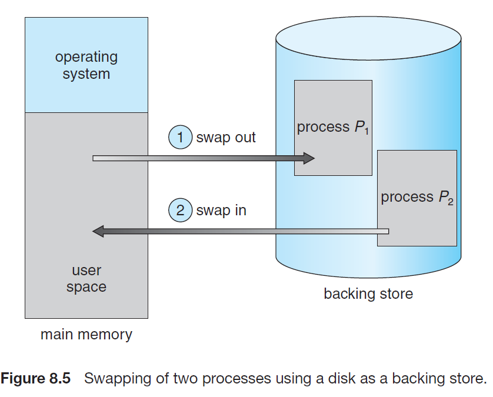
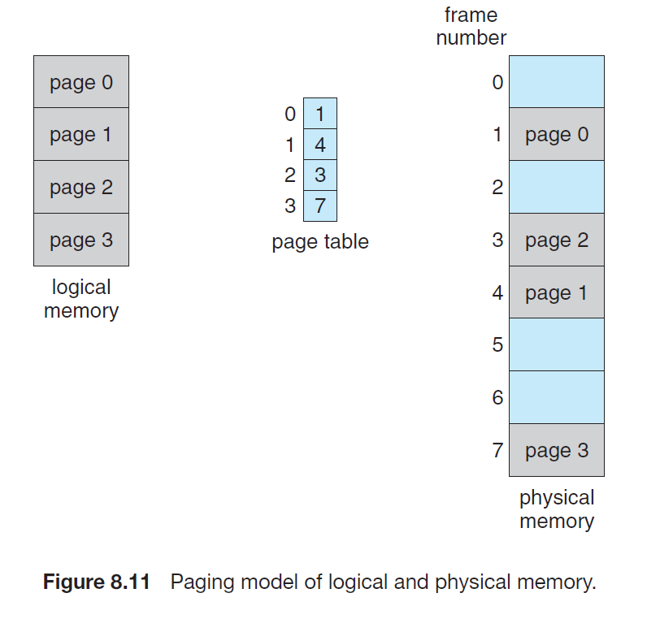
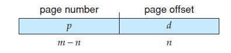
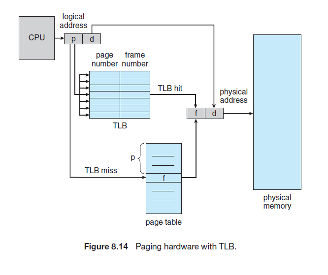
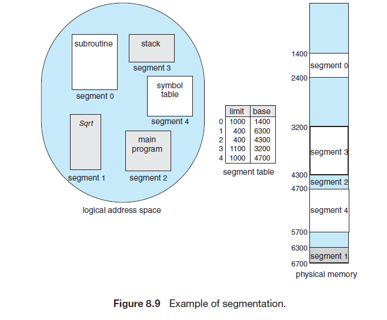
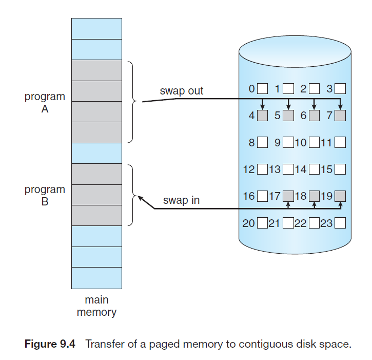
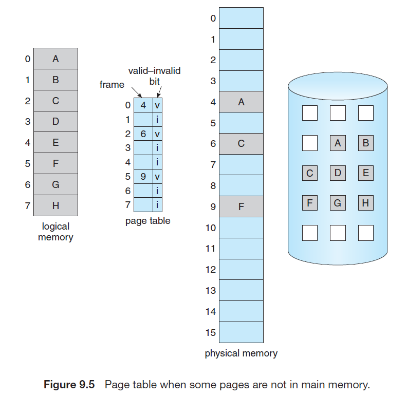
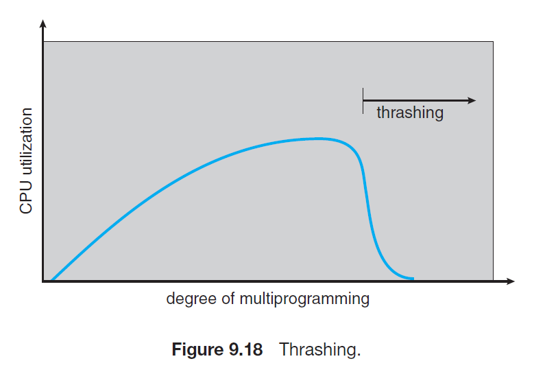

# Memory Management

## Memory

메모리는 일종의 byte array. 디스크에 있는 프로그램 파일이 메모리에 올라와서 프로세스가 된다.

## Logical / Physical Address

- Physical address: 실제 메모리 자체의 인덱스. User 프로그램이 접근하지 못한다.
- Logical address: CPU에 의해 생성된 주소, Virtual address라고도 한다. User 프로그램이 접근할 수 있다.
- Logical Memory: Logical address를 주소로 가지는 공간.

## MMU

logical address를 physical address로 바꾸는 하드웨어.

## Swapping

프로세스는 메모리에 있어야 하지만, 메모리가 부족한 경우 일시적으로 backing store에 저장해 둘 수 있다.

- swap out: 메모리 → 저장소
- swap in: 저장소 → 메모리

## Contiguous Memory Allocation

프로세스를 메모리의 하나의 연속적인 공간에 할당하는 기법. 프로세스를 할당하기 위해 메모리를 분할하는 방법은 다음과 같다.

- Fixed-size partition: 메모리를 고정된 크기의 파티션으로 분할. 각 파티션은 한 프로세스만 이용할 수 있다. Internal fragmentation 발생 가능.

- Variable partition: 메모리를 각 프로세스의 크기에 맞는 파티션으로 분할해서 올림. 빈 메모리 공간 (hole)을 찾아서 프로세스에 할당해 줌. Hole을 찾는 방법으로는 First fit, Best fit, Worts fit 등이 있다. External fragmentation 발생 가능.

## Fragmentation

기억 장치의 빈 공간이 여러 조각으로 나뉘는 현상

## Internal Fragmentation

프로세스가 요청한 것보다 많은 양의 메모리를 할당받았을 때, 프로세스가 사용하는 메모리 공간에 남는 부분.

## External Fragmentation

빈 메모리 공간이 요청받은 메모리 공간보다 많지만, 연속적이지 않아서 할당이 불가능한 부분. 프로세스가 사용하지 않는 공간에 남음.

메모리를 섞어서 큰 메모리 공간을 만드는 compaction으로 해결이 가능하나, 항상 적용할 수 있는 것은 아니고, 아주 높은 코스트를 요구할 수 있음.

## Paging

프로세스가 불연속적인 메모리에 올라갈 수 있게 하는 방법. 프로세스를 일정한 크기의 **페이지**로 나눠 메모리에 올리는 방법. 물리적 메모리는 같은 크기의 frame이라는 조각으로 나뉨.

page의 크기는 하드웨어에 의해 결정되며, 2^n 형태로 구성됨. (비트를 이용한 계산 용이)

page의 크기가 크면 내부 단편화 문제가 커질 수 있지만, 작다면 page table이 커지고 복잡해짐.

## Page Table

logical memory의 페이지에 해당하는 physical memory의 프레임을 반환해주는 테이블. 이를 이용해 logical address의 physical address를 구할 수 있음.

## Logical Address

logical address의 앞 비트로 페이지 번호를 정하고, 뒤의 비트로 페이지 내의 offset을 정한다.

## TLB (Transition Look-aside Buffer)

logical address를 physical address로 변환할 때 page table 전에 참고하는 캐시 하드웨어.

## Segmentation

프로세스가 불연속적인 메모리에 올라갈 수 있게 하는 다른 방법. 프로세스를 논리적 단위인 세그먼트로 나눠 메모리에 올리는 방법.

외부 단편화가 여전히 생길 수 있음.

page table과 같은 역할을 하는 segment table이 있음. 세그먼트는 그 크기가 다르므로 크기를 명시해줌.

## Virtual Memory

프로세스 전부가 다 메모리에 있지 않아도 실행되게 하는 기법. 메모리 크기보다 큰 프로그램도 실행 가능. 사용자는 아주 큰 메모리가 있다고 느끼게 됨.

## Demand Paging

Virtual memory를 구현하기 위해 사용되는 방법으로, 프로세스를 실행하는데 요구된 페이지만 메모리에 올리는 방법. Swapping과 유사하나 프로세스 전체가 아닌 페이지만 옮김.

## Valid-invalid Bit

어떤 페이지가 메모리에 올라와 있는지 확인하기 위해, 페이지 테이블에 추가로 저장하는 bit 값. 해당하는 frame이 메모리에 있으면 valid, 아닌 경우 invalid.

## Page Fault

필요한 페이지가 메모리에 올라와 있지 않은 경우. (Page table에서 해당하는 page가 invalid bit를 가지고 있는 경우) 디스크에서 데이터를 읽어 와 메모리의 빈 프레임에 올림.

Locality 때문에 잦게 일어나지 않음.

## Pure Demand Paging

Page Fault가 발생한 페이지만 들고 오는 방법. 이 방법을 이용하면 처음 메모리에는 어떤 페이지도 없게 되고, 초반에 잦은 page fault가 일어남.

## PrePaging

Pure Demamd Paging과 달리 필요할 수 있는 페이지를 미리 가져와 두는 것.

## Page Replacement Algorithm

메모리에 빈 frame이 없을 때 page fault가 발생하면 페이지를 교체해야함. 이 때 어떤 페이지를 교체할지 결정하는 알고리즘.

## FIFO(First In First Out)

메모리에 올라온 지 가장 오래된 페이지를 교체하는 방법. 메모리의 프레임 수가 늘어났는데 page fault 횟수가 늘어나는 Belady's Anomaly라는 문제가 있다. 초기화 코드에선 적절한 방법.

## OPT(Optimal Page Replacement)

가장 오랫동안 사용되지 않을 페이지를 교체하는 방법. Page fault가 가장 적게 나지만, 미래에 어떤 페이지가 사용될 지 알아야 하기 때문에 구현이 **불가능**에 가깝다.

## LRU(Least Recently Used)

OPT와 유사한 방법으로, 가장 오랫동안 사용되지 않은 페이지를 교체하는 방법.

- Counter를 이용한 구현: 각 페이지에 가장 최근에 참고된 시간을 적어두고, 가장 적은 시간을 가진 페이지를 교체. 시간을 재는 오버헤드 존재
- Stack을 이용한 구현: 어떤 페이지가 참고되면, 그 페이지 pop한 후 스택의 맨 위에 놓아둠. Stack의 중간에서 pop해야 하므로 업데이트 비용이 비싸나 교체할 페이지를 찾기 쉬움. (Stack의 맨 바닥)

## 기타 교체 방법

- Second chance: 교체될 페이지에게 한 번의 기회를 더 줌.
- LFU (Least Frequently Used): 가장 적게 사용된 페이지 교체.
- MFU (Most Frequently Used): 가장 많이 사용된 페이지 교체.

## Thrashing

Page Fault가 자주 발생해서 페이징에 많은 시간이 소요되는 현상. CPU가 다중 프로그래밍의 정도를 필요 이상으로 높아지게 해서 발생.

## References

1. Operating System Concepts 9th Edition, Silberschatz, Galvin and Gagne ©2013
