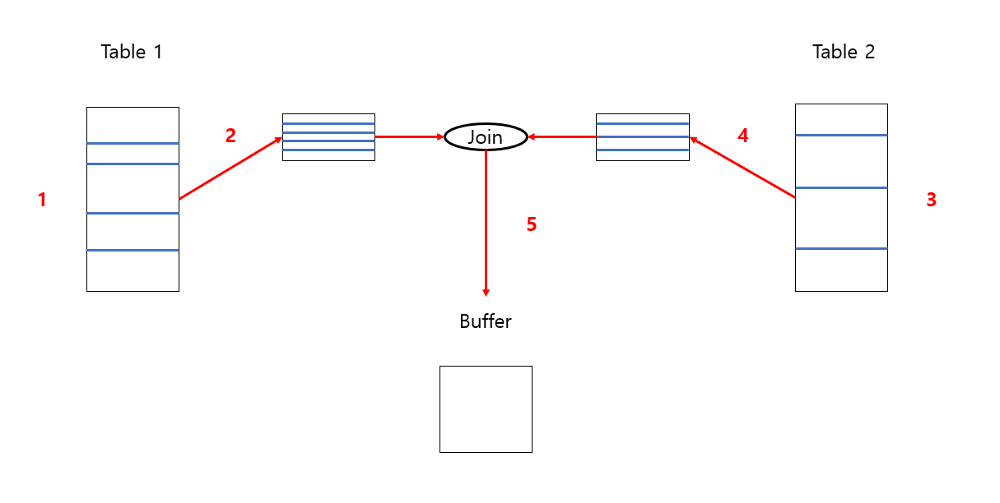

# Sort Merge Join

## Sort Merge Join 이란

두 개의 테이블을 각각 접근하고 결과를 정렬해서 join을 수행하는 방법.

## 동작 방식

1. 첫 번째 테이블에서 각 행에 접근해 조건에 맞는 행을 찾음. (Full scan)
2. 해당 행에서 조인 키 값을 기준으로 행들을 정렬.
3. 두 번째 테이블에서 각 행에 접근해 조건에 맞는 행을 찾음. (Full scan)
4. 해당 행에서 조인 키 값을 기준으로 행들을 정렬.
5. 정렬된 두 개의 행들을 이용해 조인 조건에 맞는 행들을 추출 버퍼에 넣음.
6. 모든 작업이 끝난 뒤 추출 버퍼에 있는 값을 출력.

## 특징

1. 정렬된 N개의 행들에서 비교 작업을 수행하는 데 걸리는 시간은 O(N).
2. 부등호 연산을 사용하는 non-equi join을 효율적으로 수행 가능.
3. Full scan을 수행하므로 index가 존재하지 않을 때도 사용 가능.
4. 조인 이전에 테이블의 키 값이 정렬되어 있다면, 조인할 때는 정렬 작업을 수행하지 않으므로 속도가 향상됨.
5. Random access를 수행하는 NL join보다 많은 데이터를 다룰 수 있음.
6. 정렬을 위해 공간이 필요하고, 데이터가 많아지거나 정렬 공간이 작으면 추가로 디스크를 사용하게 되어 성능 하락 발생 가능.
7. 두 테이블의 크기 차이가 나는 경우, 한 테이블은 정렬이 완료되어도 다른 테이블이 정렬되기 전까지 조인을 대기해야 하므로 비효율적.

## References

1. https://coding-factory.tistory.com/757
2. https://bangu4.tistory.com/83
3. https://hoon93.tistory.com/46
