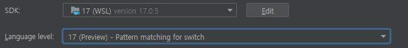
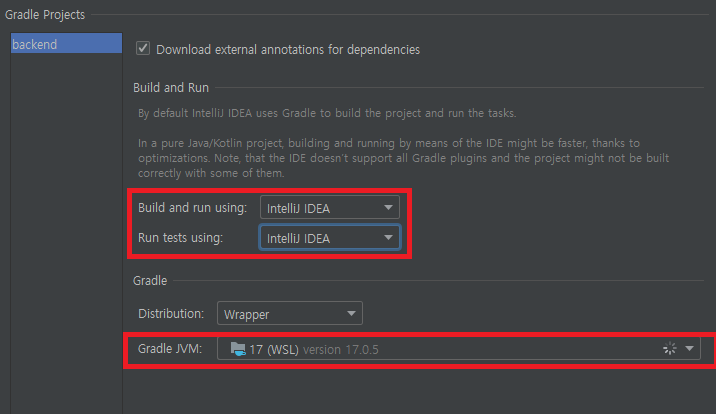

# Intellij IDEA WSL Spring

## Intellij IDEA로 WSL에서 Spring 프로젝트 설정

1. 하단에 `Microsoft Defender configuration` 이 뜨면 `Automatically`를 눌러 해결
2. `Project Structure`에 들어가서 다음과 같이 설정
   - SDK를 wsl에 설치된 JDK로 변경
   - Language level을 맞춤
   - 
3. `build.gradle`을 이용해 gradle 프로젝트 load
   - 에러 창이 나온 경우 4번으로
4. 에러 창의 `Open gradle settings`를 눌러 다음과 같은 설정 변경
   - 위 네모 부분을 `Intellij IDEA`로 변경
   - `Gradle JVM`을 2번에서 사용한 wsl의 JDK로 변경
   - 적용하면 gradle build가 시작됨
   - 

## 문제점 및 결론

- Spring boot + Vue.js를 한 프로젝트에서 쓰기 위해, wsl 환경에서 spring을 사용해 보려고 다음과 같이 세팅해 봄
- 그러나 실행 버튼이 활성화되지 않고 설정이 제대로 되지 않는 등 여러 문제점 발쌩
- 또한 wsl에서 gradle을 build 하는 데 엄청난 시간이 소요됨
- 어짜피 spring 프로젝트는 추후 AWS에 올라 가야 하므로, windows에서 사용하기로 결정

## References

1. https://hou27.tistory.com/entry/Spring-%ED%94%84%EB%A1%9C%EC%A0%9D%ED%8A%B8-%EC%8B%A4%ED%96%89-with-Intellij-from-WSL
