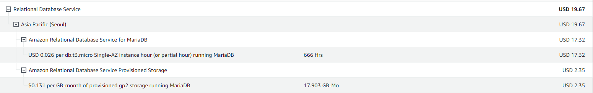
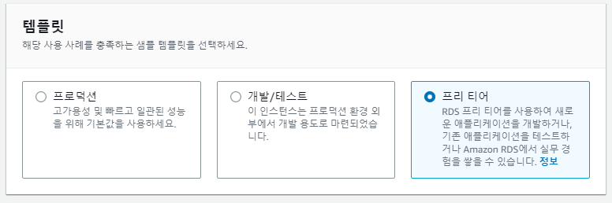
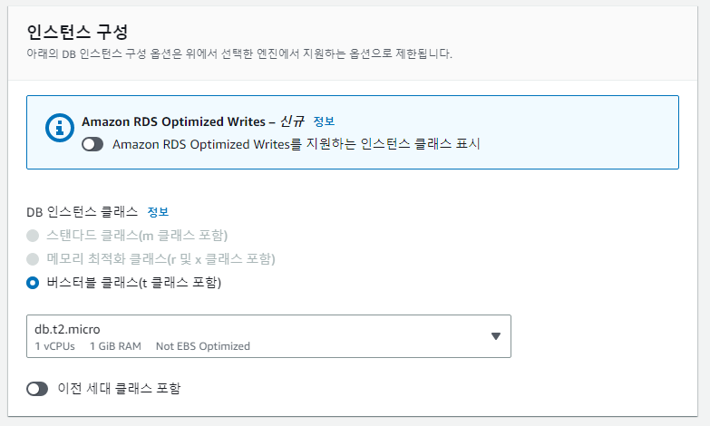
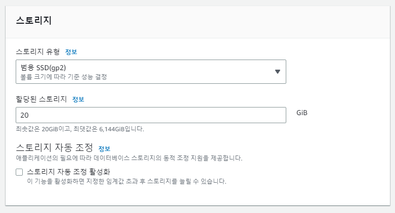
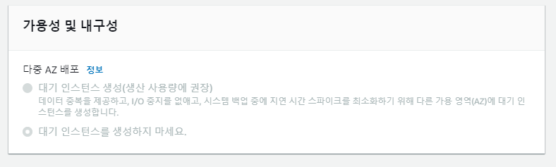

# AWS RDS 프리 티어 비용 발생 방지

> 2023.05.29 기준 작성

## AWS RDS 프리 티어 비용 발생

- AWS RDS를 프리 티어로 사용하던 중 다음과 같이 과금된 것을 발견
- 프리 티어로 사용하면 이 정도로 과금이 발생할 수 없는데 무언가 잘못됐다는 것을 알게 됨
- `USD 0.026 per db.t3.micro Single-AZ instance hour (or partial hour) running MariaDB`
  - 자동 백업이 활성화 되어 있어서 발생하는 문제로 추정
  - `db.t3.micro`는 프리 티어의 지원을 받아서 `db.t2.micro`를 사용하지 않은 게 문제는 아닌듯
- `$0.131 per GB-month of provisioned gp2 storage running MariaDB`
  - 할당된 공간보다 많은 공간을 사용해서 발생한 문제
  - 스토리지 자동 조정 옵션에 체크해서 문제가 된 것으로 추정됨

## RDS 프리 티어 비용 방지 방법

1. 생성하는 경우 프리티어 템플릿 사용

2. `db.t2.micro` 이용하기
   - `db.t3.micro`를 사용해도 문제는 없을 것으로 추정됨

3. 스토리지 생성 시
   - `스토리지 자동 조정 활성화` 옵션 해제
   - 스토리지를 20GB로 설정
   - `스토리지 유형` 을 범용 SSD로 설정

4. `다중 AZ 배포`를 생성하지 않음

5. **자동 백업을 키지 않음**
   - 이 부분에서 가장 많이 과금된 것으로 추정

## References

1. https://programforlife.tistory.com/28
2. https://velog.io/@arara90/AWS-Free-tier%EB%A1%9C-RDS-%EC%82%AC%EC%9A%A9-%EC%A4%91-%EC%9A%94%EA%B8%88%EC%9D%84-%EC%A7%80%EB%B6%88%ED%96%88%EC%96%B4%EC%9A%94
3. https://velog.io/@yangsijun528/AWS-EC2%EC%99%80-RDS-%EC%A7%84%EC%A7%9C-Free-tier-%EC%82%AC%EC%9A%A9%ED%95%98%EA%B8%B0
4. https://velog.io/@hwsa1004/AWS-RDS-%ED%94%84%EB%A6%AC%ED%8B%B0%EC%96%B4%EC%97%90%EC%84%9C-RDS-%EA%B3%BC%EA%B8%88-%EB%B0%A9%EC%A7%80%ED%95%98%EA%B8%B0
