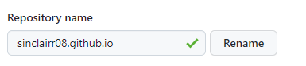

# GitHub Pages 도입 2

## 진척

- Repo 이름을, `sinclairr08.github.io`로 바꿨다
  - 깃허브 페이지 에서는 특정 프로젝트 사이트가 아닌, 유저의 사이트를 만들고 싶은 경우 위와 같은 이름으로 [설정 하라고 한다](https://docs.github.com/en/pages/getting-started-with-github-pages/about-github-pages#types-of-github-pages-sites)
  - 이 방식을 채용하면, base path로 인한 경로 문제가 일단은 해결되긴 한다



- 또한 깃허브 레포 이름을 바꿨으니 로컬에서 remote의 URL도 변경해 줬다.

  - `git remote set-url origin https://github.com/sinclairr08/sinclairr08.github.io`

- 마지막으로 깃허브에서 UTF-8 인코딩 오류가 나는 경우 알려준 [방법](https://docs.github.com/ko/pages/setting-up-a-github-pages-site-with-jekyll/troubleshooting-jekyll-build-errors-for-github-pages-sites#file-is-not-properly-utf-8-encoded)에 따라 다음과 같이 세팅해서 한글 깨짐 문제를 해결해 보려 했다.
  - `_config.yml` 파일을 만듦
  - 다음 내용을 작성

```yml
encoding: UTF-8
```

## 문제점 및 생각

- 경로 문제는 해결되긴 했다. 그러나 파일을 들어갔을 때 한글이 깨지는 문제는 여전했다
- 기존에 경로 문제가 생긴 이유도, 한글이 깨진 이유도 하나의 원인 때문임을 알게 되었다
- 아래 사진과 같이 파일을 들어갔을 때, 마크다운이 html로 변환되지 않고, md 파일 자체로 나오는 것 때문이었다


- 그러나 `README.md` 및 해당 위치에서 클릭해서 들어간 마크다운 파일들은 모두 html로 잘 변환되어 나왔다


- 왜 이런 문제가 발생하는지 정확한 이유는 알 수 없지만, 원래 Jekyll이 수행해야 할 md 파일을 html로 변경하는 과정이 제대로 실행되지 못하는 것으로 보인다
- 이 문제를 해결하기 위해서는, 결국 Jekyll을 직접 적용해 보는 수 밖에 없는 것 같다

## 할 일

- Jekyll 적용
  - md 파일이 html로 변환되지 못하는 문제를 해결
  - 여러 가지 테마로 꾸며 보기
- 별도의 브랜치를 만들어, 개발 / 배포 브랜치의 구분
  - 로컬에서 테스트가 가능한 환경 만들기

## References

1. https://docs.github.com/en/pages/getting-started-with-github-pages/about-github-pages#types-of-github-pages-sites
2. https://computer-science-student.tistory.com/432
3. https://docs.github.com/ko/pages/setting-up-a-github-pages-site-with-jekyll/troubleshooting-jekyll-build-errors-for-github-pages-sites#file-is-not-properly-utf-8-encoded
