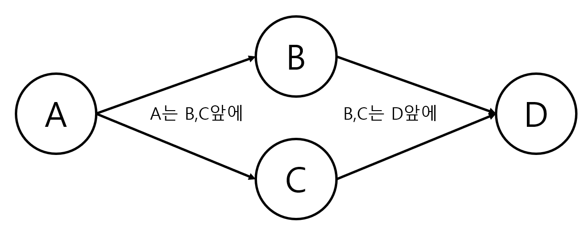
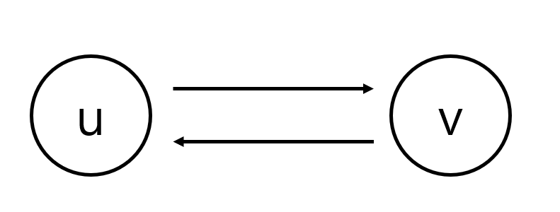
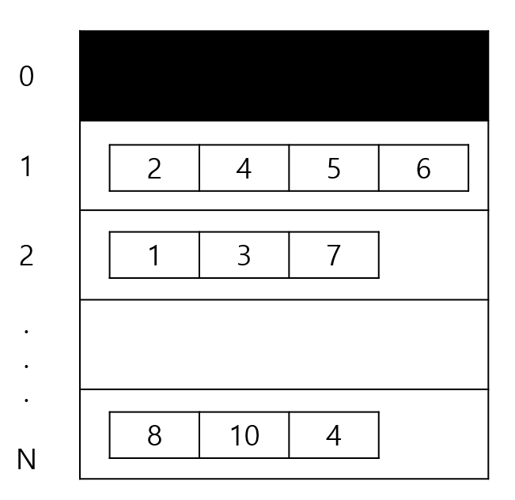

# BOJ 2623

## 문제 설명

- 문제 : [백준 2623](https://www.acmicpc.net/problem/2623)

이 문제는 주어진 순서에 따라 번호들을 정렬시키는 문제, 더 정확히는 그래프를 위상 정렬(`topological sort`)시키는 문제입니다. 일반적인 위상 정렬 문제이지만, 이 문제에서는 정렬시키는 방법이 존재하지 않을 수도 있습니다.

## 사전 지식

이 문제를 풀기 위해서는 위상 정렬에 대한 내용과 C++에서 `graph`를 구현하는 방법에 대한 지식이 필요합니다. 위상 정렬에 대한 추가적인 설명은 참고 자료들을 확인해보시면 좋을 것 같습니다.

### 위상 정렬

위상 정렬이란 유향 그래프에서, 정점 u에서 v로 가는 간선이 있으면, u가 v 앞에 오도록 정점들을 배열하는 것을 의미합니다. 다음 그림과 같은 유향 그래프를 예로 들어봅시다.



A는 B, C앞에, B, C는 D앞에 와야 한다는 조건을 가지고 정점들을 배열하면 됩니다. `ABCD`, `ACBD`는 이 그래프의 위상 정렬이 될 수 있겠네요. 다만 `ABDC` 같은 경우에는 D가 C앞에 오므로 이 그래프의 위상 정렬이 아닙니다.

단순해 보이지만, 모든 유향 그래프가 위상 정렬을 가지는 것은 아닙니다. 위상 정렬을 가지려면 사이클을 가지지 않는다는 조건이 필요합니다. 다음 그림을 보면 사이클을 가질 때 왜 위상 정렬이 생기지 않는지 알 수 있습니다. u가 v앞에 오면서, v가 u 앞에 올 수 없기 때문이죠.



### C++에서 graph 구현

`graph`를 구현하는 방법에는 여러 가지 방법이 있습니다. 연결 리스트 혹은 `2차원 N*N 배열` 등을 이용해 구현하기도 하지만, C++에서는 `std::vector`라는 좋은 수단이 있습니다. 이를 이용해 C++에서 `graph`를 어떻게 구현하는지 설명하고자 합니다.

정점이 총 `N`개 있고, 각 정점은 1부터 `N`까지의 자연수로 표현된다고 합시다. 간선은 `(x, y)` 형태로 표시되고, 이는 `x`번 정점과 `y`번 정점이 서로 연결되어 있다는 것을 의미합니다. 그래프를 표현한다는 것은 모든 정점과 간선을 표현하는 것과 같으므로, 2차원 벡터를 이용해 정점과 간선을 모두 표현하려고 합니다.

총 `N`개의 정점이 있으므로, 각 정점을 나타내는 `N`개의 정수형 벡터를 담는 벡터를 만듭니다. `X`번째 벡터 안에는 `X`번 정점과 연결된 정점들의 값을 저장합니다. 다만 정점의 수가 1부터 시작한다고 했으므로, 구현할 때는 `N+1`개의 벡터를 만들고 0번째 벡터는 비워두면 됩니다. 다음 그림과 같습니다.



위에서 설명한 2차원 벡터를 `nodes`로 정의합니다. 그리고 그래프의 정점 개수를 나타내는 정수형 변수 size, 각 정점이 방문되어있는지를 나타내는 1차원 `boolean` 벡터 `visited`를 정의합니다.

그래프를 생성할 때는 크기를 인자로 받아 해당 크기에 맞게 `nodes`와 `visited`, `size`를 초기화해줍니다.

이렇게 그래프를 생성하게 되면 간선 없이 정점만 있는 빈 그래프가 생성됩니다. 이후 `add_edge`함수를 사용해 간선을 추가해 줍니다. 이 함수는 시작점 `start`와 끝 점 `end`를 입력으로 받아 `start`번째 벡터에 `end` 값을 맨 뒤에 넣습니다. 만약 무향 그래프라면 간선이 양 방향을 연결하고 있다는 뜻이므로 반대로도 삽입해줍니다.

```cpp
class GRAPH{
private:
    int size;
    bool* visited;
    vector<vector<int>> nodes;

public:
    GRAPH(int n){
        this->nodes.resize(n + 1);
        this->visited = new bool[n + 1];
        this->size = n;
    }

    ~GRAPH(){
        delete [] visited;
    }

    //Directed case
    void add_edge(int start, int end){
        nodes[start].push_back(end);
    }

    //Undirected case
    void add_edge(int start, int end){
        nodes[start].push_back(end);
        nodes[end].push_back(start);
    }

};
```

## 접근 방법

이 문단에서는 임의의 그래프에서 위상 정렬을 구하는 두 가지 방법과, 사이클이 있을 경우 판단하는 방법을 살펴보려고 합니다.

### 큐를 이용한 해결 방법

위상 정렬을 수행한다면 어떤 정점이 가장 처음에 올 수 있을까요? 정점 중 자신을 향한 간선의 수가 0인 경우만 첫 정점이 될 수 있습니다. (그렇지 않은 경우 절대 첫 정점이 될 수 없습니다) 자신을 향한 간선의 수를 `incoming degree`라고 합니다.

이렇게 `incoming degree가` 0인 모든 정점을 큐에 넣습니다. 그다음 큐의 맨 앞에서 정점을 하나 선택해, 결과 리스트의 맨 뒤에 저장합니다. 이 정점은 이제 정렬되었고, 더 이상 그래프에서 필요가 없으니 해당 정점과 정점이 가리키는 간선 모두를 그래프에서 제거합니다.

이렇게 간선이 제거된 후에 `incoming degree`가 0인 새로운 정점이 생길 수 있으므로, 큐에 새로운 정점들을 추가하고, 다시 큐의 맨 앞에서 정점을 선택하고 제거하는 작업을 반복합니다. 이를 단순화하면 다음과 같습니다.

```
1. 큐에 들어있지 않으면서 incoming degree가 0인 정점들을 큐에 넣습니다. 큐가 비었다면 종료합니다.
2. 큐의 맨 앞에서 정점 하나를 결과 리스트의 맨 뒤에 넣습니다.
3. 2번에서 가져온 정점과 그 정점이 가리키는 모든 간선을 삭제합니다.
4. 1번으로 돌아갑니다.
```

만약 1부터 4까지 모두 수행했는데, 그래프에 정점이 남아있다면 이는 사이클이 있다고 판단할 수 있습니다.(사이클에 속해 있는 정점은 큐에 절대 들어갈 수 없으므로)

### DFS를 이용한 해결 방법

이 방법은 3.1 방법을 반대로 생각하는 것에서부터 시작합니다. 즉 incoming degree가 0인 하나도 없는 노드를 하나씩 정렬해나가는 방식이 아니라 위상 정렬의 마지막에 오는 점부터 채워 나가는 방식입니다.

어떤 정점에서 부탁해 이 정점이 가리키는 모든 정점을 DFS로 재귀적으로 찾습니다. 만약 어떤 정점이 더 이상 가리키는 정점이 없다면 해당 정점을 결과 리스트의 맨 앞에 저장합니다. 이를 그림으로 표현하면 다음과 같습니다.


위 과정은 A에서 `DFS`를 수행해서 모든 정점을 순서대로 정렬한 경우입니다.(`DFS`를 함수명이라 합시다.) `DFS(A), DFS(B), DFS(D)` 순으로 호출합니다. D는 더 이상 가리키는 정점이 없기 때문에 D를 결과 리스트 맨 앞에 삽입합니다. 이후 B도 더 이상 가리키는 정점이 없으므로, B를 D 앞에 삽입합니다. 이 과정을 계속해서 위상 정렬 결괏값을 얻습니다.

이 경우는 A 하나에 대해서 `DFS`를 수행해도 모든 결과가 나왔지만, 사실 이 방법을 통해 모든 결과를 얻으려면 `DFS`함수를 모든 정점에 대해 수행해야 합니다. 그리고 `DFS`를 수행하면서, 연결된 정점 중에 이미 방문된 점이 있다면 다시 `DFS`를 수행할 필요가 없습니다. 따라서 `DFS` 함수의 동작을 설명해보면 다음과 같습니다.

```
1. 현재 정점의 방문 상태를 확인해 방문 완료되었다면 아무것도 하지 않고 반환합니다.
2. 현재 정점이 방문된 적이 없다면 현재 정점이 방문되었다고 체크합니다.
3. 현재 정점이 가리키는 다른 모든 정점에 대해 다시 재귀적으로 DFS를 호출합니다.
4. 함수를 반환하기 전에 결과 리스트의 맨 앞에 현재 정점을 삽입합니다.
```

직관적으로 이해하기는 힘들지만, 이 방법은 앞에 와야 할 점이 `DFS`상에서는 더 늦게 반환된다는 점을 이용해서 결괏값을 반환 직전에 앞에 추가함으로 인해 정렬하는 방식입니다.

여담으로, 자료 구조의 종류에 따라 다르지만, C++의 `vector`에서는 앞에 데이터를 추가하는 연산이 O(N)이 걸리는 반면 뒤에 데이터를 추가하는 것은 O(1)이 걸립니다. 따라서 결과를 저장할 때 리스트의 맨 뒤에 저장한 후에 위상 정렬이 끝나면 리스트를 뒤집거나 역순으로 읽는 방식을 이용합니다. (혹은 `deque`를 이용해도 되겠습니다.)

### 사이클을 발견하는 방법

이 문제에서는 그래프 내에 사이클이 존재할 수 있습니다. 따라서 3.2의 방법을 적용할 때, 사이클이 생기는지 추가적으로 확인해야 합니다.

`DFS`를 수행할 때, 현재 노드가 방문된 적이 없다면, 현재 노드를 `방문 중` 상태로 만들어 놓고, 연결된 다른 노드들에 대해 `DFS`를 재귀적으로 수행한 다음, 함수가 종료될 때 `방문 완료` 표시를 해 두면 됩니다.

그리고 DFS를 수행하는 중 `방문 중` 상태의 노드를 발견했다면, 그건 아직 그 정점으로부터 시작된 DFS가 끝나지 않았는데 자신에게 다시 돌아온 것이므로, 사이클이 있다고 확신할 수 있습니다.

## 코드 설명

이 문제는 3.2의 방법으로 문제를 해결했습니다. 3.1의 방법으로도 충분히 풀 수 있습니다.

그래프 구현은 2.2에서 설명한 바와 거의 동일하나, 이 그래프가 사이클이 없는지 판단해주는 `boolean` 변수 `is_acyclic`과 결과를 역순으로 저장하는 `results_rev` 벡터를 정의합니다.

`state_visit`은 방문 상태를 나타내기 위해 정의한 열거형입니다. `perm_vis`는 방문 완료를, `temp_vis`는 방문 중을, `not_vis`는 방문한 적 없음을 나타냅니다.

```cpp
enum state_visit {not_vis, temp_vis, perm_vis};

class D_GRAPH{
private:
    int size;
    bool is_acyclic;
    state_visit* visited;
    vector<vector<int>> nodes;
    vector<int> results_rev;

public:
    D_GRAPH(int n){
        this->nodes.resize(n + 1);
        this->visited = new state_visit[n + 1];
        this->size = n;
        this->is_acyclic = true;
    }

    ~D_GRAPH(){
        delete [] visited;
    }

    void add_edge(int start, int end){
        nodes[start].push_back(end);
    }
```

그래프를 만들고, 주어진 입력을 이용해 `add_edge`함수로 간선을 추가해 줍니다. 그 후 위상 정렬을 위해 그래프 내의 모든 정점에 대해 `DFS`를 수행해주는 `topological_sort` 함수를 수행해 줍니다.

```cpp
void topological_sort(){
    for(int i = 1; i <= this->size; i++){
        dfs(i);
    }
}
```

`DFS`를 어떤 정점에 대해 수행할 경우 해당 정점을 방문했으면 반환, 방문 중인 경우 cycle이 있다는 표시를 해 줍니다. 방문한 적이 없으면 방문 중이라는 표시를 한 뒤 연결된 모든 정점들에 대해 재귀적으로 DFS를 호출합니다. `DFS`가 끝나면 방문 완료 표시를 해 주고 결괏값에 기록해줍니다.

```cpp
void dfs(int idx){
    if(visited[idx] == perm_vis)
        return;

    else if(visited[idx] == temp_vis){
        is_acyclic = false;
        return;
    }

    else{
        visited[idx] = temp_vis;
        for(int connected_idx : nodes[idx]){
            dfs(connected_idx);
        }
        visited[idx] = perm_vis;
        results_rev.push_back(idx);

        return;
    }
}
```

## 결론

위상 정렬을 수행하기 위해 그래프 이론과 이를 응용하는 문제였습니다. [2252번 문제](https://www.acmicpc.net/problem/2252) 역시 위상 정렬을 이용하는 문제인데, 이 문제는 정점과 간선이 훨씬 많기 때문에 시간제한에 더 유의해서 풀어야 할 겁니다.

코드 원본은 [여기](./codes/2021-05-04.cpp)를 참고해 주시면 됩니다.

## References

1. [위상 정렬 설명 블로그 1](https://gmlwjd9405.github.io/2018/08/27/algorithm-topological-sort.html)
2. [위상 정렬 설명 블로그 2](https://namnamseo.tistory.com/entry/Topological-Sort-%EC%9C%84%EC%83%81%EC%A0%95%EB%A0%AC)
3. [위상 정렬 (영문 위키)](https://en.wikipedia.org/wiki/Topological_sorting)
4. [백준 2623](https://www.acmicpc.net/problem/2623)
5. [백준 2252 (유사 문제)](https://www.acmicpc.net/problem/2252)
