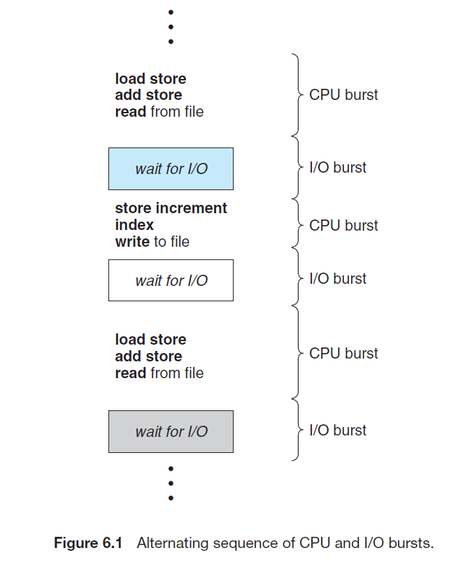

# CPU Scheduling

## CPU Scheduling 이란

다중 프로그래밍에서는 어떤 프로세스가 실행 중 대기해야 하는 경우에 그에게서 CPU 사용권을 뺏아 다른 프로세스에게 CPU 사용권을 준다. 이 때 어떤 프로세스가 실행될 지 결정하는 작업을 CPU scheduling 이라 한다.

## CPU-I/O Burst Cycle

프로세스 실행은 **CPU 실행** (CPU 버스트) 과 **I/O 대기** (I/O 버스트)로 이루어짐. CPU 버스트 뒤에 I/O 버스트가 옴.

- I/O-bound 프로세스는 I/O 버스트에 대부분의 시간을 씀. I/O 버스트는 짧고 많다.
- CPU-bound 프로세스는 CPU 버스트에 대부분의 시간을 씀. CPU 버스트는 길고 적다.

## CPU Scheduler

CPU가 idle 상태가 되면, OS는 ready queue에 있는 프로세스를 선택해 실행하고 CPU를 할당해 준다. Short-term scheduler라고도 부름.

## Preemptive scheduling

다음과 같이 프로세스가 변하는 네 가지 상황에서 CPU 스케쥴링이 일어남.

1. Running → Waiting: I/O 요청 혹은 대기 요청이 들어온 경우.
2. Running → Ready: 인터럽트가 발생한 경우.
3. Waiting → Ready: I/O 요청 혹은 대기 요청이 끝난 경우.
4. Running → Terminated: 프로세스가 종료된 경우.

1, 4번의 경우에만 스케쥴링이 일어나는 경우, 프로세스가 종료되거나 I/O가 있을 때 까지 실행을 보장한다는 의미에서 **non-preemptive scheduling**.

모든 경우에서 스케쥴링이 일어나는 경우, OS가 프로세스의 CPU 사용권을 선점할 수 있다는 의미에서 **preemptive scheduling**. race condition 발생 가능.

## Dispatcher

Short-term scheduler에게 선택된 프로세스에게 CPU 제어권을 넘겨주는 모듈. 한 프로세스를 멈추고 다른 프로세스를 실행하는데 걸리는 시간을 dispatch latency라 함.

## Scheduling Algorithms

Short-term scheduler가 프로세스를 선택하는 알고리즘.

## Scheduling Criteria

다음은 스케쥴링 알고리즘의 성능을 판단하는 기준들.

1. CPU Utilization: 총 시간 중 CPU가 작업을 처리한 시간의 비중. 높을수록 좋음.
2. Throughput: CPU가 단위 시간당 작업을 마친 프로세스 수. 많을수록 좋음.
3. Response Time: 요청 후 첫 응답이 오는 시간. 짧을수록 좋음.
4. Waiting Time: 프로세스가 ready queue에서 대기하는 시간. 짧을수록 좋음
5. Turnaround Time: 프로세스가 대기한 시간과 실행시간의 총 합. 짧을수록 좋음.

## First Come First Served

먼저 들어온 프로세스부터 실행. 실행시간이 긴 프로세스에 의해 다른 프로세스들의 대기 시간이 늘어나는 convoy effect 발생 가능. 비선점.

## Shortest Job First

실행시간이 짧은 프로세스를 우선적으로 실행. 프로세스의 다음 실행 시간을 알기 힘드므로 구현이 힘듦. 비선점.

## Shortest Remain Time First

SJF에서 선점 방식으로 바꾼 것. 프로세스가 실행 중 더 짧은 실행 시간을 가진 프로세스가 들어오면 해당 프로세스에게 CPU 할당.

## Priority Scheduling

SJF보다 일반적인 알고리즘. 프로세스에 우선순위를 부여한 후 우선 순위가 높은 것 부터 실행. 선점 / 비선점 둘 다 가능.

낮은 우선순위를 가진 프로세스는 무한정 대기하는 starvation 현상 발생 가능. 이를 방지하기 위해 오래 기다린 프로세스의 우선 순위를 높이는 aging 방식 가능.

## Round Robin

타임슬라이스를 설정 후 일정 시간이 지나면 다음 프로세스 수행, 완료되지 못한 프로세스는 ready queue의 맨 마지막에 삽입.

타임슬라이스가 크면 FCFS와 차이가 없고, 작으면 context switch overhead가 발생함. 적절한 선정이 필요. 선점.

## Multi Level Queue

우선 순위에 따라 여러 큐를 두고 각 프로세스마다 해당하는 큐에 배정. 각 큐마다 다른 스케쥴링 방식 적용. 한번 할당되면 다른 큐로 이동 불가능.

## Multi Level Feedback Queue (우선순위)

Multi level queue에서 유연성을 더해 프로세스가 다른 큐로 이동이 가능하게 만들어 둠. 다만 관리의 복잡성이 증가.

## References

1. Operating System Concepts 9th Edition, Silberschatz, Galvin and Gagne ©2013
