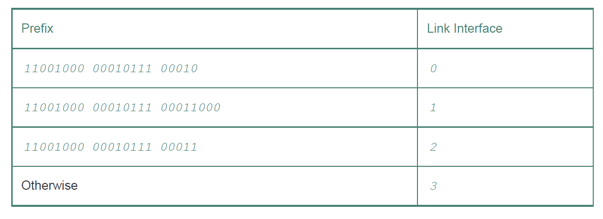

# Network Layer

## Network Layer란

Transport layer 아래에 존재하며 host간의 통신 제공. 모든 호스트와 라우터에 네트워크 레이어가 존재.

Forwarding과 routing이라는 두 가지 기능 보유, 각 기능을 수행하는 data plane과 control plane으로 구성.

## Forwarding

라우터의 input link에 들어온 패킷을 forwarding table을 통해 적절한 output link로 내보내 주는 기능. HW에서 구현. (Data plane)

## Routing

패킷의 경로, 즉 forwarding table을 정해주는 기능. SW에서 구현. (Control plane)

## Data Plane

라우터 내부에서 forwarding 기능 수행.

## Switching fabric

라우터의 입력 포트와 출력 포트를 연결해 주는 과정. Memory, bus, crossbar 방식이 있다.

## Longest prefix matching

패킷이 라우터에 들어왔을 때, forwarding table을 통해 어떤 link interface로 내보낼지 결정해야 함.

이 때 forwarding table에 있는 prefix 중 도착 주소랑 가장 **길게 매칭** 되는 것의 link interface로 내보내면 됨.

## IP datagram

Network layer의 패킷은 datagram이라 불림. TCP segment에서 추가된 점은 다음과 같음

1. Time-to-live: 데이터그램이 루프에 빠지지 않도록 이 값이 라우터를 지날 때 마다 1씩 감소시킴. 0이 되면 데이터그램을 버림.

2. Source / Destination IP address

## IP fragmentation

- MTU: link layer의 frame이 담을 수 있는 최대 데이터 양

datagram을 link layer에 보내기 위해 fragment라는 더 작은 단위로 분리.

## IPv4 addressing

IP 주소는 32 bit로 구성되고 상위 비트의 subnet part와 하위 비트의 host part로 구성.

- subnet: 라우터/호스트에 독립적으로 연결된 네트워크
- subnet mask: subnet part의 길이를 알려주는 숫자.

## DHCP (Dynamic Host Configuration Protocol)

IP 주소가 필요한 host에 IP 주소를 할당해 주는 방법. host가 네트워크에 연결할 때 마다 다른 임시 주소를 할당해 준다.

다음과 같이 네 가지 단계를 거침.

## DHCP server discovery

새로 들어온 호스트가 서브넷 내 모든 노드에 DHCP discover message를 broadcast함.

## DHCP server offers

DHCP 서버는 DHCP discovery message에 DHCP offer message로 응답함. 역시 모든 노드에 brodacast.

## DHCP request

새로 들어온 호스트는 하나 이상의 서버에서 온 offer message를 선택해 DHCP request message를 보냄.

## DHCP ACK

DHCP request message를 받은 서버는 DHCP ACK message를 통해 응답하고 새로 들어온 호스트는 IP 주소를 사용할 수 있음.

## NAT (Network Address Translation)

local 네트워크의 IP 주소들을 하나의 공용 IP 주소로 변환하는 기술. loacl network는 외부에서 보기에 한 개의 IP 주소를 가진 디바이스로 보이게 된다.

## NAT Logic

1. local 네트워크의 host가 서버에 패킷을 보낸 경우: NAT 라우터는 이 패킷의 주소를 자신의 주소로 바꾸고, port 번호를 새로 부여함
2. 서버가 local 네트워크의 host에게 패킷을 보낸 경우: NAT 라우터는 **NAT translation table**과 port 번호를 통해 올바른 host에게 보내줌.

## NAT traversal problem

local network가 서버인 경우 외부 네트워크에서 패킷이 먼저 들어오나, NAT translation table에 해당 서버의 포트 번호가 없으므로 라우터가 host를 특정하지 못하는 문제. 다음과 같은 방법으로 해결

1. Statically configure: 포트 번호 직접 지정
2. Connection reversal: local 네트워크에 연결하려면 해당 호스트가 먼저 연결을 해야 하는 방법.
3. Relaying: 별도 서버를 두어 서버가 패킷을 송,수신자에게 전달해 주는 방법.
4. UDP hole puncing: 송,수신자가 별도 서버에 등록을 해서 IP와 port를 통해 직접 통신하는 방법.

## Control Plane

Network 전체에서 동작, forwarding table을 계산.

## Per-router control

Routing 알고리즘이 각 라우터마다 동작하는 방식. OSFP, BGP 프로토콜 사용. Traditional한 방식.

## Logically centeralized control

Logically centeralized controller가 forwarding table을 계산하고 모든 라우터에 분배하는 방식. SDN 방식.

## Routing algorithm

최소한의 비용을 가진 경로를 찾게 만드는 알고리즘. 다음과 같은 두 가지 알고리즘 존재.

## Link state (LS)

모든 link의 상태를 아는 경우 사용 가능. Dijkstar's algorithm을 사용하며, 정확함. 그러나 모든 상태를 알아야 하므로 오버헤드 가능성 존재.

## Distance Vector (DV)

각 노드가 본인과 연결된 노드에 대한 정보만 아는 경우. Bellman-ford 알고리즘을 이용하며, 오버헤드는 적지만 부정확할 수 있음.

## Autonomous System (AS)

같은 관리 하에 놓인 여러 라우터 그룹. AS 내부 라우터에 사용하는 라우팅 알고리즘(intra-AS routing protocol)과 AS끼리 사용하는 라우터 알고리즘 (inter-AS routing protocol)존재

## OSPF (Open Shortest Path First)

Intra-AS routing protocol. LS 알고리즘 사용.

## BGF (Borderway Gate Protocol)

사실상 유일한 inter-AS routing protocol. DV 알고리즘 사용.

## References

1. Computer Networking: A Top-Down Approach, James. F. Kurose and Keith W. Ross
