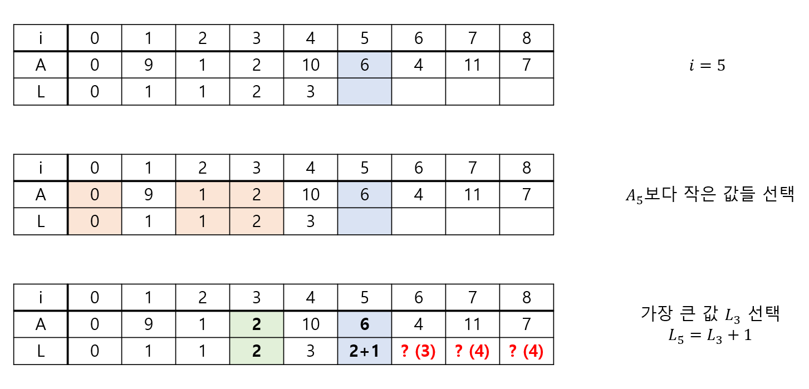
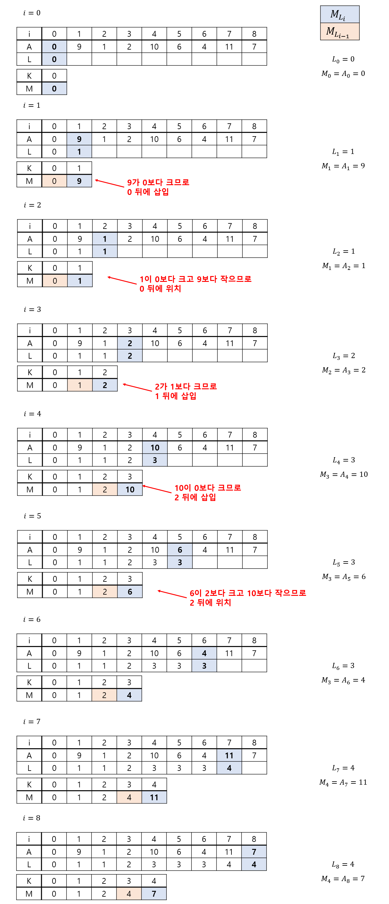

# BOJ 14003

## 문제 설명

- 문제: [백준 14003](https://www.acmicpc.net/problem/14003)

이 문제는 어떤 수열이 주어졌을 때 그 수열 내의 가장 긴 증가하는 부분 수열과 그 길이를 구하는 문제입니다. 수열의 길이는 최대 $10^6$이므로 $O(N^2)$ 알고리즘으로는 풀기 힘듭니다.

## 사전 지식

### $O(N^2)$ 으로 가장 긴 증가하는 부분 수열의 길이 구하기

가장 긴 증가하는 수열을 영어로 `Longest Increasing Subsequence`, 줄여서 `LIS`라고 부르겠습니다. 또한 입력으로 주어진 수열을 $A_i$ (i는 1 이상 N 이하, N은 수열 A의 길이)라고 표시하겠습니다.

어떤 수열의 부분 수열 중 LIS의 길이를 구하는 방법부터 차근차근 생각해 봅시다. 하지만 처음부터 전체 수열을 보면서 구하기는 힘듭니다. 그렇다면 생각을 조금 바꿔서 모든 i에 대해 $A_i$를 마지막 값으로 가지는 LIS의 길이를 구해보면 어떨까요? 이 값을 $L_i$라고 합시다. 용어를 정리하면 다음과 같습니다.

$A_i$ : 입력으로 주어진 수열

$L_i$ : $A_i$를 마지막 값으로 가지는 LIS의 길이

즉. $L_i$를 구하기 위해서는 수열 $A_1$, $A_2$, ... , $A_N$에서 $A_i$를 반드시 포함하는 증가하는 부분 수열 중 가장 긴 것의 길이를 찾으면 됩니다. 모든 i에 대해 $L_i$를 구할 수 있으면 $L_i$의 최댓값이 LIS의 길이가 됩니다.

그렇다면 $L_i$를 어떻게 구할 수 있을까요? 이를 구하기 위해서는 $L_1$부터 $L_{i-1}$까지의 모든 값들을 이용하면 됩니다. $A_j$가 $A_i$보다 작은 모든 $L_{j} (1 <= j <= i - 1)$들 중 최댓값 $L_k$를 찾았다고 생각해 봅시다. 그렇다면 $A_i$를 마지막으로 하는 LIS는, $A_k$를 마지막으로 하는 LIS에 $A_i$를 붙인 수열이 됩니다. 즉, $L_i = L_k + 1$이 되는 셈이죠. 이를 단계별로 정리하면 다음과 같습니다.

1. i보다 작은 모든 j에 대해서, $A_j$ 가 $A_i$ 보다 작은 j들을 찾습니다.

2. 해당 j들에 대해 $L_j$의 값들 중 가장 큰 값을 $L_k$를 찾습니다.

3. $L_i = L_k + 1$이 됩니다.

그림으로 표시하면 다음과 같습니다. 단, 예시에서는 입력으로 주어지는 모든 수가 양수인 경우만 다루었습니다.



i = 5일 때 $L_i$를 구하기 위해 $A_i$보다 작은 $A_j$값들을 모두 살펴보고, 그중 $L_j$값이 가장 큰 것은 $L_3$입니다. 이를 이용해 $L_5 = L_3 + 1 = 3$을 얻습니다. $L_6$, $L_7$, $L_8$을 구해보면 각각 3, 4, 4가 됩니다.

1부터 N까지 모든 i에 대해 $L_i$를 구하면 됩니다. 각 과정마다 앞에 있는 모든 $L_j$의 값을 참고해야 하니 $O(N)$의 시간 복잡도를 가집니다. 즉, 총 시간 복잡도는 $O(N^2)$입니다. L을 모두 구한 후 이 수열의 최댓값을 구하면 최대 LIS의 길이를 알 수 있습니다.

### 0번째 값

일반적인 컴퓨터 프로그래밍에서 모든 배열의 인덱스의 시작은 0입니다. 하지만 특별한 경우에는 1부터 시작하고, 지금 이 문제 역시 그랬죠. 왜 1부터 시작했을까요?

수열 L의 첫 번째 값 $L_1$은 앞에 어떠한 값도 없기 때문에 2.1의 과정을 수행할 수 없습니다. 사실 이 값은 무조건 1이 될 수밖에 없습니다. 하지만 구현의 편의성을 위해 수열 A의 모든 값보다 작은 $A_0$를 맨 앞에 추가합니다. 이렇게 되면 별도의 초기값 설정 없이도 일관적인 구현이 가능해집니다.

다만 $A_0$는 저희가 임의로 설정한 값이기 때문에 길이에 포함이 되면 안 됩니다. 즉, $A_0$는 길이에 계산이 되지 않는다고 생각하면 됩니다. 따라서 $L_1 = L_0 + 1$이 될 텐데, A_0는 길이에 포함이 안되므로 $L_0$를 0으로 두면 해결됩니다.

## 접근 방법

### $O(NlogN)$으로 가장 긴 증가하는 부분 수열의 길이 구하기

이전 장에서 LIS의 길이를 구할 때, $L_i$의 값을 구하기 위해 i보다 작은 인덱스 j를 가지는 모든 $A_j$값을 다 살펴봤습니다. 이 과정이 O(N)의 시간 복잡도를 요구하기 때문에 총 $O(N^2)의$ 시간 복잡도를 가졌습니다. 반면 이렇게 생각해볼 수 있겠죠.

현재 값 $A_i$보다 작은 $A_j$값들 중 $L_j$의 값이 가장 큰 것을 이진 탐색으로 찾을 수 있지 않을까?

이진 탐색으로 이 값을 찾을 수 있다면 각 과정에서의 시간 복잡도는 $O(logN)$이 되고, 총 시간 복잡도는 $O(NlogN)$이 됩니다. 그렇다면 이진 탐색으로 j값을 어떻게 찾을 수 있을까요?

새로운 수열 M을 정의합시다. M은 다음과 같습니다.

$M_k$ : $L_j = k$를 만족하는 $A_j$의 최솟값.

배열 M이 존재하면 i를 1부터 N까지 증가시키며 $L_i$를 구할 수 있습니다. 이진 탐색을 이용해 수열 M의 원소들 중 $A_i$보다 작은 수 중에서 가장 큰 값을 구하면 됩니다. 해당 값의 인덱스를 k라고 하면 $L_i = k + 1$이 됩니다.

반대로 M 역시 i = 1부터 N까지 증가시키면서 채워집니다. 위에서 구한 $L_i$의 값이 기존에 있는 값이 아니면, $M_{L_i}$의 값을 $A_i$의 값으로 저장하면 됩니다. 반면 $L_i$의 값이 기존에 존재하는 값이 아니라면, $A_i$가 $M_{L_i}$보다 작은 지 확인해서 작다면 $A_i$값으로 $M_{L_i}$의 값을 바꾸면 됩니다.

여기서 주목할만한 점이 있습니다. $A_i$가 $M_{L_i}$보다 작은지 굳이 확인하는 과정이 필요할까요? $M_{L_i - 1}$은 $A_i$보다 작은 수 중에서 가장 큰 값입니다. 그렇다면 반대로 $M_{L_i}$는 무조건 $A_i$보다 크겠죠. 즉, 어떤 경우든 확인할 필요 없이 $A_i$를 $M_{L_i}$로 대체해주면 됩니다.

$L_i$와 M을 채워가는 과정을 그림으로 설명하면 다음과 같습니다. 이 예시에서도 입력으로 받은 모든 수가 양수임을 가정했습니다.



### 수열 M의 0번째 값

$L_k = 0$을 만족시키는 $A_k$는 0 밖에 없으므로, $M_0$는 $A_0$가 됩니다. 이는 반드시 원소가 정렬되어야 하는 이진 탐색에 알맞습니다.

### 수열 구하기

$O(NlogN)$의 시간 내에 수열의 길이를 구하는 법은 알아보았습니다. 여기서 한 발자국 더 나아가 그 수열 자체를 구하려면 어떻게 해야 할까요?

답은 간단합니다. $A_i$를 마지막 값으로 가지는 LIS중 $A_i$ 이전에 오는 값의 인덱스를 저장하는 배열을 만들면 됩니다. 이 배열을 P라고 합시다. $P_i$는 $A_i$를 마지막 값으로 가지는 LIS중 $A_i$ 이전에 오는 값의 인덱스입니다.

$P_i$를 구하기 위해서는 i를 1부터 N까지 증가시켜가면서 $L_i$를 구할 때 나오는 값을 이용합니다. $M_{L_i - 1}$의 값이 $A_k$라고 한다면, 이 값이 $A_i$ 이전에 오는 값이 되므로, $P_i = k$가 됩니다.

다만 구현에서는 $L_j$별로 $A_i$의 값을 저장하는 수열 M 대신 $A_i$의 인덱스, 즉 i값을 저장하는 또 다른 배열 T를 만들어야 합니다.

이 과정을 거친 다음에 모든 L값 중 가장 큰 $L_M$의 값을 구하면, $A_{T_M}$으로 끝나는 수열이 LIS가 됩니다. $P_{T_M}$은 $A_{T_M}$의 이전 값의 인덱스이고, 이 값을 이용해 이전 값을 구할 수 있습니다. P 수열을 계속 이용하면 순차적으로 이전 값들을 구할 수 있고, $P_k$ = 0이 될 때까지 반복하면 LIS를 구할 수 있습니다.

다만 주의할 점은 큰 값에서 작은 값으로 감소하는 식으로 수열을 구했기 때문에 출력할 때는 반대로 해 주면 됩니다.

## 코드 설명

### 배열 설명

input은 A 수열을, endval_per_length는 본문의 M 배열을, endidx_per_length는 본문의 T 배열을, prev_idx는 본문의 P 배열을 나타냅니다.

endval_per_length의 초항 $M_0$는 $A_0$이고, 이 값은 A의 모든 값보다 작아야 하므로 입력으로 주어지는 모든 값보다 작게 설정했습니다.

```cpp
#define MAXLEN 1000000
#define LOWER_BOUND -1000000001

int input[MAXLEN+1] = {0};

/* The minumum end value of a subsequence whose length is its idx */
int endval_per_length[MAXLEN+1] = {LOWER_BOUND};

/* Index of the endval_per_length */
int endidx_per_length[MAXLEN+1] = {0};

/* Index of former value corresponding to current subsequence */
int prev_idx[MAXLEN+1] = {0};
```

### 이진 탐색 함수

배열과 왼쪽 끝, 오른쪽 끝 인덱스와, 찾고자 하는 값을 입력으로 줍니다. 배열의 값들 중 찾고자 하는 값보다 작은 값 중에서 가장 큰 값의 인덱스를 찾아 반환합니다. 배열 M을 통해 $L_i$를 구하기 위해 사용됩니다.

```cpp
/* Find the index of the certain value */
int binary_search_idx(int* arr, int left, int right, int val){
    int mid;
    while(left != right){
        mid = (left + right + 1) / 2;
        if(val <= arr[mid]){
            right = mid - 1;
        }
        else{
            left = mid;
        }

    }
    return left;
}
```

### 입력 배열 탐색

i는 1부터 N까지 증가시키며 배열 M을 이진 탐색을 통해 $L_i$를 구합니다. $L_i$가 최대 길이보다 이를 기록해 줍니다. $M_{L_i}$, $T_{L_i}$를 각각 $A_i$, i로 업데이트합니다. 또한 $P_i$는 $M_{L_i - 1}$로 갱신하면 됩니다.

```cpp
for(int idx = 1; idx <=input_length; idx++){
    /* cur length means the maximum legth of subseq that ends with current value */
    cur_length = binary_search_idx(endval_per_length, 0, max_length, input[idx]) + 1;

    /* max length is maximum lengths among cur lengths */
    if(cur_length > max_length){
        max_length = cur_length;
    }

    /* update the end value as current value */
    endval_per_length[cur_length] = input[idx];
    endidx_per_length[cur_length] = idx;

    prev_idx[idx] = endidx_per_length[cur_length - 1];
}
```

### 부분 수열 구하기

cur_idx에는 최고 길이를 가질 때 마지막 값의 인덱스를 저장해 둡니다. 이후 cur_idx가 0이 아닐 때까지 계속 이전 인덱스를 추적해 나갑니다. 또한 그 인덱스에 해당하는 값을 LIS 벡터에 순차적으로 저장합니다.

```cpp
std::vector<int> result;
int cur_idx = endidx_per_length[max_length];

/* Stack the value of the LIS at the vector */
while(cur_idx != 0){
    result.push_back(input[cur_idx]);
    cur_idx = prev_idx[cur_idx];
}
```

다만 위에서 언급한 대로 LIS 벡터에는 증가하는 부분 수열의 마지막부터 역순으로 저장되어 있으므로 출력 역시 반대로 해 주면 됩니다.

```cpp
/* Print the results in the right order */
std::vector<int>::reverse_iterator rit;
for(rit = result.rbegin(); rit != result.rend(); rit++){
    printf("%d ", *rit);
}
```

## 결론

위키들을 참고해서 푼 최장 증가 부분 수열입니다.

코드 원본은 [여기](codes/2021-07-15.cpp)를 참고해 주시면 됩니다.

# References

1. [백준 14003](https://www.acmicpc.net/problem/14003)
2. [백준 12015](https://www.acmicpc.net/problem/12015)
3. [최장 증가 부분 수열](https://namu.wiki/w/%EC%B5%9C%EC%9E%A5%20%EC%A6%9D%EA%B0%80%20%EB%B6%80%EB%B6%84%20%EC%88%98%EC%97%B4)
4. [Longest increasing subsequence](https://en.wikipedia.org/wiki/Longest_increasing_subsequence)
