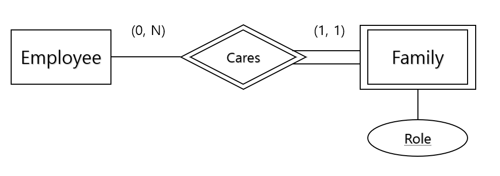

# ER model - 2

> [ER model - 1](/contents/2022-10/2022-10-05.md)

## How to Represent Relationship

관계를 표현하는 제약 조건들.

1. Cardinaltiy Ratio Constraint
2. Participation Constraint
3. Structual Constraint

## Cardinality Ratio Constarint

관계를 맺는 두 엔티티 타입에 대해, 한 엔티티가 얼마나 많은 다른 엔티티와 관련될 수 있는 지를 나타내는 제약 조건

- 1:1 : 두 엔티티 타입의 엔티티들이 각각 일 대 일 대응
- 1:N : 한 엔티티 타입의 엔티티가 다른 엔티티 타입의 여러 엔티티와 연관 됨. 역은 성립 X
- N:M : 한 엔티티 타입의 엔티티가 다른 엔티티 타입의 여러 엔티티와 연관 됨. 역도 성립

다음과 같이 표기.

## Participation Constraint

관계를 맺는 두 엔티티 타입에 대해, 각 엔티티가 관계에 모두 참여하는지 여부를 나타 냄

- Total participation: 엔티티 타입의 모든 엔티티가 관계를 맺는 경우
- Partial participation: 엔티티 타입의 일부 엔티티만 관계를 맺는 경우

Total의 경우 두 줄의 실선으로, partial의 경우 한 개의 실선으로 표기. 모든 item의 경우 user가 존재해야 하지만, user는 item이 반드시 필요한 것은 아님.

## Structual Constraint

관계를 맺는 두 엔티티 타입에 대해, 각 **관계에 참가하는 엔티티의 갯수**를 (최솟값, 최댓값) 형태로 나타냄.

## Weak Entity

자신의 key attribute가 없는 엔티티 타입. 관계에 의해 다른 엔티티 타입에 의존해야 함. Weak entitiy의 키를 partial key라고 함.

다음과 같이 weak entity와 그 관계를 표시할 때는 이중으로 표시되고, partial key는 밑줄로서 표시.

각 직원이 부양하는 가족은 해당 직원에 의존하고, 해당 직원과의 관계가 key가 될 수 없기 때문에 weak entity.

## References

1. https://victorydntmd.tistory.com/126
2. https://dad-rock.tistory.com/373
3. https://velog.io/@kchs94/%EB%8D%B0%EC%9D%B4%ED%84%B0%EB%B2%A0%EC%9D%B4%EC%8A%A4-ER-Model-%EA%B0%9C%EB%85%90%EC%A0%81-%EC%84%A4%EA%B3%84
