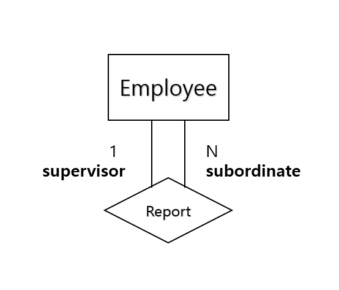
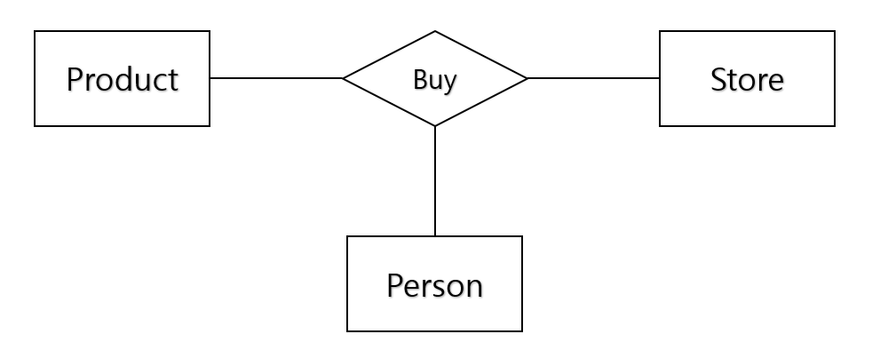
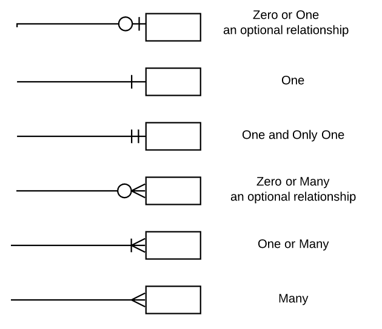

# ER model - 3

> [ER model - 1](/contents/2022-10/2022-10-05.md), [ER model - 2](/contents/2022-10/2022-10-06.md)

## Relationship degree

관계에 참가하는 엔티티 타입의 수. 다음과 같다.

- Binary relationship: 두 엔티티 타입이 관계를 맺음. 가장 흔한 경우
- Recursive relationship
- Ternary relationship

## Recursive(Unary) Relationship

한 개의 엔티티가 자기 자신과 관계를 맺음. 직원들은 최대 1명의 상사가 있고, 또한 직원은 최대 N명의 부하가 있는 경우 다음과 같이 표시.

## Ternary Relationship

3개의 엔티티가 관계를 맺음. 사람이 가게에서 물건을 사는 경우의 다음과 같이 표시.

상황에 따라 모호해질 수 있으므로, ternary relationship과 세 개의 binary relationship으로 분리하는 방법 중 하나를 선택해야 함. 잘못 선택하면 의미를 제대로 전달하지 못하는 경우가 생길 수 있음.

## Crow Feet Notation

ER 다이어그램보다 표현을 간략화 한 것. Attribute들을 엔티티 내에 명기하고 relation을 다음과 같이 기호를 통해 표기함.

오른쪽에 기호가 있으면 왼쪽 엔티티가 한 개 존재할 때 오른쪽 엔티티가 몇 개 존재하는 지를 나타냄. 반대 역시 마찬가지.

## References

1. https://inpa.tistory.com/entry/DB-%F0%9F%93%9A-%EB%8D%B0%EC%9D%B4%ED%84%B0-%EB%AA%A8%EB%8D%B8%EB%A7%81-1N-%EA%B4%80%EA%B3%84-%F0%9F%93%88-ERD-%EB%8B%A4%EC%9D%B4%EC%96%B4%EA%B7%B8%EB%9E%A8
2. https://www.dlsweb.rmit.edu.au/Toolbox/ecommerce/tbn_respak/tbn_e2/html/tbn_e2_devsol/er_model_relnshps.htm
3. https://dad-rock.tistory.com/373
4. https://satisfactoryplace.tistory.com/233
